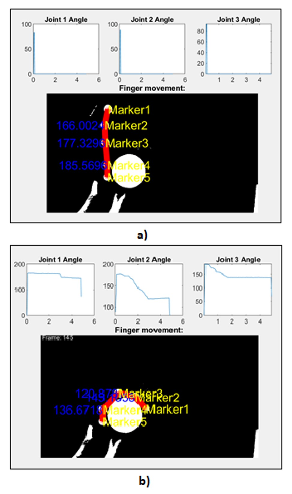

# Marker-based imaging system for tracking finger joint angles of a prosthetic/robotic hand.

In the image-based motion detection system, a shape-based detection algorithm is used to detect the positions of the pointers placed on the fingers in each frame of the captured video. In each of the video frames, all the segments that remain below a certain brightness value are eliminated using MATLAB's "imfindcircles" command according to whether they are circles in the desired radius. The MATLAB function used is based on the Circular Hough Transform algorithm.

In all video frames, it has been seen that only markers remain after elimination. The markers are tagged by the user after the first frame detected. Markers detected in each video frame that follow continue to be tracked according to the tagging made by the user. In this way, the position changes of the markers on the X and Y axes have no effect on their naming throughout the video stream. Figure below shows sample outputs of the motion detection system before and after the closing motion.

In order to utilize marker positions in the determination of joint angles, the internal angles between the vectors passing through the markers are calculated. First, v1 and v2 vectors are created with the help of the following expressions, where P11, P12, P21 and P22 are the first point of the first line, the second point of the first line, the first point of the second line and the second point of the second line, respectively.
