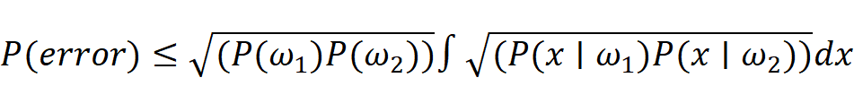
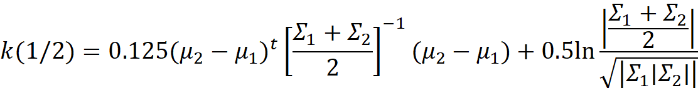

<html xmlns:v="urn:schemas-microsoft-com:vml"
xmlns:o="urn:schemas-microsoft-com:office:office"
xmlns:w="urn:schemas-microsoft-com:office:word"
xmlns:dt="uuid:C2F41010-65B3-11d1-A29F-00AA00C14882"
xmlns:m="http://schemas.microsoft.com/office/2004/12/omml"
xmlns="http://www.w3.org/TR/REC-html40">

<head>
<meta http-equiv=Content-Type content="text/html; charset=windows-1252">
<meta name=ProgId content=Word.Document>
<meta name=Generator content="Microsoft Word 15">
<meta name=Originator content="Microsoft Word 15">
<link rel=File-List href="readme_files/filelist.xml">
<link rel=Edit-Time-Data href="readme_files/editdata.mso">
<!--[if !mso]>

<![endif]--><!--[if gte mso 9]><xml>
 <o:DocumentProperties>
  <o:Author>evren</o:Author>
  <o:LastAuthor>Zahit Evren Kaya</o:LastAuthor>
  <o:Revision>3</o:Revision>
  <o:TotalTime>544</o:TotalTime>
  <o:Created>2020-05-09T14:58:00Z</o:Created>
  <o:LastSaved>2020-05-09T14:58:00Z</o:LastSaved>
  <o:Pages>1</o:Pages>
  <o:Words>12</o:Words>
  <o:Characters>71</o:Characters>
  <o:Lines>1</o:Lines>
  <o:Paragraphs>1</o:Paragraphs>
  <o:CharactersWithSpaces>82</o:CharactersWithSpaces>
  <o:Version>16.00</o:Version>
 </o:DocumentProperties>
 <o:CustomDocumentProperties>
  <o:Info_x0020_1 dt:dt="string"></o:Info_x0020_1>
  <o:Info_x0020_2 dt:dt="string"></o:Info_x0020_2>
  <o:Info_x0020_3 dt:dt="string"></o:Info_x0020_3>
  <o:Info_x0020_4 dt:dt="string"></o:Info_x0020_4>
 </o:CustomDocumentProperties>
</xml><![endif]-->
<link rel=themeData href="readme_files/themedata.thmx">
<link rel=colorSchemeMapping
href="readme_files/colorschememapping.xml">
<!--[if gte mso 9]><xml>
 <w:WordDocument>
  <w:SpellingState>Clean</w:SpellingState>
  <w:GrammarState>Clean</w:GrammarState>
  <w:TrackMoves>false</w:TrackMoves>
  <w:TrackFormatting/>
  <w:AutoHyphenation/>
  <w:HyphenationZone>21</w:HyphenationZone>
  <w:PunctuationKerning/>
  <w:ValidateAgainstSchemas/>
  <w:SaveIfXMLInvalid>false</w:SaveIfXMLInvalid>
  <w:IgnoreMixedContent>false</w:IgnoreMixedContent>
  <w:AlwaysShowPlaceholderText>false</w:AlwaysShowPlaceholderText>
  <w:DoNotPromoteQF/>
  <w:LidThemeOther>TR</w:LidThemeOther>
  <w:LidThemeAsian>X-NONE</w:LidThemeAsian>
  <w:LidThemeComplexScript>X-NONE</w:LidThemeComplexScript>
  <w:Compatibility>
   <w:BreakWrappedTables/>
   <w:SnapToGridInCell/>
   <w:WrapTextWithPunct/>
   <w:UseAsianBreakRules/>
   <w:UseWord2010TableStyleRules/>
   <w:DontGrowAutofit/>
   <w:SplitPgBreakAndParaMark/>
  </w:Compatibility>
  <w:DoNotOptimizeForBrowser/>
  <m:mathPr>
   <m:mathFont m:val="Cambria Math"/>
   <m:brkBin m:val="before"/>
   <m:brkBinSub m:val="&#45;-"/>
   <m:smallFrac m:val="off"/>
   <m:dispDef/>
   <m:lMargin m:val="0"/>
   <m:rMargin m:val="0"/>
   <m:defJc m:val="centerGroup"/>
   <m:wrapIndent m:val="1440"/>
   <m:intLim m:val="subSup"/>
   <m:naryLim m:val="undOvr"/>
  </m:mathPr></w:WordDocument>
</xml><![endif]--><!--[if gte mso 9]><xml>
 <w:LatentStyles DefLockedState="false" DefUnhideWhenUsed="false"
  DefSemiHidden="false" DefQFormat="false" DefPriority="99"
  LatentStyleCount="376">
  <w:LsdException Locked="false" Priority="0" QFormat="true" Name="Normal"/>
  <w:LsdException Locked="false" Priority="9" QFormat="true" Name="heading 1"/>
  <w:LsdException Locked="false" Priority="9" SemiHidden="true"
   UnhideWhenUsed="true" QFormat="true" Name="heading 2"/>
  <w:LsdException Locked="false" Priority="9" SemiHidden="true"
   UnhideWhenUsed="true" QFormat="true" Name="heading 3"/>
  <w:LsdException Locked="false" Priority="9" SemiHidden="true"
   UnhideWhenUsed="true" QFormat="true" Name="heading 4"/>
  <w:LsdException Locked="false" Priority="9" SemiHidden="true"
   UnhideWhenUsed="true" QFormat="true" Name="heading 5"/>
  <w:LsdException Locked="false" Priority="9" SemiHidden="true"
   UnhideWhenUsed="true" QFormat="true" Name="heading 6"/>
  <w:LsdException Locked="false" Priority="9" SemiHidden="true"
   UnhideWhenUsed="true" QFormat="true" Name="heading 7"/>
  <w:LsdException Locked="false" Priority="9" SemiHidden="true"
   UnhideWhenUsed="true" QFormat="true" Name="heading 8"/>
  <w:LsdException Locked="false" Priority="9" SemiHidden="true"
   UnhideWhenUsed="true" QFormat="true" Name="heading 9"/>
  <w:LsdException Locked="false" SemiHidden="true" UnhideWhenUsed="true"
   Name="index 1"/>
  <w:LsdException Locked="false" SemiHidden="true" UnhideWhenUsed="true"
   Name="index 2"/>
  <w:LsdException Locked="false" SemiHidden="true" UnhideWhenUsed="true"
   Name="index 3"/>
  <w:LsdException Locked="false" SemiHidden="true" UnhideWhenUsed="true"
   Name="index 4"/>
  <w:LsdException Locked="false" SemiHidden="true" UnhideWhenUsed="true"
   Name="index 5"/>
  <w:LsdException Locked="false" SemiHidden="true" UnhideWhenUsed="true"
   Name="index 6"/>
  <w:LsdException Locked="false" SemiHidden="true" UnhideWhenUsed="true"
   Name="index 7"/>
  <w:LsdException Locked="false" SemiHidden="true" UnhideWhenUsed="true"
   Name="index 8"/>
  <w:LsdException Locked="false" SemiHidden="true" UnhideWhenUsed="true"
   Name="index 9"/>
  <w:LsdException Locked="false" Priority="39" SemiHidden="true"
   UnhideWhenUsed="true" Name="toc 1"/>
  <w:LsdException Locked="false" Priority="39" SemiHidden="true"
   UnhideWhenUsed="true" Name="toc 2"/>
  <w:LsdException Locked="false" Priority="39" SemiHidden="true"
   UnhideWhenUsed="true" Name="toc 3"/>
  <w:LsdException Locked="false" Priority="39" SemiHidden="true"
   UnhideWhenUsed="true" Name="toc 4"/>
  <w:LsdException Locked="false" Priority="39" SemiHidden="true"
   UnhideWhenUsed="true" Name="toc 5"/>
  <w:LsdException Locked="false" Priority="39" SemiHidden="true"
   UnhideWhenUsed="true" Name="toc 6"/>
  <w:LsdException Locked="false" Priority="39" SemiHidden="true"
   UnhideWhenUsed="true" Name="toc 7"/>
  <w:LsdException Locked="false" Priority="39" SemiHidden="true"
   UnhideWhenUsed="true" Name="toc 8"/>
  <w:LsdException Locked="false" Priority="39" SemiHidden="true"
   UnhideWhenUsed="true" Name="toc 9"/>
  <w:LsdException Locked="false" SemiHidden="true" UnhideWhenUsed="true"
   Name="Normal Indent"/>
  <w:LsdException Locked="false" SemiHidden="true" UnhideWhenUsed="true"
   Name="footnote text"/>
  <w:LsdException Locked="false" SemiHidden="true" UnhideWhenUsed="true"
   Name="annotation text"/>
  <w:LsdException Locked="false" SemiHidden="true" UnhideWhenUsed="true"
   Name="header"/>
  <w:LsdException Locked="false" SemiHidden="true" UnhideWhenUsed="true"
   Name="footer"/>
  <w:LsdException Locked="false" SemiHidden="true" UnhideWhenUsed="true"
   Name="index heading"/>
  <w:LsdException Locked="false" Priority="35" SemiHidden="true"
   UnhideWhenUsed="true" QFormat="true" Name="caption"/>
  <w:LsdException Locked="false" SemiHidden="true" UnhideWhenUsed="true"
   Name="table of figures"/>
  <w:LsdException Locked="false" SemiHidden="true" UnhideWhenUsed="true"
   Name="envelope address"/>
  <w:LsdException Locked="false" SemiHidden="true" UnhideWhenUsed="true"
   Name="envelope return"/>
  <w:LsdException Locked="false" SemiHidden="true" UnhideWhenUsed="true"
   Name="footnote reference"/>
  <w:LsdException Locked="false" SemiHidden="true" UnhideWhenUsed="true"
   Name="annotation reference"/>
  <w:LsdException Locked="false" SemiHidden="true" UnhideWhenUsed="true"
   Name="line number"/>
  <w:LsdException Locked="false" SemiHidden="true" UnhideWhenUsed="true"
   Name="page number"/>
  <w:LsdException Locked="false" SemiHidden="true" UnhideWhenUsed="true"
   Name="endnote reference"/>
  <w:LsdException Locked="false" SemiHidden="true" UnhideWhenUsed="true"
   Name="endnote text"/>
  <w:LsdException Locked="false" SemiHidden="true" UnhideWhenUsed="true"
   Name="table of authorities"/>
  <w:LsdException Locked="false" SemiHidden="true" UnhideWhenUsed="true"
   Name="macro"/>
  <w:LsdException Locked="false" SemiHidden="true" UnhideWhenUsed="true"
   Name="toa heading"/>
  <w:LsdException Locked="false" SemiHidden="true" UnhideWhenUsed="true"
   Name="List"/>
  <w:LsdException Locked="false" SemiHidden="true" UnhideWhenUsed="true"
   Name="List Bullet"/>
  <w:LsdException Locked="false" SemiHidden="true" UnhideWhenUsed="true"
   Name="List Number"/>
  <w:LsdException Locked="false" SemiHidden="true" UnhideWhenUsed="true"
   Name="List 2"/>
  <w:LsdException Locked="false" SemiHidden="true" UnhideWhenUsed="true"
   Name="List 3"/>
  <w:LsdException Locked="false" SemiHidden="true" UnhideWhenUsed="true"
   Name="List 4"/>
  <w:LsdException Locked="false" SemiHidden="true" UnhideWhenUsed="true"
   Name="List 5"/>
  <w:LsdException Locked="false" SemiHidden="true" UnhideWhenUsed="true"
   Name="List Bullet 2"/>
  <w:LsdException Locked="false" SemiHidden="true" UnhideWhenUsed="true"
   Name="List Bullet 3"/>
  <w:LsdException Locked="false" SemiHidden="true" UnhideWhenUsed="true"
   Name="List Bullet 4"/>
  <w:LsdException Locked="false" SemiHidden="true" UnhideWhenUsed="true"
   Name="List Bullet 5"/>
  <w:LsdException Locked="false" SemiHidden="true" UnhideWhenUsed="true"
   Name="List Number 2"/>
  <w:LsdException Locked="false" SemiHidden="true" UnhideWhenUsed="true"
   Name="List Number 3"/>
  <w:LsdException Locked="false" SemiHidden="true" UnhideWhenUsed="true"
   Name="List Number 4"/>
  <w:LsdException Locked="false" SemiHidden="true" UnhideWhenUsed="true"
   Name="List Number 5"/>
  <w:LsdException Locked="false" Priority="10" QFormat="true" Name="Title"/>
  <w:LsdException Locked="false" SemiHidden="true" UnhideWhenUsed="true"
   Name="Closing"/>
  <w:LsdException Locked="false" SemiHidden="true" UnhideWhenUsed="true"
   Name="Signature"/>
  <w:LsdException Locked="false" Priority="1" SemiHidden="true"
   UnhideWhenUsed="true" Name="Default Paragraph Font"/>
  <w:LsdException Locked="false" SemiHidden="true" UnhideWhenUsed="true"
   Name="Body Text"/>
  <w:LsdException Locked="false" SemiHidden="true" UnhideWhenUsed="true"
   Name="Body Text Indent"/>
  <w:LsdException Locked="false" SemiHidden="true" UnhideWhenUsed="true"
   Name="List Continue"/>
  <w:LsdException Locked="false" SemiHidden="true" UnhideWhenUsed="true"
   Name="List Continue 2"/>
  <w:LsdException Locked="false" SemiHidden="true" UnhideWhenUsed="true"
   Name="List Continue 3"/>
  <w:LsdException Locked="false" SemiHidden="true" UnhideWhenUsed="true"
   Name="List Continue 4"/>
  <w:LsdException Locked="false" SemiHidden="true" UnhideWhenUsed="true"
   Name="List Continue 5"/>
  <w:LsdException Locked="false" SemiHidden="true" UnhideWhenUsed="true"
   Name="Message Header"/>
  <w:LsdException Locked="false" Priority="11" QFormat="true" Name="Subtitle"/>
  <w:LsdException Locked="false" SemiHidden="true" UnhideWhenUsed="true"
   Name="Salutation"/>
  <w:LsdException Locked="false" SemiHidden="true" UnhideWhenUsed="true"
   Name="Date"/>
  <w:LsdException Locked="false" SemiHidden="true" UnhideWhenUsed="true"
   Name="Body Text First Indent"/>
  <w:LsdException Locked="false" SemiHidden="true" UnhideWhenUsed="true"
   Name="Body Text First Indent 2"/>
  <w:LsdException Locked="false" SemiHidden="true" UnhideWhenUsed="true"
   Name="Note Heading"/>
  <w:LsdException Locked="false" SemiHidden="true" UnhideWhenUsed="true"
   Name="Body Text 2"/>
  <w:LsdException Locked="false" SemiHidden="true" UnhideWhenUsed="true"
   Name="Body Text 3"/>
  <w:LsdException Locked="false" SemiHidden="true" UnhideWhenUsed="true"
   Name="Body Text Indent 2"/>
  <w:LsdException Locked="false" SemiHidden="true" UnhideWhenUsed="true"
   Name="Body Text Indent 3"/>
  <w:LsdException Locked="false" SemiHidden="true" UnhideWhenUsed="true"
   Name="Block Text"/>
  <w:LsdException Locked="false" SemiHidden="true" UnhideWhenUsed="true"
   Name="Hyperlink"/>
  <w:LsdException Locked="false" SemiHidden="true" UnhideWhenUsed="true"
   Name="FollowedHyperlink"/>
  <w:LsdException Locked="false" Priority="22" QFormat="true" Name="Strong"/>
  <w:LsdException Locked="false" Priority="20" QFormat="true" Name="Emphasis"/>
  <w:LsdException Locked="false" SemiHidden="true" UnhideWhenUsed="true"
   Name="Document Map"/>
  <w:LsdException Locked="false" SemiHidden="true" UnhideWhenUsed="true"
   Name="Plain Text"/>
  <w:LsdException Locked="false" SemiHidden="true" UnhideWhenUsed="true"
   Name="E-mail Signature"/>
  <w:LsdException Locked="false" SemiHidden="true" UnhideWhenUsed="true"
   Name="HTML Top of Form"/>
  <w:LsdException Locked="false" SemiHidden="true" UnhideWhenUsed="true"
   Name="HTML Bottom of Form"/>
  <w:LsdException Locked="false" SemiHidden="true" UnhideWhenUsed="true"
   Name="Normal (Web)"/>
  <w:LsdException Locked="false" SemiHidden="true" UnhideWhenUsed="true"
   Name="HTML Acronym"/>
  <w:LsdException Locked="false" SemiHidden="true" UnhideWhenUsed="true"
   Name="HTML Address"/>
  <w:LsdException Locked="false" SemiHidden="true" UnhideWhenUsed="true"
   Name="HTML Cite"/>
  <w:LsdException Locked="false" SemiHidden="true" UnhideWhenUsed="true"
   Name="HTML Code"/>
  <w:LsdException Locked="false" SemiHidden="true" UnhideWhenUsed="true"
   Name="HTML Definition"/>
  <w:LsdException Locked="false" SemiHidden="true" UnhideWhenUsed="true"
   Name="HTML Keyboard"/>
  <w:LsdException Locked="false" SemiHidden="true" UnhideWhenUsed="true"
   Name="HTML Preformatted"/>
  <w:LsdException Locked="false" SemiHidden="true" UnhideWhenUsed="true"
   Name="HTML Sample"/>
  <w:LsdException Locked="false" SemiHidden="true" UnhideWhenUsed="true"
   Name="HTML Typewriter"/>
  <w:LsdException Locked="false" SemiHidden="true" UnhideWhenUsed="true"
   Name="HTML Variable"/>
  <w:LsdException Locked="false" SemiHidden="true" UnhideWhenUsed="true"
   Name="Normal Table"/>
  <w:LsdException Locked="false" SemiHidden="true" UnhideWhenUsed="true"
   Name="annotation subject"/>
  <w:LsdException Locked="false" SemiHidden="true" UnhideWhenUsed="true"
   Name="No List"/>
  <w:LsdException Locked="false" SemiHidden="true" UnhideWhenUsed="true"
   Name="Outline List 1"/>
  <w:LsdException Locked="false" SemiHidden="true" UnhideWhenUsed="true"
   Name="Outline List 2"/>
  <w:LsdException Locked="false" SemiHidden="true" UnhideWhenUsed="true"
   Name="Outline List 3"/>
  <w:LsdException Locked="false" SemiHidden="true" UnhideWhenUsed="true"
   Name="Table Simple 1"/>
  <w:LsdException Locked="false" SemiHidden="true" UnhideWhenUsed="true"
   Name="Table Simple 2"/>
  <w:LsdException Locked="false" SemiHidden="true" UnhideWhenUsed="true"
   Name="Table Simple 3"/>
  <w:LsdException Locked="false" SemiHidden="true" UnhideWhenUsed="true"
   Name="Table Classic 1"/>
  <w:LsdException Locked="false" SemiHidden="true" UnhideWhenUsed="true"
   Name="Table Classic 2"/>
  <w:LsdException Locked="false" SemiHidden="true" UnhideWhenUsed="true"
   Name="Table Classic 3"/>
  <w:LsdException Locked="false" SemiHidden="true" UnhideWhenUsed="true"
   Name="Table Classic 4"/>
  <w:LsdException Locked="false" SemiHidden="true" UnhideWhenUsed="true"
   Name="Table Colorful 1"/>
  <w:LsdException Locked="false" SemiHidden="true" UnhideWhenUsed="true"
   Name="Table Colorful 2"/>
  <w:LsdException Locked="false" SemiHidden="true" UnhideWhenUsed="true"
   Name="Table Colorful 3"/>
  <w:LsdException Locked="false" SemiHidden="true" UnhideWhenUsed="true"
   Name="Table Columns 1"/>
  <w:LsdException Locked="false" SemiHidden="true" UnhideWhenUsed="true"
   Name="Table Columns 2"/>
  <w:LsdException Locked="false" SemiHidden="true" UnhideWhenUsed="true"
   Name="Table Columns 3"/>
  <w:LsdException Locked="false" SemiHidden="true" UnhideWhenUsed="true"
   Name="Table Columns 4"/>
  <w:LsdException Locked="false" SemiHidden="true" UnhideWhenUsed="true"
   Name="Table Columns 5"/>
  <w:LsdException Locked="false" SemiHidden="true" UnhideWhenUsed="true"
   Name="Table Grid 1"/>
  <w:LsdException Locked="false" SemiHidden="true" UnhideWhenUsed="true"
   Name="Table Grid 2"/>
  <w:LsdException Locked="false" SemiHidden="true" UnhideWhenUsed="true"
   Name="Table Grid 3"/>
  <w:LsdException Locked="false" SemiHidden="true" UnhideWhenUsed="true"
   Name="Table Grid 4"/>
  <w:LsdException Locked="false" SemiHidden="true" UnhideWhenUsed="true"
   Name="Table Grid 5"/>
  <w:LsdException Locked="false" SemiHidden="true" UnhideWhenUsed="true"
   Name="Table Grid 6"/>
  <w:LsdException Locked="false" SemiHidden="true" UnhideWhenUsed="true"
   Name="Table Grid 7"/>
  <w:LsdException Locked="false" SemiHidden="true" UnhideWhenUsed="true"
   Name="Table Grid 8"/>
  <w:LsdException Locked="false" SemiHidden="true" UnhideWhenUsed="true"
   Name="Table List 1"/>
  <w:LsdException Locked="false" SemiHidden="true" UnhideWhenUsed="true"
   Name="Table List 2"/>
  <w:LsdException Locked="false" SemiHidden="true" UnhideWhenUsed="true"
   Name="Table List 3"/>
  <w:LsdException Locked="false" SemiHidden="true" UnhideWhenUsed="true"
   Name="Table List 4"/>
  <w:LsdException Locked="false" SemiHidden="true" UnhideWhenUsed="true"
   Name="Table List 5"/>
  <w:LsdException Locked="false" SemiHidden="true" UnhideWhenUsed="true"
   Name="Table List 6"/>
  <w:LsdException Locked="false" SemiHidden="true" UnhideWhenUsed="true"
   Name="Table List 7"/>
  <w:LsdException Locked="false" SemiHidden="true" UnhideWhenUsed="true"
   Name="Table List 8"/>
  <w:LsdException Locked="false" SemiHidden="true" UnhideWhenUsed="true"
   Name="Table 3D effects 1"/>
  <w:LsdException Locked="false" SemiHidden="true" UnhideWhenUsed="true"
   Name="Table 3D effects 2"/>
  <w:LsdException Locked="false" SemiHidden="true" UnhideWhenUsed="true"
   Name="Table 3D effects 3"/>
  <w:LsdException Locked="false" SemiHidden="true" UnhideWhenUsed="true"
   Name="Table Contemporary"/>
  <w:LsdException Locked="false" SemiHidden="true" UnhideWhenUsed="true"
   Name="Table Elegant"/>
  <w:LsdException Locked="false" SemiHidden="true" UnhideWhenUsed="true"
   Name="Table Professional"/>
  <w:LsdException Locked="false" SemiHidden="true" UnhideWhenUsed="true"
   Name="Table Subtle 1"/>
  <w:LsdException Locked="false" SemiHidden="true" UnhideWhenUsed="true"
   Name="Table Subtle 2"/>
  <w:LsdException Locked="false" SemiHidden="true" UnhideWhenUsed="true"
   Name="Table Web 1"/>
  <w:LsdException Locked="false" SemiHidden="true" UnhideWhenUsed="true"
   Name="Table Web 2"/>
  <w:LsdException Locked="false" SemiHidden="true" UnhideWhenUsed="true"
   Name="Table Web 3"/>
  <w:LsdException Locked="false" SemiHidden="true" UnhideWhenUsed="true"
   Name="Balloon Text"/>
  <w:LsdException Locked="false" Priority="39" Name="Table Grid"/>
  <w:LsdException Locked="false" SemiHidden="true" UnhideWhenUsed="true"
   Name="Table Theme"/>
  <w:LsdException Locked="false" SemiHidden="true" Name="Placeholder Text"/>
  <w:LsdException Locked="false" Priority="1" QFormat="true" Name="No Spacing"/>
  <w:LsdException Locked="false" Priority="60" Name="Light Shading"/>
  <w:LsdException Locked="false" Priority="61" Name="Light List"/>
  <w:LsdException Locked="false" Priority="62" Name="Light Grid"/>
  <w:LsdException Locked="false" Priority="63" Name="Medium Shading 1"/>
  <w:LsdException Locked="false" Priority="64" Name="Medium Shading 2"/>
  <w:LsdException Locked="false" Priority="65" Name="Medium List 1"/>
  <w:LsdException Locked="false" Priority="66" Name="Medium List 2"/>
  <w:LsdException Locked="false" Priority="67" Name="Medium Grid 1"/>
  <w:LsdException Locked="false" Priority="68" Name="Medium Grid 2"/>
  <w:LsdException Locked="false" Priority="69" Name="Medium Grid 3"/>
  <w:LsdException Locked="false" Priority="70" Name="Dark List"/>
  <w:LsdException Locked="false" Priority="71" Name="Colorful Shading"/>
  <w:LsdException Locked="false" Priority="72" Name="Colorful List"/>
  <w:LsdException Locked="false" Priority="73" Name="Colorful Grid"/>
  <w:LsdException Locked="false" Priority="60" Name="Light Shading Accent 1"/>
  <w:LsdException Locked="false" Priority="61" Name="Light List Accent 1"/>
  <w:LsdException Locked="false" Priority="62" Name="Light Grid Accent 1"/>
  <w:LsdException Locked="false" Priority="63" Name="Medium Shading 1 Accent 1"/>
  <w:LsdException Locked="false" Priority="64" Name="Medium Shading 2 Accent 1"/>
  <w:LsdException Locked="false" Priority="65" Name="Medium List 1 Accent 1"/>
  <w:LsdException Locked="false" SemiHidden="true" Name="Revision"/>
  <w:LsdException Locked="false" Priority="34" QFormat="true"
   Name="List Paragraph"/>
  <w:LsdException Locked="false" Priority="29" QFormat="true" Name="Quote"/>
  <w:LsdException Locked="false" Priority="30" QFormat="true"
   Name="Intense Quote"/>
  <w:LsdException Locked="false" Priority="66" Name="Medium List 2 Accent 1"/>
  <w:LsdException Locked="false" Priority="67" Name="Medium Grid 1 Accent 1"/>
  <w:LsdException Locked="false" Priority="68" Name="Medium Grid 2 Accent 1"/>
  <w:LsdException Locked="false" Priority="69" Name="Medium Grid 3 Accent 1"/>
  <w:LsdException Locked="false" Priority="70" Name="Dark List Accent 1"/>
  <w:LsdException Locked="false" Priority="71" Name="Colorful Shading Accent 1"/>
  <w:LsdException Locked="false" Priority="72" Name="Colorful List Accent 1"/>
  <w:LsdException Locked="false" Priority="73" Name="Colorful Grid Accent 1"/>
  <w:LsdException Locked="false" Priority="60" Name="Light Shading Accent 2"/>
  <w:LsdException Locked="false" Priority="61" Name="Light List Accent 2"/>
  <w:LsdException Locked="false" Priority="62" Name="Light Grid Accent 2"/>
  <w:LsdException Locked="false" Priority="63" Name="Medium Shading 1 Accent 2"/>
  <w:LsdException Locked="false" Priority="64" Name="Medium Shading 2 Accent 2"/>
  <w:LsdException Locked="false" Priority="65" Name="Medium List 1 Accent 2"/>
  <w:LsdException Locked="false" Priority="66" Name="Medium List 2 Accent 2"/>
  <w:LsdException Locked="false" Priority="67" Name="Medium Grid 1 Accent 2"/>
  <w:LsdException Locked="false" Priority="68" Name="Medium Grid 2 Accent 2"/>
  <w:LsdException Locked="false" Priority="69" Name="Medium Grid 3 Accent 2"/>
  <w:LsdException Locked="false" Priority="70" Name="Dark List Accent 2"/>
  <w:LsdException Locked="false" Priority="71" Name="Colorful Shading Accent 2"/>
  <w:LsdException Locked="false" Priority="72" Name="Colorful List Accent 2"/>
  <w:LsdException Locked="false" Priority="73" Name="Colorful Grid Accent 2"/>
  <w:LsdException Locked="false" Priority="60" Name="Light Shading Accent 3"/>
  <w:LsdException Locked="false" Priority="61" Name="Light List Accent 3"/>
  <w:LsdException Locked="false" Priority="62" Name="Light Grid Accent 3"/>
  <w:LsdException Locked="false" Priority="63" Name="Medium Shading 1 Accent 3"/>
  <w:LsdException Locked="false" Priority="64" Name="Medium Shading 2 Accent 3"/>
  <w:LsdException Locked="false" Priority="65" Name="Medium List 1 Accent 3"/>
  <w:LsdException Locked="false" Priority="66" Name="Medium List 2 Accent 3"/>
  <w:LsdException Locked="false" Priority="67" Name="Medium Grid 1 Accent 3"/>
  <w:LsdException Locked="false" Priority="68" Name="Medium Grid 2 Accent 3"/>
  <w:LsdException Locked="false" Priority="69" Name="Medium Grid 3 Accent 3"/>
  <w:LsdException Locked="false" Priority="70" Name="Dark List Accent 3"/>
  <w:LsdException Locked="false" Priority="71" Name="Colorful Shading Accent 3"/>
  <w:LsdException Locked="false" Priority="72" Name="Colorful List Accent 3"/>
  <w:LsdException Locked="false" Priority="73" Name="Colorful Grid Accent 3"/>
  <w:LsdException Locked="false" Priority="60" Name="Light Shading Accent 4"/>
  <w:LsdException Locked="false" Priority="61" Name="Light List Accent 4"/>
  <w:LsdException Locked="false" Priority="62" Name="Light Grid Accent 4"/>
  <w:LsdException Locked="false" Priority="63" Name="Medium Shading 1 Accent 4"/>
  <w:LsdException Locked="false" Priority="64" Name="Medium Shading 2 Accent 4"/>
  <w:LsdException Locked="false" Priority="65" Name="Medium List 1 Accent 4"/>
  <w:LsdException Locked="false" Priority="66" Name="Medium List 2 Accent 4"/>
  <w:LsdException Locked="false" Priority="67" Name="Medium Grid 1 Accent 4"/>
  <w:LsdException Locked="false" Priority="68" Name="Medium Grid 2 Accent 4"/>
  <w:LsdException Locked="false" Priority="69" Name="Medium Grid 3 Accent 4"/>
  <w:LsdException Locked="false" Priority="70" Name="Dark List Accent 4"/>
  <w:LsdException Locked="false" Priority="71" Name="Colorful Shading Accent 4"/>
  <w:LsdException Locked="false" Priority="72" Name="Colorful List Accent 4"/>
  <w:LsdException Locked="false" Priority="73" Name="Colorful Grid Accent 4"/>
  <w:LsdException Locked="false" Priority="60" Name="Light Shading Accent 5"/>
  <w:LsdException Locked="false" Priority="61" Name="Light List Accent 5"/>
  <w:LsdException Locked="false" Priority="62" Name="Light Grid Accent 5"/>
  <w:LsdException Locked="false" Priority="63" Name="Medium Shading 1 Accent 5"/>
  <w:LsdException Locked="false" Priority="64" Name="Medium Shading 2 Accent 5"/>
  <w:LsdException Locked="false" Priority="65" Name="Medium List 1 Accent 5"/>
  <w:LsdException Locked="false" Priority="66" Name="Medium List 2 Accent 5"/>
  <w:LsdException Locked="false" Priority="67" Name="Medium Grid 1 Accent 5"/>
  <w:LsdException Locked="false" Priority="68" Name="Medium Grid 2 Accent 5"/>
  <w:LsdException Locked="false" Priority="69" Name="Medium Grid 3 Accent 5"/>
  <w:LsdException Locked="false" Priority="70" Name="Dark List Accent 5"/>
  <w:LsdException Locked="false" Priority="71" Name="Colorful Shading Accent 5"/>
  <w:LsdException Locked="false" Priority="72" Name="Colorful List Accent 5"/>
  <w:LsdException Locked="false" Priority="73" Name="Colorful Grid Accent 5"/>
  <w:LsdException Locked="false" Priority="60" Name="Light Shading Accent 6"/>
  <w:LsdException Locked="false" Priority="61" Name="Light List Accent 6"/>
  <w:LsdException Locked="false" Priority="62" Name="Light Grid Accent 6"/>
  <w:LsdException Locked="false" Priority="63" Name="Medium Shading 1 Accent 6"/>
  <w:LsdException Locked="false" Priority="64" Name="Medium Shading 2 Accent 6"/>
  <w:LsdException Locked="false" Priority="65" Name="Medium List 1 Accent 6"/>
  <w:LsdException Locked="false" Priority="66" Name="Medium List 2 Accent 6"/>
  <w:LsdException Locked="false" Priority="67" Name="Medium Grid 1 Accent 6"/>
  <w:LsdException Locked="false" Priority="68" Name="Medium Grid 2 Accent 6"/>
  <w:LsdException Locked="false" Priority="69" Name="Medium Grid 3 Accent 6"/>
  <w:LsdException Locked="false" Priority="70" Name="Dark List Accent 6"/>
  <w:LsdException Locked="false" Priority="71" Name="Colorful Shading Accent 6"/>
  <w:LsdException Locked="false" Priority="72" Name="Colorful List Accent 6"/>
  <w:LsdException Locked="false" Priority="73" Name="Colorful Grid Accent 6"/>
  <w:LsdException Locked="false" Priority="19" QFormat="true"
   Name="Subtle Emphasis"/>
  <w:LsdException Locked="false" Priority="21" QFormat="true"
   Name="Intense Emphasis"/>
  <w:LsdException Locked="false" Priority="31" QFormat="true"
   Name="Subtle Reference"/>
  <w:LsdException Locked="false" Priority="32" QFormat="true"
   Name="Intense Reference"/>
  <w:LsdException Locked="false" Priority="33" QFormat="true" Name="Book Title"/>
  <w:LsdException Locked="false" Priority="37" SemiHidden="true"
   UnhideWhenUsed="true" Name="Bibliography"/>
  <w:LsdException Locked="false" Priority="39" SemiHidden="true"
   UnhideWhenUsed="true" QFormat="true" Name="TOC Heading"/>
  <w:LsdException Locked="false" Priority="41" Name="Plain Table 1"/>
  <w:LsdException Locked="false" Priority="42" Name="Plain Table 2"/>
  <w:LsdException Locked="false" Priority="43" Name="Plain Table 3"/>
  <w:LsdException Locked="false" Priority="44" Name="Plain Table 4"/>
  <w:LsdException Locked="false" Priority="45" Name="Plain Table 5"/>
  <w:LsdException Locked="false" Priority="40" Name="Grid Table Light"/>
  <w:LsdException Locked="false" Priority="46" Name="Grid Table 1 Light"/>
  <w:LsdException Locked="false" Priority="47" Name="Grid Table 2"/>
  <w:LsdException Locked="false" Priority="48" Name="Grid Table 3"/>
  <w:LsdException Locked="false" Priority="49" Name="Grid Table 4"/>
  <w:LsdException Locked="false" Priority="50" Name="Grid Table 5 Dark"/>
  <w:LsdException Locked="false" Priority="51" Name="Grid Table 6 Colorful"/>
  <w:LsdException Locked="false" Priority="52" Name="Grid Table 7 Colorful"/>
  <w:LsdException Locked="false" Priority="46"
   Name="Grid Table 1 Light Accent 1"/>
  <w:LsdException Locked="false" Priority="47" Name="Grid Table 2 Accent 1"/>
  <w:LsdException Locked="false" Priority="48" Name="Grid Table 3 Accent 1"/>
  <w:LsdException Locked="false" Priority="49" Name="Grid Table 4 Accent 1"/>
  <w:LsdException Locked="false" Priority="50" Name="Grid Table 5 Dark Accent 1"/>
  <w:LsdException Locked="false" Priority="51"
   Name="Grid Table 6 Colorful Accent 1"/>
  <w:LsdException Locked="false" Priority="52"
   Name="Grid Table 7 Colorful Accent 1"/>
  <w:LsdException Locked="false" Priority="46"
   Name="Grid Table 1 Light Accent 2"/>
  <w:LsdException Locked="false" Priority="47" Name="Grid Table 2 Accent 2"/>
  <w:LsdException Locked="false" Priority="48" Name="Grid Table 3 Accent 2"/>
  <w:LsdException Locked="false" Priority="49" Name="Grid Table 4 Accent 2"/>
  <w:LsdException Locked="false" Priority="50" Name="Grid Table 5 Dark Accent 2"/>
  <w:LsdException Locked="false" Priority="51"
   Name="Grid Table 6 Colorful Accent 2"/>
  <w:LsdException Locked="false" Priority="52"
   Name="Grid Table 7 Colorful Accent 2"/>
  <w:LsdException Locked="false" Priority="46"
   Name="Grid Table 1 Light Accent 3"/>
  <w:LsdException Locked="false" Priority="47" Name="Grid Table 2 Accent 3"/>
  <w:LsdException Locked="false" Priority="48" Name="Grid Table 3 Accent 3"/>
  <w:LsdException Locked="false" Priority="49" Name="Grid Table 4 Accent 3"/>
  <w:LsdException Locked="false" Priority="50" Name="Grid Table 5 Dark Accent 3"/>
  <w:LsdException Locked="false" Priority="51"
   Name="Grid Table 6 Colorful Accent 3"/>
  <w:LsdException Locked="false" Priority="52"
   Name="Grid Table 7 Colorful Accent 3"/>
  <w:LsdException Locked="false" Priority="46"
   Name="Grid Table 1 Light Accent 4"/>
  <w:LsdException Locked="false" Priority="47" Name="Grid Table 2 Accent 4"/>
  <w:LsdException Locked="false" Priority="48" Name="Grid Table 3 Accent 4"/>
  <w:LsdException Locked="false" Priority="49" Name="Grid Table 4 Accent 4"/>
  <w:LsdException Locked="false" Priority="50" Name="Grid Table 5 Dark Accent 4"/>
  <w:LsdException Locked="false" Priority="51"
   Name="Grid Table 6 Colorful Accent 4"/>
  <w:LsdException Locked="false" Priority="52"
   Name="Grid Table 7 Colorful Accent 4"/>
  <w:LsdException Locked="false" Priority="46"
   Name="Grid Table 1 Light Accent 5"/>
  <w:LsdException Locked="false" Priority="47" Name="Grid Table 2 Accent 5"/>
  <w:LsdException Locked="false" Priority="48" Name="Grid Table 3 Accent 5"/>
  <w:LsdException Locked="false" Priority="49" Name="Grid Table 4 Accent 5"/>
  <w:LsdException Locked="false" Priority="50" Name="Grid Table 5 Dark Accent 5"/>
  <w:LsdException Locked="false" Priority="51"
   Name="Grid Table 6 Colorful Accent 5"/>
  <w:LsdException Locked="false" Priority="52"
   Name="Grid Table 7 Colorful Accent 5"/>
  <w:LsdException Locked="false" Priority="46"
   Name="Grid Table 1 Light Accent 6"/>
  <w:LsdException Locked="false" Priority="47" Name="Grid Table 2 Accent 6"/>
  <w:LsdException Locked="false" Priority="48" Name="Grid Table 3 Accent 6"/>
  <w:LsdException Locked="false" Priority="49" Name="Grid Table 4 Accent 6"/>
  <w:LsdException Locked="false" Priority="50" Name="Grid Table 5 Dark Accent 6"/>
  <w:LsdException Locked="false" Priority="51"
   Name="Grid Table 6 Colorful Accent 6"/>
  <w:LsdException Locked="false" Priority="52"
   Name="Grid Table 7 Colorful Accent 6"/>
  <w:LsdException Locked="false" Priority="46" Name="List Table 1 Light"/>
  <w:LsdException Locked="false" Priority="47" Name="List Table 2"/>
  <w:LsdException Locked="false" Priority="48" Name="List Table 3"/>
  <w:LsdException Locked="false" Priority="49" Name="List Table 4"/>
  <w:LsdException Locked="false" Priority="50" Name="List Table 5 Dark"/>
  <w:LsdException Locked="false" Priority="51" Name="List Table 6 Colorful"/>
  <w:LsdException Locked="false" Priority="52" Name="List Table 7 Colorful"/>
  <w:LsdException Locked="false" Priority="46"
   Name="List Table 1 Light Accent 1"/>
  <w:LsdException Locked="false" Priority="47" Name="List Table 2 Accent 1"/>
  <w:LsdException Locked="false" Priority="48" Name="List Table 3 Accent 1"/>
  <w:LsdException Locked="false" Priority="49" Name="List Table 4 Accent 1"/>
  <w:LsdException Locked="false" Priority="50" Name="List Table 5 Dark Accent 1"/>
  <w:LsdException Locked="false" Priority="51"
   Name="List Table 6 Colorful Accent 1"/>
  <w:LsdException Locked="false" Priority="52"
   Name="List Table 7 Colorful Accent 1"/>
  <w:LsdException Locked="false" Priority="46"
   Name="List Table 1 Light Accent 2"/>
  <w:LsdException Locked="false" Priority="47" Name="List Table 2 Accent 2"/>
  <w:LsdException Locked="false" Priority="48" Name="List Table 3 Accent 2"/>
  <w:LsdException Locked="false" Priority="49" Name="List Table 4 Accent 2"/>
  <w:LsdException Locked="false" Priority="50" Name="List Table 5 Dark Accent 2"/>
  <w:LsdException Locked="false" Priority="51"
   Name="List Table 6 Colorful Accent 2"/>
  <w:LsdException Locked="false" Priority="52"
   Name="List Table 7 Colorful Accent 2"/>
  <w:LsdException Locked="false" Priority="46"
   Name="List Table 1 Light Accent 3"/>
  <w:LsdException Locked="false" Priority="47" Name="List Table 2 Accent 3"/>
  <w:LsdException Locked="false" Priority="48" Name="List Table 3 Accent 3"/>
  <w:LsdException Locked="false" Priority="49" Name="List Table 4 Accent 3"/>
  <w:LsdException Locked="false" Priority="50" Name="List Table 5 Dark Accent 3"/>
  <w:LsdException Locked="false" Priority="51"
   Name="List Table 6 Colorful Accent 3"/>
  <w:LsdException Locked="false" Priority="52"
   Name="List Table 7 Colorful Accent 3"/>
  <w:LsdException Locked="false" Priority="46"
   Name="List Table 1 Light Accent 4"/>
  <w:LsdException Locked="false" Priority="47" Name="List Table 2 Accent 4"/>
  <w:LsdException Locked="false" Priority="48" Name="List Table 3 Accent 4"/>
  <w:LsdException Locked="false" Priority="49" Name="List Table 4 Accent 4"/>
  <w:LsdException Locked="false" Priority="50" Name="List Table 5 Dark Accent 4"/>
  <w:LsdException Locked="false" Priority="51"
   Name="List Table 6 Colorful Accent 4"/>
  <w:LsdException Locked="false" Priority="52"
   Name="List Table 7 Colorful Accent 4"/>
  <w:LsdException Locked="false" Priority="46"
   Name="List Table 1 Light Accent 5"/>
  <w:LsdException Locked="false" Priority="47" Name="List Table 2 Accent 5"/>
  <w:LsdException Locked="false" Priority="48" Name="List Table 3 Accent 5"/>
  <w:LsdException Locked="false" Priority="49" Name="List Table 4 Accent 5"/>
  <w:LsdException Locked="false" Priority="50" Name="List Table 5 Dark Accent 5"/>
  <w:LsdException Locked="false" Priority="51"
   Name="List Table 6 Colorful Accent 5"/>
  <w:LsdException Locked="false" Priority="52"
   Name="List Table 7 Colorful Accent 5"/>
  <w:LsdException Locked="false" Priority="46"
   Name="List Table 1 Light Accent 6"/>
  <w:LsdException Locked="false" Priority="47" Name="List Table 2 Accent 6"/>
  <w:LsdException Locked="false" Priority="48" Name="List Table 3 Accent 6"/>
  <w:LsdException Locked="false" Priority="49" Name="List Table 4 Accent 6"/>
  <w:LsdException Locked="false" Priority="50" Name="List Table 5 Dark Accent 6"/>
  <w:LsdException Locked="false" Priority="51"
   Name="List Table 6 Colorful Accent 6"/>
  <w:LsdException Locked="false" Priority="52"
   Name="List Table 7 Colorful Accent 6"/>
  <w:LsdException Locked="false" SemiHidden="true" UnhideWhenUsed="true"
   Name="Mention"/>
  <w:LsdException Locked="false" SemiHidden="true" UnhideWhenUsed="true"
   Name="Smart Hyperlink"/>
  <w:LsdException Locked="false" SemiHidden="true" UnhideWhenUsed="true"
   Name="Hashtag"/>
  <w:LsdException Locked="false" SemiHidden="true" UnhideWhenUsed="true"
   Name="Unresolved Mention"/>
  <w:LsdException Locked="false" SemiHidden="true" UnhideWhenUsed="true"
   Name="Smart Link"/>
 </w:LatentStyles>
</xml><![endif]-->
<style>
<!--
 /* Font Definitions */
 @font-face
	{font-family:"Cambria Math";
	panose-1:2 4 5 3 5 4 6 3 2 4;
	mso-font-charset:0;
	mso-generic-font-family:roman;
	mso-font-pitch:variable;
	mso-font-signature:-536869121 1107305727 33554432 0 415 0;}
@font-face
	{font-family:Calibri;
	panose-1:2 15 5 2 2 2 4 3 2 4;
	mso-font-charset:0;
	mso-generic-font-family:swiss;
	mso-font-pitch:variable;
	mso-font-signature:-469750017 -1073732485 9 0 511 0;}
@font-face
	{font-family:Tahoma;
	panose-1:2 11 6 4 3 5 4 4 2 4;
	mso-font-charset:0;
	mso-generic-font-family:swiss;
	mso-font-pitch:variable;
	mso-font-signature:-520081665 -1073717157 41 0 66047 0;}
@font-face
	{font-family:"Andale Sans UI";
	mso-font-charset:0;
	mso-generic-font-family:auto;
	mso-font-pitch:variable;
	mso-font-signature:0 0 0 0 0 0;}
 /* Style Definitions */
 p.MsoNormal, li.MsoNormal, div.MsoNormal
	{mso-style-unhide:no;
	mso-style-qformat:yes;
	mso-style-parent:"";
	margin:0cm;
	margin-bottom:.0001pt;
	mso-pagination:none;
	mso-hyphenate:none;
	text-autospace:ideograph-other;
	font-size:12.0pt;
	font-family:"Times New Roman",serif;
	mso-fareast-font-family:"Andale Sans UI";
	mso-bidi-font-family:Tahoma;
	mso-font-kerning:1.5pt;
	mso-ansi-language:DE;
	mso-fareast-language:JA;
	mso-bidi-language:FA;}
h4
	{mso-style-noshow:yes;
	mso-style-priority:9;
	mso-style-qformat:yes;
	mso-style-parent:Heading;
	mso-style-link:"Ba\015Fl\0131k 4 Char";
	mso-style-next:"Text body";
	margin-top:12.0pt;
	margin-right:0cm;
	margin-bottom:6.0pt;
	margin-left:0cm;
	mso-pagination:none;
	page-break-after:avoid;
	mso-outline-level:4;
	mso-hyphenate:none;
	text-autospace:ideograph-other;
	font-size:14.0pt;
	font-family:"Arial",sans-serif;
	mso-fareast-font-family:"Times New Roman";
	mso-fareast-theme-font:minor-fareast;
	mso-bidi-font-family:Tahoma;
	mso-font-kerning:1.5pt;
	mso-ansi-language:#1000;
	mso-fareast-language:#1000;
	mso-bidi-language:#1000;
	font-style:italic;}
p.MsoCaption, li.MsoCaption, div.MsoCaption
	{mso-style-noshow:yes;
	mso-style-priority:35;
	mso-style-qformat:yes;
	mso-style-parent:Standard;
	margin-top:6.0pt;
	margin-right:0cm;
	margin-bottom:6.0pt;
	margin-left:0cm;
	mso-pagination:no-line-numbers;
	mso-hyphenate:none;
	text-autospace:ideograph-other;
	font-size:12.0pt;
	font-family:"Times New Roman",serif;
	mso-fareast-font-family:"Andale Sans UI";
	mso-bidi-font-family:Tahoma;
	mso-font-kerning:1.5pt;
	mso-ansi-language:#1000;
	mso-fareast-language:#1000;
	mso-bidi-language:#1000;
	font-style:italic;}
p.MsoList, li.MsoList, div.MsoList
	{mso-style-noshow:yes;
	mso-style-priority:99;
	mso-style-parent:"Text body";
	margin-top:0cm;
	margin-right:0cm;
	margin-bottom:6.0pt;
	margin-left:0cm;
	mso-pagination:none;
	mso-hyphenate:none;
	text-autospace:ideograph-other;
	font-size:12.0pt;
	font-family:"Times New Roman",serif;
	mso-fareast-font-family:"Andale Sans UI";
	mso-bidi-font-family:Tahoma;
	mso-font-kerning:1.5pt;
	mso-ansi-language:#1000;
	mso-fareast-language:#1000;
	mso-bidi-language:#1000;}
p.MsoTitle, li.MsoTitle, div.MsoTitle
	{mso-style-priority:10;
	mso-style-unhide:no;
	mso-style-qformat:yes;
	mso-style-parent:Heading;
	mso-style-link:"Konu Ba\015Fl\0131\011F\0131 Char";
	mso-style-next:Altyaz\0131;
	margin-top:12.0pt;
	margin-right:0cm;
	margin-bottom:6.0pt;
	margin-left:0cm;
	text-align:center;
	mso-pagination:none;
	page-break-after:avoid;
	mso-hyphenate:none;
	text-autospace:ideograph-other;
	font-size:18.0pt;
	font-family:"Arial",sans-serif;
	mso-fareast-font-family:"Andale Sans UI";
	mso-bidi-font-family:Tahoma;
	mso-font-kerning:1.5pt;
	mso-ansi-language:#1000;
	mso-fareast-language:#1000;
	mso-bidi-language:#1000;
	font-weight:bold;}
p.MsoSubtitle, li.MsoSubtitle, div.MsoSubtitle
	{mso-style-priority:11;
	mso-style-unhide:no;
	mso-style-qformat:yes;
	mso-style-parent:Heading;
	mso-style-link:"Altyaz\0131 Char";
	mso-style-next:"Text body";
	margin-top:12.0pt;
	margin-right:0cm;
	margin-bottom:6.0pt;
	margin-left:0cm;
	text-align:center;
	mso-pagination:none;
	page-break-after:avoid;
	mso-hyphenate:none;
	text-autospace:ideograph-other;
	font-size:14.0pt;
	font-family:"Arial",sans-serif;
	mso-fareast-font-family:"Andale Sans UI";
	mso-bidi-font-family:Tahoma;
	mso-font-kerning:1.5pt;
	mso-ansi-language:#1000;
	mso-fareast-language:#1000;
	mso-bidi-language:#1000;
	font-style:italic;}
p.msonormal0, li.msonormal0, div.msonormal0
	{mso-style-name:msonormal;
	mso-style-unhide:no;
	mso-margin-top-alt:auto;
	margin-right:0cm;
	mso-margin-bottom-alt:auto;
	margin-left:0cm;
	mso-pagination:widow-orphan;
	font-size:12.0pt;
	font-family:"Times New Roman",serif;
	mso-fareast-font-family:"Times New Roman";
	mso-fareast-theme-font:minor-fareast;}
span.AltyazChar
	{mso-style-name:"Altyaz\0131 Char";
	mso-style-priority:11;
	mso-style-unhide:no;
	mso-style-locked:yes;
	mso-style-link:Altyaz\0131;
	mso-ansi-font-size:11.0pt;
	mso-bidi-font-size:11.0pt;
	font-family:"Calibri",sans-serif;
	mso-ascii-font-family:Calibri;
	mso-ascii-theme-font:minor-latin;
	mso-fareast-font-family:"Times New Roman";
	mso-fareast-theme-font:minor-fareast;
	mso-hansi-font-family:Calibri;
	mso-hansi-theme-font:minor-latin;
	mso-bidi-font-family:"Times New Roman";
	mso-bidi-theme-font:minor-bidi;
	color:#5A5A5A;
	mso-themecolor:text1;
	mso-themetint:165;
	letter-spacing:.75pt;}
p.Standard, li.Standard, div.Standard
	{mso-style-name:Standard;
	mso-style-unhide:no;
	mso-style-parent:"";
	margin:0cm;
	margin-bottom:.0001pt;
	mso-pagination:none;
	mso-hyphenate:none;
	text-autospace:ideograph-other;
	font-size:12.0pt;
	font-family:"Times New Roman",serif;
	mso-fareast-font-family:"Andale Sans UI";
	mso-bidi-font-family:Tahoma;
	mso-font-kerning:1.5pt;
	mso-ansi-language:#1000;
	mso-fareast-language:#1000;
	mso-bidi-language:#1000;}
p.Textbody, li.Textbody, div.Textbody
	{mso-style-name:"Text body";
	mso-style-unhide:no;
	mso-style-parent:Standard;
	margin-top:0cm;
	margin-right:0cm;
	margin-bottom:6.0pt;
	margin-left:0cm;
	mso-pagination:none;
	mso-hyphenate:none;
	text-autospace:ideograph-other;
	font-size:12.0pt;
	font-family:"Times New Roman",serif;
	mso-fareast-font-family:"Andale Sans UI";
	mso-bidi-font-family:Tahoma;
	mso-font-kerning:1.5pt;
	mso-ansi-language:#1000;
	mso-fareast-language:#1000;
	mso-bidi-language:#1000;}
p.Heading, li.Heading, div.Heading
	{mso-style-name:Heading;
	mso-style-unhide:no;
	mso-style-parent:Standard;
	mso-style-next:"Text body";
	margin-top:12.0pt;
	margin-right:0cm;
	margin-bottom:6.0pt;
	margin-left:0cm;
	mso-pagination:none;
	page-break-after:avoid;
	mso-hyphenate:none;
	text-autospace:ideograph-other;
	font-size:14.0pt;
	font-family:"Arial",sans-serif;
	mso-fareast-font-family:"Andale Sans UI";
	mso-bidi-font-family:Tahoma;
	mso-font-kerning:1.5pt;
	mso-ansi-language:#1000;
	mso-fareast-language:#1000;
	mso-bidi-language:#1000;}
p.Index, li.Index, div.Index
	{mso-style-name:Index;
	mso-style-unhide:no;
	mso-style-parent:Standard;
	margin:0cm;
	margin-bottom:.0001pt;
	mso-pagination:no-line-numbers;
	mso-hyphenate:none;
	text-autospace:ideograph-other;
	font-size:12.0pt;
	font-family:"Times New Roman",serif;
	mso-fareast-font-family:"Andale Sans UI";
	mso-bidi-font-family:Tahoma;
	mso-font-kerning:1.5pt;
	mso-ansi-language:#1000;
	mso-fareast-language:#1000;
	mso-bidi-language:#1000;}
p.TableContents, li.TableContents, div.TableContents
	{mso-style-name:"Table Contents";
	mso-style-unhide:no;
	mso-style-parent:Standard;
	margin:0cm;
	margin-bottom:.0001pt;
	mso-pagination:no-line-numbers;
	mso-hyphenate:none;
	text-autospace:ideograph-other;
	font-size:12.0pt;
	font-family:"Times New Roman",serif;
	mso-fareast-font-family:"Andale Sans UI";
	mso-bidi-font-family:Tahoma;
	mso-font-kerning:1.5pt;
	mso-ansi-language:#1000;
	mso-fareast-language:#1000;
	mso-bidi-language:#1000;}
p.TableHeading, li.TableHeading, div.TableHeading
	{mso-style-name:"Table Heading";
	mso-style-unhide:no;
	mso-style-parent:"Table Contents";
	margin:0cm;
	margin-bottom:.0001pt;
	text-align:center;
	mso-pagination:no-line-numbers;
	mso-hyphenate:none;
	text-autospace:ideograph-other;
	font-size:12.0pt;
	font-family:"Times New Roman",serif;
	mso-fareast-font-family:"Andale Sans UI";
	mso-bidi-font-family:Tahoma;
	mso-font-kerning:1.5pt;
	mso-ansi-language:#1000;
	mso-fareast-language:#1000;
	mso-bidi-language:#1000;
	font-weight:bold;}
p.Objectwitharrow, li.Objectwitharrow, div.Objectwitharrow
	{mso-style-name:"Object with arrow";
	mso-style-unhide:no;
	mso-style-parent:Standard;
	margin:0cm;
	margin-bottom:.0001pt;
	mso-pagination:none;
	mso-hyphenate:none;
	text-autospace:ideograph-other;
	font-size:12.0pt;
	font-family:"Times New Roman",serif;
	mso-fareast-font-family:"Andale Sans UI";
	mso-bidi-font-family:Tahoma;
	mso-font-kerning:1.5pt;
	mso-ansi-language:#1000;
	mso-fareast-language:#1000;
	mso-bidi-language:#1000;}
p.Objectwithshadow, li.Objectwithshadow, div.Objectwithshadow
	{mso-style-name:"Object with shadow";
	mso-style-unhide:no;
	mso-style-parent:Standard;
	margin:0cm;
	margin-bottom:.0001pt;
	mso-pagination:none;
	mso-hyphenate:none;
	text-autospace:ideograph-other;
	font-size:12.0pt;
	font-family:"Times New Roman",serif;
	mso-fareast-font-family:"Andale Sans UI";
	mso-bidi-font-family:Tahoma;
	mso-font-kerning:1.5pt;
	mso-ansi-language:#1000;
	mso-fareast-language:#1000;
	mso-bidi-language:#1000;}
p.Objectwithoutfill, li.Objectwithoutfill, div.Objectwithoutfill
	{mso-style-name:"Object without fill";
	mso-style-unhide:no;
	mso-style-parent:Standard;
	margin:0cm;
	margin-bottom:.0001pt;
	mso-pagination:none;
	mso-hyphenate:none;
	text-autospace:ideograph-other;
	font-size:12.0pt;
	font-family:"Times New Roman",serif;
	mso-fareast-font-family:"Andale Sans UI";
	mso-bidi-font-family:Tahoma;
	mso-font-kerning:1.5pt;
	mso-ansi-language:#1000;
	mso-fareast-language:#1000;
	mso-bidi-language:#1000;}
p.Text, li.Text, div.Text
	{mso-style-name:Text;
	mso-style-unhide:no;
	mso-style-parent:"Resim Yaz\0131s\0131";
	margin-top:6.0pt;
	margin-right:0cm;
	margin-bottom:6.0pt;
	margin-left:0cm;
	mso-pagination:no-line-numbers;
	mso-hyphenate:none;
	text-autospace:ideograph-other;
	font-size:12.0pt;
	font-family:"Times New Roman",serif;
	mso-fareast-font-family:"Andale Sans UI";
	mso-bidi-font-family:Tahoma;
	mso-font-kerning:1.5pt;
	mso-ansi-language:#1000;
	mso-fareast-language:#1000;
	mso-bidi-language:#1000;
	font-style:italic;}
p.Textbodyjustified, li.Textbodyjustified, div.Textbodyjustified
	{mso-style-name:"Text body justified";
	mso-style-unhide:no;
	mso-style-parent:Standard;
	margin:0cm;
	margin-bottom:.0001pt;
	mso-pagination:none;
	mso-hyphenate:none;
	text-autospace:ideograph-other;
	font-size:12.0pt;
	font-family:"Times New Roman",serif;
	mso-fareast-font-family:"Andale Sans UI";
	mso-bidi-font-family:Tahoma;
	mso-font-kerning:1.5pt;
	mso-ansi-language:#1000;
	mso-fareast-language:#1000;
	mso-bidi-language:#1000;}
p.Firstlineindent, li.Firstlineindent, div.Firstlineindent
	{mso-style-name:"First line indent";
	mso-style-unhide:no;
	mso-style-parent:"Text body";
	margin-top:0cm;
	margin-right:0cm;
	margin-bottom:6.0pt;
	margin-left:0cm;
	text-indent:14.15pt;
	mso-pagination:none;
	mso-hyphenate:none;
	text-autospace:ideograph-other;
	font-size:12.0pt;
	font-family:"Times New Roman",serif;
	mso-fareast-font-family:"Andale Sans UI";
	mso-bidi-font-family:Tahoma;
	mso-font-kerning:1.5pt;
	mso-ansi-language:#1000;
	mso-fareast-language:#1000;
	mso-bidi-language:#1000;}
p.Title1, li.Title1, div.Title1
	{mso-style-name:Title1;
	mso-style-unhide:no;
	mso-style-parent:Standard;
	margin:0cm;
	margin-bottom:.0001pt;
	text-align:center;
	mso-pagination:none;
	mso-hyphenate:none;
	text-autospace:ideograph-other;
	font-size:12.0pt;
	font-family:"Times New Roman",serif;
	mso-fareast-font-family:"Andale Sans UI";
	mso-bidi-font-family:Tahoma;
	mso-font-kerning:1.5pt;
	mso-ansi-language:#1000;
	mso-fareast-language:#1000;
	mso-bidi-language:#1000;}
p.Title2, li.Title2, div.Title2
	{mso-style-name:Title2;
	mso-style-unhide:no;
	mso-style-parent:Standard;
	margin-top:2.85pt;
	margin-right:5.65pt;
	margin-bottom:2.85pt;
	margin-left:0cm;
	text-align:center;
	mso-pagination:none;
	mso-hyphenate:none;
	text-autospace:ideograph-other;
	font-size:12.0pt;
	font-family:"Times New Roman",serif;
	mso-fareast-font-family:"Andale Sans UI";
	mso-bidi-font-family:Tahoma;
	mso-font-kerning:1.5pt;
	mso-ansi-language:#1000;
	mso-fareast-language:#1000;
	mso-bidi-language:#1000;}
p.Heading1, li.Heading1, div.Heading1
	{mso-style-name:Heading1;
	mso-style-unhide:no;
	mso-style-parent:Standard;
	margin-top:11.9pt;
	margin-right:0cm;
	margin-bottom:5.95pt;
	margin-left:0cm;
	mso-pagination:none;
	mso-hyphenate:none;
	text-autospace:ideograph-other;
	font-size:12.0pt;
	font-family:"Times New Roman",serif;
	mso-fareast-font-family:"Andale Sans UI";
	mso-bidi-font-family:Tahoma;
	mso-font-kerning:1.5pt;
	mso-ansi-language:#1000;
	mso-fareast-language:#1000;
	mso-bidi-language:#1000;}
p.Heading2, li.Heading2, div.Heading2
	{mso-style-name:Heading2;
	mso-style-unhide:no;
	mso-style-parent:Standard;
	margin-top:11.9pt;
	margin-right:0cm;
	margin-bottom:5.95pt;
	margin-left:0cm;
	mso-pagination:none;
	mso-hyphenate:none;
	text-autospace:ideograph-other;
	font-size:12.0pt;
	font-family:"Times New Roman",serif;
	mso-fareast-font-family:"Andale Sans UI";
	mso-bidi-font-family:Tahoma;
	mso-font-kerning:1.5pt;
	mso-ansi-language:#1000;
	mso-fareast-language:#1000;
	mso-bidi-language:#1000;}
p.DimensionLine, li.DimensionLine, div.DimensionLine
	{mso-style-name:"Dimension Line";
	mso-style-unhide:no;
	mso-style-parent:Standard;
	margin:0cm;
	margin-bottom:.0001pt;
	mso-pagination:none;
	mso-hyphenate:none;
	text-autospace:ideograph-other;
	font-size:12.0pt;
	font-family:"Times New Roman",serif;
	mso-fareast-font-family:"Andale Sans UI";
	mso-bidi-font-family:Tahoma;
	mso-font-kerning:1.5pt;
	mso-ansi-language:#1000;
	mso-fareast-language:#1000;
	mso-bidi-language:#1000;}
p.DefaultLTGliederung1, li.DefaultLTGliederung1, div.DefaultLTGliederung1
	{mso-style-name:"Default~LT~Gliederung 1";
	mso-style-unhide:no;
	mso-style-parent:"";
	margin-top:8.0pt;
	margin-right:0cm;
	margin-bottom:0cm;
	margin-left:0cm;
	margin-bottom:.0001pt;
	mso-pagination:none;
	mso-hyphenate:none;
	tab-stops:45.0pt 117.0pt 189.0pt 261.0pt 333.0pt 405.0pt 477.0pt 549.0pt 621.0pt 693.0pt 765.0pt;
	text-autospace:none;
	font-size:32.0pt;
	font-family:"Tahoma",sans-serif;
	mso-fareast-font-family:Tahoma;
	color:black;
	mso-font-kerning:1.5pt;
	mso-ansi-language:DE;
	mso-fareast-language:JA;
	mso-bidi-language:FA;}
p.DefaultLTGliederung2, li.DefaultLTGliederung2, div.DefaultLTGliederung2
	{mso-style-name:"Default~LT~Gliederung 2";
	mso-style-unhide:no;
	mso-style-parent:"Default~LT~Gliederung 1";
	margin-top:6.95pt;
	margin-right:0cm;
	margin-bottom:0cm;
	margin-left:0cm;
	margin-bottom:.0001pt;
	mso-pagination:none;
	mso-hyphenate:none;
	tab-stops:13.5pt 85.5pt 157.5pt 229.5pt 301.5pt 373.5pt 445.5pt 517.5pt 589.5pt 661.5pt 733.5pt;
	text-autospace:none;
	font-size:28.0pt;
	font-family:"Tahoma",sans-serif;
	mso-fareast-font-family:Tahoma;
	color:black;
	mso-font-kerning:1.5pt;
	mso-ansi-language:DE;
	mso-fareast-language:JA;
	mso-bidi-language:FA;}
p.DefaultLTGliederung3, li.DefaultLTGliederung3, div.DefaultLTGliederung3
	{mso-style-name:"Default~LT~Gliederung 3";
	mso-style-unhide:no;
	mso-style-parent:"Default~LT~Gliederung 2";
	margin-top:6.0pt;
	margin-right:0cm;
	margin-bottom:0cm;
	margin-left:0cm;
	margin-bottom:.0001pt;
	mso-pagination:none;
	mso-hyphenate:none;
	tab-stops:54.0pt 126.0pt 198.0pt 270.0pt 342.0pt 414.0pt 486.0pt 558.0pt 630.0pt 702.0pt;
	text-autospace:none;
	font-size:24.0pt;
	font-family:"Tahoma",sans-serif;
	mso-fareast-font-family:Tahoma;
	color:black;
	mso-font-kerning:1.5pt;
	mso-ansi-language:DE;
	mso-fareast-language:JA;
	mso-bidi-language:FA;}
p.DefaultLTGliederung4, li.DefaultLTGliederung4, div.DefaultLTGliederung4
	{mso-style-name:"Default~LT~Gliederung 4";
	mso-style-unhide:no;
	mso-style-parent:"Default~LT~Gliederung 3";
	margin-top:5.0pt;
	margin-right:0cm;
	margin-bottom:0cm;
	margin-left:0cm;
	margin-bottom:.0001pt;
	mso-pagination:none;
	mso-hyphenate:none;
	tab-stops:18.0pt 90.0pt 162.0pt 234.0pt 306.0pt 378.0pt 450.0pt 522.0pt 594.0pt 666.0pt;
	text-autospace:none;
	font-size:20.0pt;
	font-family:"Tahoma",sans-serif;
	mso-fareast-font-family:Tahoma;
	color:black;
	mso-font-kerning:1.5pt;
	mso-ansi-language:DE;
	mso-fareast-language:JA;
	mso-bidi-language:FA;}
p.DefaultLTGliederung5, li.DefaultLTGliederung5, div.DefaultLTGliederung5
	{mso-style-name:"Default~LT~Gliederung 5";
	mso-style-unhide:no;
	mso-style-parent:"Default~LT~Gliederung 4";
	margin-top:5.0pt;
	margin-right:0cm;
	margin-bottom:0cm;
	margin-left:0cm;
	margin-bottom:.0001pt;
	mso-pagination:none;
	mso-hyphenate:none;
	tab-stops:54.0pt 126.0pt 198.0pt 270.0pt 342.0pt 414.0pt 486.0pt 558.0pt 630.0pt;
	text-autospace:none;
	font-size:20.0pt;
	font-family:"Tahoma",sans-serif;
	mso-fareast-font-family:Tahoma;
	color:black;
	mso-font-kerning:1.5pt;
	mso-ansi-language:DE;
	mso-fareast-language:JA;
	mso-bidi-language:FA;}
p.DefaultLTGliederung6, li.DefaultLTGliederung6, div.DefaultLTGliederung6
	{mso-style-name:"Default~LT~Gliederung 6";
	mso-style-unhide:no;
	mso-style-parent:"Default~LT~Gliederung 5";
	margin-top:5.0pt;
	margin-right:0cm;
	margin-bottom:0cm;
	margin-left:0cm;
	margin-bottom:.0001pt;
	mso-pagination:none;
	mso-hyphenate:none;
	tab-stops:54.0pt 126.0pt 198.0pt 270.0pt 342.0pt 414.0pt 486.0pt 558.0pt 630.0pt;
	text-autospace:none;
	font-size:20.0pt;
	font-family:"Tahoma",sans-serif;
	mso-fareast-font-family:Tahoma;
	color:black;
	mso-font-kerning:1.5pt;
	mso-ansi-language:DE;
	mso-fareast-language:JA;
	mso-bidi-language:FA;}
p.DefaultLTGliederung7, li.DefaultLTGliederung7, div.DefaultLTGliederung7
	{mso-style-name:"Default~LT~Gliederung 7";
	mso-style-unhide:no;
	mso-style-parent:"Default~LT~Gliederung 6";
	margin-top:5.0pt;
	margin-right:0cm;
	margin-bottom:0cm;
	margin-left:0cm;
	margin-bottom:.0001pt;
	mso-pagination:none;
	mso-hyphenate:none;
	tab-stops:54.0pt 126.0pt 198.0pt 270.0pt 342.0pt 414.0pt 486.0pt 558.0pt 630.0pt;
	text-autospace:none;
	font-size:20.0pt;
	font-family:"Tahoma",sans-serif;
	mso-fareast-font-family:Tahoma;
	color:black;
	mso-font-kerning:1.5pt;
	mso-ansi-language:DE;
	mso-fareast-language:JA;
	mso-bidi-language:FA;}
p.DefaultLTGliederung8, li.DefaultLTGliederung8, div.DefaultLTGliederung8
	{mso-style-name:"Default~LT~Gliederung 8";
	mso-style-unhide:no;
	mso-style-parent:"Default~LT~Gliederung 7";
	margin-top:5.0pt;
	margin-right:0cm;
	margin-bottom:0cm;
	margin-left:0cm;
	margin-bottom:.0001pt;
	mso-pagination:none;
	mso-hyphenate:none;
	tab-stops:54.0pt 126.0pt 198.0pt 270.0pt 342.0pt 414.0pt 486.0pt 558.0pt 630.0pt;
	text-autospace:none;
	font-size:20.0pt;
	font-family:"Tahoma",sans-serif;
	mso-fareast-font-family:Tahoma;
	color:black;
	mso-font-kerning:1.5pt;
	mso-ansi-language:DE;
	mso-fareast-language:JA;
	mso-bidi-language:FA;}
p.DefaultLTGliederung9, li.DefaultLTGliederung9, div.DefaultLTGliederung9
	{mso-style-name:"Default~LT~Gliederung 9";
	mso-style-unhide:no;
	mso-style-parent:"Default~LT~Gliederung 8";
	margin-top:5.0pt;
	margin-right:0cm;
	margin-bottom:0cm;
	margin-left:0cm;
	margin-bottom:.0001pt;
	mso-pagination:none;
	mso-hyphenate:none;
	tab-stops:54.0pt 126.0pt 198.0pt 270.0pt 342.0pt 414.0pt 486.0pt 558.0pt 630.0pt;
	text-autospace:none;
	font-size:20.0pt;
	font-family:"Tahoma",sans-serif;
	mso-fareast-font-family:Tahoma;
	color:black;
	mso-font-kerning:1.5pt;
	mso-ansi-language:DE;
	mso-fareast-language:JA;
	mso-bidi-language:FA;}
p.DefaultLTTitel, li.DefaultLTTitel, div.DefaultLTTitel
	{mso-style-name:Default~LT~Titel;
	mso-style-unhide:no;
	mso-style-parent:"";
	margin:0cm;
	margin-bottom:.0001pt;
	text-align:center;
	mso-pagination:none;
	mso-hyphenate:none;
	tab-stops:0cm 72.0pt 144.0pt 216.0pt 288.0pt 360.0pt 432.0pt 504.0pt 576.0pt 648.0pt 720.0pt 792.0pt;
	text-autospace:none;
	font-size:44.0pt;
	font-family:"Tahoma",sans-serif;
	mso-fareast-font-family:Tahoma;
	color:black;
	mso-font-kerning:1.5pt;
	mso-ansi-language:DE;
	mso-fareast-language:JA;
	mso-bidi-language:FA;}
p.DefaultLTUntertitel, li.DefaultLTUntertitel, div.DefaultLTUntertitel
	{mso-style-name:Default~LT~Untertitel;
	mso-style-unhide:no;
	mso-style-parent:"";
	margin-top:8.0pt;
	margin-right:0cm;
	margin-bottom:0cm;
	margin-left:0cm;
	margin-bottom:.0001pt;
	text-align:center;
	mso-pagination:none;
	mso-hyphenate:none;
	tab-stops:0cm 72.0pt 144.0pt 216.0pt 288.0pt 360.0pt 432.0pt 504.0pt 576.0pt 648.0pt 720.0pt 792.0pt;
	text-autospace:none;
	font-size:32.0pt;
	font-family:"Tahoma",sans-serif;
	mso-fareast-font-family:Tahoma;
	color:black;
	mso-font-kerning:1.5pt;
	mso-ansi-language:DE;
	mso-fareast-language:JA;
	mso-bidi-language:FA;}
p.DefaultLTNotizen, li.DefaultLTNotizen, div.DefaultLTNotizen
	{mso-style-name:Default~LT~Notizen;
	mso-style-unhide:no;
	mso-style-parent:"";
	margin-top:4.5pt;
	margin-right:0cm;
	margin-bottom:0cm;
	margin-left:0cm;
	margin-bottom:.0001pt;
	mso-pagination:none;
	mso-hyphenate:none;
	tab-stops:0cm 72.0pt 144.0pt 216.0pt 288.0pt 360.0pt 432.0pt 504.0pt 576.0pt 648.0pt 720.0pt 792.0pt;
	text-autospace:none;
	font-size:12.0pt;
	font-family:"Tahoma",sans-serif;
	mso-fareast-font-family:Tahoma;
	color:black;
	mso-font-kerning:1.5pt;
	mso-ansi-language:DE;
	mso-fareast-language:JA;
	mso-bidi-language:FA;}
p.DefaultLTHintergrundobjekte, li.DefaultLTHintergrundobjekte, div.DefaultLTHintergrundobjekte
	{mso-style-name:Default~LT~Hintergrundobjekte;
	mso-style-unhide:no;
	mso-style-parent:"";
	margin:0cm;
	margin-bottom:.0001pt;
	mso-pagination:none;
	mso-hyphenate:none;
	tab-stops:0cm 72.0pt 144.0pt 216.0pt 288.0pt 360.0pt 432.0pt 504.0pt 576.0pt 648.0pt 720.0pt 792.0pt;
	text-autospace:none;
	font-size:24.0pt;
	font-family:"Arial",sans-serif;
	mso-fareast-font-family:Arial;
	color:black;
	mso-font-kerning:1.5pt;
	mso-ansi-language:DE;
	mso-fareast-language:JA;
	mso-bidi-language:FA;}
p.DefaultLTHintergrund, li.DefaultLTHintergrund, div.DefaultLTHintergrund
	{mso-style-name:Default~LT~Hintergrund;
	mso-style-unhide:no;
	mso-style-parent:"";
	margin:0cm;
	margin-bottom:.0001pt;
	text-align:center;
	mso-pagination:none;
	mso-hyphenate:none;
	text-autospace:none;
	font-size:12.0pt;
	font-family:"Times New Roman",serif;
	mso-fareast-font-family:"Andale Sans UI";
	mso-bidi-font-family:Tahoma;
	mso-font-kerning:1.5pt;
	mso-ansi-language:DE;
	mso-fareast-language:JA;
	mso-bidi-language:FA;}
p.default, li.default, div.default
	{mso-style-name:default;
	mso-style-unhide:no;
	mso-style-parent:"";
	margin:0cm;
	margin-bottom:.0001pt;
	mso-line-height-alt:10.0pt;
	mso-pagination:none;
	mso-hyphenate:none;
	text-autospace:none;
	font-size:18.0pt;
	font-family:"Tahoma",sans-serif;
	mso-fareast-font-family:Tahoma;
	mso-font-kerning:1.5pt;
	mso-ansi-language:DE;
	mso-fareast-language:JA;
	mso-bidi-language:FA;}
p.blue1, li.blue1, div.blue1
	{mso-style-name:blue1;
	mso-style-unhide:no;
	mso-style-parent:default;
	margin:0cm;
	margin-bottom:.0001pt;
	mso-line-height-alt:10.0pt;
	mso-pagination:none;
	mso-hyphenate:none;
	text-autospace:none;
	font-size:18.0pt;
	font-family:"Tahoma",sans-serif;
	mso-fareast-font-family:Tahoma;
	mso-font-kerning:1.5pt;
	mso-ansi-language:DE;
	mso-fareast-language:JA;
	mso-bidi-language:FA;}
p.blue2, li.blue2, div.blue2
	{mso-style-name:blue2;
	mso-style-unhide:no;
	mso-style-parent:default;
	margin:0cm;
	margin-bottom:.0001pt;
	mso-line-height-alt:10.0pt;
	mso-pagination:none;
	mso-hyphenate:none;
	text-autospace:none;
	font-size:18.0pt;
	font-family:"Tahoma",sans-serif;
	mso-fareast-font-family:Tahoma;
	mso-font-kerning:1.5pt;
	mso-ansi-language:DE;
	mso-fareast-language:JA;
	mso-bidi-language:FA;}
p.blue3, li.blue3, div.blue3
	{mso-style-name:blue3;
	mso-style-unhide:no;
	mso-style-parent:default;
	margin:0cm;
	margin-bottom:.0001pt;
	mso-line-height-alt:10.0pt;
	mso-pagination:none;
	mso-hyphenate:none;
	text-autospace:none;
	font-size:18.0pt;
	font-family:"Tahoma",sans-serif;
	mso-fareast-font-family:Tahoma;
	mso-font-kerning:1.5pt;
	mso-ansi-language:DE;
	mso-fareast-language:JA;
	mso-bidi-language:FA;}
p.bw1, li.bw1, div.bw1
	{mso-style-name:bw1;
	mso-style-unhide:no;
	mso-style-parent:default;
	margin:0cm;
	margin-bottom:.0001pt;
	mso-line-height-alt:10.0pt;
	mso-pagination:none;
	mso-hyphenate:none;
	text-autospace:none;
	font-size:18.0pt;
	font-family:"Tahoma",sans-serif;
	mso-fareast-font-family:Tahoma;
	mso-font-kerning:1.5pt;
	mso-ansi-language:DE;
	mso-fareast-language:JA;
	mso-bidi-language:FA;}
p.bw2, li.bw2, div.bw2
	{mso-style-name:bw2;
	mso-style-unhide:no;
	mso-style-parent:default;
	margin:0cm;
	margin-bottom:.0001pt;
	mso-line-height-alt:10.0pt;
	mso-pagination:none;
	mso-hyphenate:none;
	text-autospace:none;
	font-size:18.0pt;
	font-family:"Tahoma",sans-serif;
	mso-fareast-font-family:Tahoma;
	mso-font-kerning:1.5pt;
	mso-ansi-language:DE;
	mso-fareast-language:JA;
	mso-bidi-language:FA;}
p.bw3, li.bw3, div.bw3
	{mso-style-name:bw3;
	mso-style-unhide:no;
	mso-style-parent:default;
	margin:0cm;
	margin-bottom:.0001pt;
	mso-line-height-alt:10.0pt;
	mso-pagination:none;
	mso-hyphenate:none;
	text-autospace:none;
	font-size:18.0pt;
	font-family:"Tahoma",sans-serif;
	mso-fareast-font-family:Tahoma;
	mso-font-kerning:1.5pt;
	mso-ansi-language:DE;
	mso-fareast-language:JA;
	mso-bidi-language:FA;}
p.orange1, li.orange1, div.orange1
	{mso-style-name:orange1;
	mso-style-unhide:no;
	mso-style-parent:default;
	margin:0cm;
	margin-bottom:.0001pt;
	mso-line-height-alt:10.0pt;
	mso-pagination:none;
	mso-hyphenate:none;
	text-autospace:none;
	font-size:18.0pt;
	font-family:"Tahoma",sans-serif;
	mso-fareast-font-family:Tahoma;
	mso-font-kerning:1.5pt;
	mso-ansi-language:DE;
	mso-fareast-language:JA;
	mso-bidi-language:FA;}
p.orange2, li.orange2, div.orange2
	{mso-style-name:orange2;
	mso-style-unhide:no;
	mso-style-parent:default;
	margin:0cm;
	margin-bottom:.0001pt;
	mso-line-height-alt:10.0pt;
	mso-pagination:none;
	mso-hyphenate:none;
	text-autospace:none;
	font-size:18.0pt;
	font-family:"Tahoma",sans-serif;
	mso-fareast-font-family:Tahoma;
	mso-font-kerning:1.5pt;
	mso-ansi-language:DE;
	mso-fareast-language:JA;
	mso-bidi-language:FA;}
p.orange3, li.orange3, div.orange3
	{mso-style-name:orange3;
	mso-style-unhide:no;
	mso-style-parent:default;
	margin:0cm;
	margin-bottom:.0001pt;
	mso-line-height-alt:10.0pt;
	mso-pagination:none;
	mso-hyphenate:none;
	text-autospace:none;
	font-size:18.0pt;
	font-family:"Tahoma",sans-serif;
	mso-fareast-font-family:Tahoma;
	mso-font-kerning:1.5pt;
	mso-ansi-language:DE;
	mso-fareast-language:JA;
	mso-bidi-language:FA;}
p.turquise1, li.turquise1, div.turquise1
	{mso-style-name:turquise1;
	mso-style-unhide:no;
	mso-style-parent:default;
	margin:0cm;
	margin-bottom:.0001pt;
	mso-line-height-alt:10.0pt;
	mso-pagination:none;
	mso-hyphenate:none;
	text-autospace:none;
	font-size:18.0pt;
	font-family:"Tahoma",sans-serif;
	mso-fareast-font-family:Tahoma;
	mso-font-kerning:1.5pt;
	mso-ansi-language:DE;
	mso-fareast-language:JA;
	mso-bidi-language:FA;}
p.turquise2, li.turquise2, div.turquise2
	{mso-style-name:turquise2;
	mso-style-unhide:no;
	mso-style-parent:default;
	margin:0cm;
	margin-bottom:.0001pt;
	mso-line-height-alt:10.0pt;
	mso-pagination:none;
	mso-hyphenate:none;
	text-autospace:none;
	font-size:18.0pt;
	font-family:"Tahoma",sans-serif;
	mso-fareast-font-family:Tahoma;
	mso-font-kerning:1.5pt;
	mso-ansi-language:DE;
	mso-fareast-language:JA;
	mso-bidi-language:FA;}
p.turquise3, li.turquise3, div.turquise3
	{mso-style-name:turquise3;
	mso-style-unhide:no;
	mso-style-parent:default;
	margin:0cm;
	margin-bottom:.0001pt;
	mso-line-height-alt:10.0pt;
	mso-pagination:none;
	mso-hyphenate:none;
	text-autospace:none;
	font-size:18.0pt;
	font-family:"Tahoma",sans-serif;
	mso-fareast-font-family:Tahoma;
	mso-font-kerning:1.5pt;
	mso-ansi-language:DE;
	mso-fareast-language:JA;
	mso-bidi-language:FA;}
p.gray1, li.gray1, div.gray1
	{mso-style-name:gray1;
	mso-style-unhide:no;
	mso-style-parent:default;
	margin:0cm;
	margin-bottom:.0001pt;
	mso-line-height-alt:10.0pt;
	mso-pagination:none;
	mso-hyphenate:none;
	text-autospace:none;
	font-size:18.0pt;
	font-family:"Tahoma",sans-serif;
	mso-fareast-font-family:Tahoma;
	mso-font-kerning:1.5pt;
	mso-ansi-language:DE;
	mso-fareast-language:JA;
	mso-bidi-language:FA;}
p.gray2, li.gray2, div.gray2
	{mso-style-name:gray2;
	mso-style-unhide:no;
	mso-style-parent:default;
	margin:0cm;
	margin-bottom:.0001pt;
	mso-line-height-alt:10.0pt;
	mso-pagination:none;
	mso-hyphenate:none;
	text-autospace:none;
	font-size:18.0pt;
	font-family:"Tahoma",sans-serif;
	mso-fareast-font-family:Tahoma;
	mso-font-kerning:1.5pt;
	mso-ansi-language:DE;
	mso-fareast-language:JA;
	mso-bidi-language:FA;}
p.gray3, li.gray3, div.gray3
	{mso-style-name:gray3;
	mso-style-unhide:no;
	mso-style-parent:default;
	margin:0cm;
	margin-bottom:.0001pt;
	mso-line-height-alt:10.0pt;
	mso-pagination:none;
	mso-hyphenate:none;
	text-autospace:none;
	font-size:18.0pt;
	font-family:"Tahoma",sans-serif;
	mso-fareast-font-family:Tahoma;
	mso-font-kerning:1.5pt;
	mso-ansi-language:DE;
	mso-fareast-language:JA;
	mso-bidi-language:FA;}
p.sun1, li.sun1, div.sun1
	{mso-style-name:sun1;
	mso-style-unhide:no;
	mso-style-parent:default;
	margin:0cm;
	margin-bottom:.0001pt;
	mso-line-height-alt:10.0pt;
	mso-pagination:none;
	mso-hyphenate:none;
	text-autospace:none;
	font-size:18.0pt;
	font-family:"Tahoma",sans-serif;
	mso-fareast-font-family:Tahoma;
	mso-font-kerning:1.5pt;
	mso-ansi-language:DE;
	mso-fareast-language:JA;
	mso-bidi-language:FA;}
p.sun2, li.sun2, div.sun2
	{mso-style-name:sun2;
	mso-style-unhide:no;
	mso-style-parent:default;
	margin:0cm;
	margin-bottom:.0001pt;
	mso-line-height-alt:10.0pt;
	mso-pagination:none;
	mso-hyphenate:none;
	text-autospace:none;
	font-size:18.0pt;
	font-family:"Tahoma",sans-serif;
	mso-fareast-font-family:Tahoma;
	mso-font-kerning:1.5pt;
	mso-ansi-language:DE;
	mso-fareast-language:JA;
	mso-bidi-language:FA;}
p.sun3, li.sun3, div.sun3
	{mso-style-name:sun3;
	mso-style-unhide:no;
	mso-style-parent:default;
	margin:0cm;
	margin-bottom:.0001pt;
	mso-line-height-alt:10.0pt;
	mso-pagination:none;
	mso-hyphenate:none;
	text-autospace:none;
	font-size:18.0pt;
	font-family:"Tahoma",sans-serif;
	mso-fareast-font-family:Tahoma;
	mso-font-kerning:1.5pt;
	mso-ansi-language:DE;
	mso-fareast-language:JA;
	mso-bidi-language:FA;}
p.earth1, li.earth1, div.earth1
	{mso-style-name:earth1;
	mso-style-unhide:no;
	mso-style-parent:default;
	margin:0cm;
	margin-bottom:.0001pt;
	mso-line-height-alt:10.0pt;
	mso-pagination:none;
	mso-hyphenate:none;
	text-autospace:none;
	font-size:18.0pt;
	font-family:"Tahoma",sans-serif;
	mso-fareast-font-family:Tahoma;
	mso-font-kerning:1.5pt;
	mso-ansi-language:DE;
	mso-fareast-language:JA;
	mso-bidi-language:FA;}
p.earth2, li.earth2, div.earth2
	{mso-style-name:earth2;
	mso-style-unhide:no;
	mso-style-parent:default;
	margin:0cm;
	margin-bottom:.0001pt;
	mso-line-height-alt:10.0pt;
	mso-pagination:none;
	mso-hyphenate:none;
	text-autospace:none;
	font-size:18.0pt;
	font-family:"Tahoma",sans-serif;
	mso-fareast-font-family:Tahoma;
	mso-font-kerning:1.5pt;
	mso-ansi-language:DE;
	mso-fareast-language:JA;
	mso-bidi-language:FA;}
p.earth3, li.earth3, div.earth3
	{mso-style-name:earth3;
	mso-style-unhide:no;
	mso-style-parent:default;
	margin:0cm;
	margin-bottom:.0001pt;
	mso-line-height-alt:10.0pt;
	mso-pagination:none;
	mso-hyphenate:none;
	text-autospace:none;
	font-size:18.0pt;
	font-family:"Tahoma",sans-serif;
	mso-fareast-font-family:Tahoma;
	mso-font-kerning:1.5pt;
	mso-ansi-language:DE;
	mso-fareast-language:JA;
	mso-bidi-language:FA;}
p.green1, li.green1, div.green1
	{mso-style-name:green1;
	mso-style-unhide:no;
	mso-style-parent:default;
	margin:0cm;
	margin-bottom:.0001pt;
	mso-line-height-alt:10.0pt;
	mso-pagination:none;
	mso-hyphenate:none;
	text-autospace:none;
	font-size:18.0pt;
	font-family:"Tahoma",sans-serif;
	mso-fareast-font-family:Tahoma;
	mso-font-kerning:1.5pt;
	mso-ansi-language:DE;
	mso-fareast-language:JA;
	mso-bidi-language:FA;}
p.green2, li.green2, div.green2
	{mso-style-name:green2;
	mso-style-unhide:no;
	mso-style-parent:default;
	margin:0cm;
	margin-bottom:.0001pt;
	mso-line-height-alt:10.0pt;
	mso-pagination:none;
	mso-hyphenate:none;
	text-autospace:none;
	font-size:18.0pt;
	font-family:"Tahoma",sans-serif;
	mso-fareast-font-family:Tahoma;
	mso-font-kerning:1.5pt;
	mso-ansi-language:DE;
	mso-fareast-language:JA;
	mso-bidi-language:FA;}
p.green3, li.green3, div.green3
	{mso-style-name:green3;
	mso-style-unhide:no;
	mso-style-parent:default;
	margin:0cm;
	margin-bottom:.0001pt;
	mso-line-height-alt:10.0pt;
	mso-pagination:none;
	mso-hyphenate:none;
	text-autospace:none;
	font-size:18.0pt;
	font-family:"Tahoma",sans-serif;
	mso-fareast-font-family:Tahoma;
	mso-font-kerning:1.5pt;
	mso-ansi-language:DE;
	mso-fareast-language:JA;
	mso-bidi-language:FA;}
p.seetang1, li.seetang1, div.seetang1
	{mso-style-name:seetang1;
	mso-style-unhide:no;
	mso-style-parent:default;
	margin:0cm;
	margin-bottom:.0001pt;
	mso-line-height-alt:10.0pt;
	mso-pagination:none;
	mso-hyphenate:none;
	text-autospace:none;
	font-size:18.0pt;
	font-family:"Tahoma",sans-serif;
	mso-fareast-font-family:Tahoma;
	mso-font-kerning:1.5pt;
	mso-ansi-language:DE;
	mso-fareast-language:JA;
	mso-bidi-language:FA;}
p.seetang2, li.seetang2, div.seetang2
	{mso-style-name:seetang2;
	mso-style-unhide:no;
	mso-style-parent:default;
	margin:0cm;
	margin-bottom:.0001pt;
	mso-line-height-alt:10.0pt;
	mso-pagination:none;
	mso-hyphenate:none;
	text-autospace:none;
	font-size:18.0pt;
	font-family:"Tahoma",sans-serif;
	mso-fareast-font-family:Tahoma;
	mso-font-kerning:1.5pt;
	mso-ansi-language:DE;
	mso-fareast-language:JA;
	mso-bidi-language:FA;}
p.seetang3, li.seetang3, div.seetang3
	{mso-style-name:seetang3;
	mso-style-unhide:no;
	mso-style-parent:default;
	margin:0cm;
	margin-bottom:.0001pt;
	mso-line-height-alt:10.0pt;
	mso-pagination:none;
	mso-hyphenate:none;
	text-autospace:none;
	font-size:18.0pt;
	font-family:"Tahoma",sans-serif;
	mso-fareast-font-family:Tahoma;
	mso-font-kerning:1.5pt;
	mso-ansi-language:DE;
	mso-fareast-language:JA;
	mso-bidi-language:FA;}
p.lightblue1, li.lightblue1, div.lightblue1
	{mso-style-name:lightblue1;
	mso-style-unhide:no;
	mso-style-parent:default;
	margin:0cm;
	margin-bottom:.0001pt;
	mso-line-height-alt:10.0pt;
	mso-pagination:none;
	mso-hyphenate:none;
	text-autospace:none;
	font-size:18.0pt;
	font-family:"Tahoma",sans-serif;
	mso-fareast-font-family:Tahoma;
	mso-font-kerning:1.5pt;
	mso-ansi-language:DE;
	mso-fareast-language:JA;
	mso-bidi-language:FA;}
p.lightblue2, li.lightblue2, div.lightblue2
	{mso-style-name:lightblue2;
	mso-style-unhide:no;
	mso-style-parent:default;
	margin:0cm;
	margin-bottom:.0001pt;
	mso-line-height-alt:10.0pt;
	mso-pagination:none;
	mso-hyphenate:none;
	text-autospace:none;
	font-size:18.0pt;
	font-family:"Tahoma",sans-serif;
	mso-fareast-font-family:Tahoma;
	mso-font-kerning:1.5pt;
	mso-ansi-language:DE;
	mso-fareast-language:JA;
	mso-bidi-language:FA;}
p.lightblue3, li.lightblue3, div.lightblue3
	{mso-style-name:lightblue3;
	mso-style-unhide:no;
	mso-style-parent:default;
	margin:0cm;
	margin-bottom:.0001pt;
	mso-line-height-alt:10.0pt;
	mso-pagination:none;
	mso-hyphenate:none;
	text-autospace:none;
	font-size:18.0pt;
	font-family:"Tahoma",sans-serif;
	mso-fareast-font-family:Tahoma;
	mso-font-kerning:1.5pt;
	mso-ansi-language:DE;
	mso-fareast-language:JA;
	mso-bidi-language:FA;}
p.yellow1, li.yellow1, div.yellow1
	{mso-style-name:yellow1;
	mso-style-unhide:no;
	mso-style-parent:default;
	margin:0cm;
	margin-bottom:.0001pt;
	mso-line-height-alt:10.0pt;
	mso-pagination:none;
	mso-hyphenate:none;
	text-autospace:none;
	font-size:18.0pt;
	font-family:"Tahoma",sans-serif;
	mso-fareast-font-family:Tahoma;
	mso-font-kerning:1.5pt;
	mso-ansi-language:DE;
	mso-fareast-language:JA;
	mso-bidi-language:FA;}
p.yellow2, li.yellow2, div.yellow2
	{mso-style-name:yellow2;
	mso-style-unhide:no;
	mso-style-parent:default;
	margin:0cm;
	margin-bottom:.0001pt;
	mso-line-height-alt:10.0pt;
	mso-pagination:none;
	mso-hyphenate:none;
	text-autospace:none;
	font-size:18.0pt;
	font-family:"Tahoma",sans-serif;
	mso-fareast-font-family:Tahoma;
	mso-font-kerning:1.5pt;
	mso-ansi-language:DE;
	mso-fareast-language:JA;
	mso-bidi-language:FA;}
p.yellow3, li.yellow3, div.yellow3
	{mso-style-name:yellow3;
	mso-style-unhide:no;
	mso-style-parent:default;
	margin:0cm;
	margin-bottom:.0001pt;
	mso-line-height-alt:10.0pt;
	mso-pagination:none;
	mso-hyphenate:none;
	text-autospace:none;
	font-size:18.0pt;
	font-family:"Tahoma",sans-serif;
	mso-fareast-font-family:Tahoma;
	mso-font-kerning:1.5pt;
	mso-ansi-language:DE;
	mso-fareast-language:JA;
	mso-bidi-language:FA;}
p.WW-Title, li.WW-Title, div.WW-Title
	{mso-style-name:WW-Title;
	mso-style-unhide:no;
	mso-style-parent:"";
	margin:0cm;
	margin-bottom:.0001pt;
	text-align:center;
	mso-pagination:none;
	mso-hyphenate:none;
	tab-stops:0cm 72.0pt 144.0pt 216.0pt 288.0pt 360.0pt 432.0pt 504.0pt 576.0pt 648.0pt 720.0pt 792.0pt;
	text-autospace:none;
	font-size:24.0pt;
	font-family:"Tahoma",sans-serif;
	mso-fareast-font-family:Tahoma;
	color:black;
	mso-font-kerning:1.5pt;
	mso-ansi-language:DE;
	mso-fareast-language:JA;
	mso-bidi-language:FA;
	font-weight:bold;}
p.Backgroundobjects, li.Backgroundobjects, div.Backgroundobjects
	{mso-style-name:"Background objects";
	mso-style-unhide:no;
	mso-style-parent:"";
	margin:0cm;
	margin-bottom:.0001pt;
	mso-pagination:none;
	mso-hyphenate:none;
	text-autospace:none;
	font-size:12.0pt;
	font-family:"Times New Roman",serif;
	mso-fareast-font-family:"Andale Sans UI";
	mso-bidi-font-family:Tahoma;
	mso-font-kerning:1.5pt;
	mso-ansi-language:DE;
	mso-fareast-language:JA;
	mso-bidi-language:FA;}
p.Background, li.Background, div.Background
	{mso-style-name:Background;
	mso-style-unhide:no;
	mso-style-parent:"";
	margin:0cm;
	margin-bottom:.0001pt;
	text-align:center;
	mso-pagination:none;
	mso-hyphenate:none;
	text-autospace:none;
	font-size:12.0pt;
	font-family:"Times New Roman",serif;
	mso-fareast-font-family:"Andale Sans UI";
	mso-bidi-font-family:Tahoma;
	mso-font-kerning:1.5pt;
	mso-ansi-language:DE;
	mso-fareast-language:JA;
	mso-bidi-language:FA;}
p.Notes, li.Notes, div.Notes
	{mso-style-name:Notes;
	mso-style-unhide:no;
	mso-style-parent:"";
	margin-top:4.5pt;
	margin-right:0cm;
	margin-bottom:0cm;
	margin-left:0cm;
	margin-bottom:.0001pt;
	mso-pagination:none;
	mso-hyphenate:none;
	tab-stops:0cm 72.0pt 144.0pt 216.0pt 288.0pt 360.0pt 432.0pt 504.0pt 576.0pt 648.0pt 720.0pt 792.0pt;
	text-autospace:none;
	font-size:12.0pt;
	font-family:"Tahoma",sans-serif;
	mso-fareast-font-family:Tahoma;
	color:black;
	mso-font-kerning:1.5pt;
	mso-ansi-language:DE;
	mso-fareast-language:JA;
	mso-bidi-language:FA;}
p.Outline1, li.Outline1, div.Outline1
	{mso-style-name:"Outline 1";
	mso-style-unhide:no;
	mso-style-parent:"";
	margin-top:4.5pt;
	margin-right:0cm;
	margin-bottom:0cm;
	margin-left:0cm;
	margin-bottom:.0001pt;
	mso-pagination:none;
	mso-hyphenate:none;
	tab-stops:45.0pt 117.0pt 189.0pt 261.0pt 333.0pt 405.0pt 477.0pt 549.0pt 621.0pt 693.0pt 765.0pt;
	text-autospace:none;
	font-size:18.0pt;
	font-family:"Tahoma",sans-serif;
	mso-fareast-font-family:Tahoma;
	color:black;
	mso-font-kerning:1.5pt;
	mso-ansi-language:DE;
	mso-fareast-language:JA;
	mso-bidi-language:FA;}
p.Outline2, li.Outline2, div.Outline2
	{mso-style-name:"Outline 2";
	mso-style-unhide:no;
	mso-style-parent:"Outline 1";
	margin-top:4.5pt;
	margin-right:0cm;
	margin-bottom:0cm;
	margin-left:0cm;
	margin-bottom:.0001pt;
	mso-pagination:none;
	mso-hyphenate:none;
	tab-stops:13.5pt 85.5pt 157.5pt 229.5pt 301.5pt 373.5pt 445.5pt 517.5pt 589.5pt 661.5pt 733.5pt;
	text-autospace:none;
	font-size:18.0pt;
	font-family:"Tahoma",sans-serif;
	mso-fareast-font-family:Tahoma;
	color:black;
	mso-font-kerning:1.5pt;
	mso-ansi-language:DE;
	mso-fareast-language:JA;
	mso-bidi-language:FA;}
p.Outline3, li.Outline3, div.Outline3
	{mso-style-name:"Outline 3";
	mso-style-unhide:no;
	mso-style-parent:"Outline 2";
	margin-top:4.5pt;
	margin-right:0cm;
	margin-bottom:0cm;
	margin-left:0cm;
	margin-bottom:.0001pt;
	mso-pagination:none;
	mso-hyphenate:none;
	tab-stops:54.0pt 126.0pt 198.0pt 270.0pt 342.0pt 414.0pt 486.0pt 558.0pt 630.0pt 702.0pt;
	text-autospace:none;
	font-size:18.0pt;
	font-family:"Tahoma",sans-serif;
	mso-fareast-font-family:Tahoma;
	color:black;
	mso-font-kerning:1.5pt;
	mso-ansi-language:DE;
	mso-fareast-language:JA;
	mso-bidi-language:FA;}
p.Outline4, li.Outline4, div.Outline4
	{mso-style-name:"Outline 4";
	mso-style-unhide:no;
	mso-style-parent:"Outline 3";
	margin-top:4.5pt;
	margin-right:0cm;
	margin-bottom:0cm;
	margin-left:0cm;
	margin-bottom:.0001pt;
	mso-pagination:none;
	mso-hyphenate:none;
	tab-stops:18.0pt 90.0pt 162.0pt 234.0pt 306.0pt 378.0pt 450.0pt 522.0pt 594.0pt 666.0pt;
	text-autospace:none;
	font-size:18.0pt;
	font-family:"Tahoma",sans-serif;
	mso-fareast-font-family:Tahoma;
	color:black;
	mso-font-kerning:1.5pt;
	mso-ansi-language:DE;
	mso-fareast-language:JA;
	mso-bidi-language:FA;}
p.Outline5, li.Outline5, div.Outline5
	{mso-style-name:"Outline 5";
	mso-style-unhide:no;
	mso-style-parent:"Outline 4";
	margin-top:4.5pt;
	margin-right:0cm;
	margin-bottom:0cm;
	margin-left:0cm;
	margin-bottom:.0001pt;
	mso-pagination:none;
	mso-hyphenate:none;
	tab-stops:54.0pt 126.0pt 198.0pt 270.0pt 342.0pt 414.0pt 486.0pt 558.0pt 630.0pt;
	text-autospace:none;
	font-size:18.0pt;
	font-family:"Tahoma",sans-serif;
	mso-fareast-font-family:Tahoma;
	color:black;
	mso-font-kerning:1.5pt;
	mso-ansi-language:DE;
	mso-fareast-language:JA;
	mso-bidi-language:FA;}
p.Outline6, li.Outline6, div.Outline6
	{mso-style-name:"Outline 6";
	mso-style-unhide:no;
	mso-style-parent:"Outline 5";
	margin-top:4.5pt;
	margin-right:0cm;
	margin-bottom:0cm;
	margin-left:0cm;
	margin-bottom:.0001pt;
	mso-pagination:none;
	mso-hyphenate:none;
	tab-stops:54.0pt 126.0pt 198.0pt 270.0pt 342.0pt 414.0pt 486.0pt 558.0pt 630.0pt;
	text-autospace:none;
	font-size:18.0pt;
	font-family:"Tahoma",sans-serif;
	mso-fareast-font-family:Tahoma;
	color:black;
	mso-font-kerning:1.5pt;
	mso-ansi-language:DE;
	mso-fareast-language:JA;
	mso-bidi-language:FA;}
p.Outline7, li.Outline7, div.Outline7
	{mso-style-name:"Outline 7";
	mso-style-unhide:no;
	mso-style-parent:"Outline 6";
	margin-top:4.5pt;
	margin-right:0cm;
	margin-bottom:0cm;
	margin-left:0cm;
	margin-bottom:.0001pt;
	mso-pagination:none;
	mso-hyphenate:none;
	tab-stops:54.0pt 126.0pt 198.0pt 270.0pt 342.0pt 414.0pt 486.0pt 558.0pt 630.0pt;
	text-autospace:none;
	font-size:18.0pt;
	font-family:"Tahoma",sans-serif;
	mso-fareast-font-family:Tahoma;
	color:black;
	mso-font-kerning:1.5pt;
	mso-ansi-language:DE;
	mso-fareast-language:JA;
	mso-bidi-language:FA;}
p.Outline8, li.Outline8, div.Outline8
	{mso-style-name:"Outline 8";
	mso-style-unhide:no;
	mso-style-parent:"Outline 7";
	margin-top:4.5pt;
	margin-right:0cm;
	margin-bottom:0cm;
	margin-left:0cm;
	margin-bottom:.0001pt;
	mso-pagination:none;
	mso-hyphenate:none;
	tab-stops:54.0pt 126.0pt 198.0pt 270.0pt 342.0pt 414.0pt 486.0pt 558.0pt 630.0pt;
	text-autospace:none;
	font-size:18.0pt;
	font-family:"Tahoma",sans-serif;
	mso-fareast-font-family:Tahoma;
	color:black;
	mso-font-kerning:1.5pt;
	mso-ansi-language:DE;
	mso-fareast-language:JA;
	mso-bidi-language:FA;}
p.Outline9, li.Outline9, div.Outline9
	{mso-style-name:"Outline 9";
	mso-style-unhide:no;
	mso-style-parent:"Outline 8";
	margin-top:4.5pt;
	margin-right:0cm;
	margin-bottom:0cm;
	margin-left:0cm;
	margin-bottom:.0001pt;
	mso-pagination:none;
	mso-hyphenate:none;
	tab-stops:54.0pt 126.0pt 198.0pt 270.0pt 342.0pt 414.0pt 486.0pt 558.0pt 630.0pt;
	text-autospace:none;
	font-size:18.0pt;
	font-family:"Tahoma",sans-serif;
	mso-fareast-font-family:Tahoma;
	color:black;
	mso-font-kerning:1.5pt;
	mso-ansi-language:DE;
	mso-fareast-language:JA;
	mso-bidi-language:FA;}
p.Title1LTGliederung1, li.Title1LTGliederung1, div.Title1LTGliederung1
	{mso-style-name:"Title1~LT~Gliederung 1";
	mso-style-unhide:no;
	mso-style-parent:"";
	margin-top:4.5pt;
	margin-right:0cm;
	margin-bottom:0cm;
	margin-left:0cm;
	margin-bottom:.0001pt;
	mso-pagination:none;
	mso-hyphenate:none;
	tab-stops:45.0pt 117.0pt 189.0pt 261.0pt 333.0pt 405.0pt 477.0pt 549.0pt 621.0pt 693.0pt 765.0pt;
	text-autospace:none;
	font-size:18.0pt;
	font-family:"Tahoma",sans-serif;
	mso-fareast-font-family:Tahoma;
	color:black;
	mso-font-kerning:1.5pt;
	mso-ansi-language:DE;
	mso-fareast-language:JA;
	mso-bidi-language:FA;}
p.Title1LTGliederung2, li.Title1LTGliederung2, div.Title1LTGliederung2
	{mso-style-name:"Title1~LT~Gliederung 2";
	mso-style-unhide:no;
	mso-style-parent:"Title1~LT~Gliederung 1";
	margin-top:4.5pt;
	margin-right:0cm;
	margin-bottom:0cm;
	margin-left:0cm;
	margin-bottom:.0001pt;
	mso-pagination:none;
	mso-hyphenate:none;
	tab-stops:13.5pt 85.5pt 157.5pt 229.5pt 301.5pt 373.5pt 445.5pt 517.5pt 589.5pt 661.5pt 733.5pt;
	text-autospace:none;
	font-size:18.0pt;
	font-family:"Tahoma",sans-serif;
	mso-fareast-font-family:Tahoma;
	color:black;
	mso-font-kerning:1.5pt;
	mso-ansi-language:DE;
	mso-fareast-language:JA;
	mso-bidi-language:FA;}
p.Title1LTGliederung3, li.Title1LTGliederung3, div.Title1LTGliederung3
	{mso-style-name:"Title1~LT~Gliederung 3";
	mso-style-unhide:no;
	mso-style-parent:"Title1~LT~Gliederung 2";
	margin-top:4.5pt;
	margin-right:0cm;
	margin-bottom:0cm;
	margin-left:0cm;
	margin-bottom:.0001pt;
	mso-pagination:none;
	mso-hyphenate:none;
	tab-stops:54.0pt 126.0pt 198.0pt 270.0pt 342.0pt 414.0pt 486.0pt 558.0pt 630.0pt 702.0pt;
	text-autospace:none;
	font-size:18.0pt;
	font-family:"Tahoma",sans-serif;
	mso-fareast-font-family:Tahoma;
	color:black;
	mso-font-kerning:1.5pt;
	mso-ansi-language:DE;
	mso-fareast-language:JA;
	mso-bidi-language:FA;}
p.Title1LTGliederung4, li.Title1LTGliederung4, div.Title1LTGliederung4
	{mso-style-name:"Title1~LT~Gliederung 4";
	mso-style-unhide:no;
	mso-style-parent:"Title1~LT~Gliederung 3";
	margin-top:4.5pt;
	margin-right:0cm;
	margin-bottom:0cm;
	margin-left:0cm;
	margin-bottom:.0001pt;
	mso-pagination:none;
	mso-hyphenate:none;
	tab-stops:18.0pt 90.0pt 162.0pt 234.0pt 306.0pt 378.0pt 450.0pt 522.0pt 594.0pt 666.0pt;
	text-autospace:none;
	font-size:18.0pt;
	font-family:"Tahoma",sans-serif;
	mso-fareast-font-family:Tahoma;
	color:black;
	mso-font-kerning:1.5pt;
	mso-ansi-language:DE;
	mso-fareast-language:JA;
	mso-bidi-language:FA;}
p.Title1LTGliederung5, li.Title1LTGliederung5, div.Title1LTGliederung5
	{mso-style-name:"Title1~LT~Gliederung 5";
	mso-style-unhide:no;
	mso-style-parent:"Title1~LT~Gliederung 4";
	margin-top:4.5pt;
	margin-right:0cm;
	margin-bottom:0cm;
	margin-left:0cm;
	margin-bottom:.0001pt;
	mso-pagination:none;
	mso-hyphenate:none;
	tab-stops:54.0pt 126.0pt 198.0pt 270.0pt 342.0pt 414.0pt 486.0pt 558.0pt 630.0pt;
	text-autospace:none;
	font-size:18.0pt;
	font-family:"Tahoma",sans-serif;
	mso-fareast-font-family:Tahoma;
	color:black;
	mso-font-kerning:1.5pt;
	mso-ansi-language:DE;
	mso-fareast-language:JA;
	mso-bidi-language:FA;}
p.Title1LTGliederung6, li.Title1LTGliederung6, div.Title1LTGliederung6
	{mso-style-name:"Title1~LT~Gliederung 6";
	mso-style-unhide:no;
	mso-style-parent:"Title1~LT~Gliederung 5";
	margin-top:4.5pt;
	margin-right:0cm;
	margin-bottom:0cm;
	margin-left:0cm;
	margin-bottom:.0001pt;
	mso-pagination:none;
	mso-hyphenate:none;
	tab-stops:54.0pt 126.0pt 198.0pt 270.0pt 342.0pt 414.0pt 486.0pt 558.0pt 630.0pt;
	text-autospace:none;
	font-size:18.0pt;
	font-family:"Tahoma",sans-serif;
	mso-fareast-font-family:Tahoma;
	color:black;
	mso-font-kerning:1.5pt;
	mso-ansi-language:DE;
	mso-fareast-language:JA;
	mso-bidi-language:FA;}
p.Title1LTGliederung7, li.Title1LTGliederung7, div.Title1LTGliederung7
	{mso-style-name:"Title1~LT~Gliederung 7";
	mso-style-unhide:no;
	mso-style-parent:"Title1~LT~Gliederung 6";
	margin-top:4.5pt;
	margin-right:0cm;
	margin-bottom:0cm;
	margin-left:0cm;
	margin-bottom:.0001pt;
	mso-pagination:none;
	mso-hyphenate:none;
	tab-stops:54.0pt 126.0pt 198.0pt 270.0pt 342.0pt 414.0pt 486.0pt 558.0pt 630.0pt;
	text-autospace:none;
	font-size:18.0pt;
	font-family:"Tahoma",sans-serif;
	mso-fareast-font-family:Tahoma;
	color:black;
	mso-font-kerning:1.5pt;
	mso-ansi-language:DE;
	mso-fareast-language:JA;
	mso-bidi-language:FA;}
p.Title1LTGliederung8, li.Title1LTGliederung8, div.Title1LTGliederung8
	{mso-style-name:"Title1~LT~Gliederung 8";
	mso-style-unhide:no;
	mso-style-parent:"Title1~LT~Gliederung 7";
	margin-top:4.5pt;
	margin-right:0cm;
	margin-bottom:0cm;
	margin-left:0cm;
	margin-bottom:.0001pt;
	mso-pagination:none;
	mso-hyphenate:none;
	tab-stops:54.0pt 126.0pt 198.0pt 270.0pt 342.0pt 414.0pt 486.0pt 558.0pt 630.0pt;
	text-autospace:none;
	font-size:18.0pt;
	font-family:"Tahoma",sans-serif;
	mso-fareast-font-family:Tahoma;
	color:black;
	mso-font-kerning:1.5pt;
	mso-ansi-language:DE;
	mso-fareast-language:JA;
	mso-bidi-language:FA;}
p.Title1LTGliederung9, li.Title1LTGliederung9, div.Title1LTGliederung9
	{mso-style-name:"Title1~LT~Gliederung 9";
	mso-style-unhide:no;
	mso-style-parent:"Title1~LT~Gliederung 8";
	margin-top:4.5pt;
	margin-right:0cm;
	margin-bottom:0cm;
	margin-left:0cm;
	margin-bottom:.0001pt;
	mso-pagination:none;
	mso-hyphenate:none;
	tab-stops:54.0pt 126.0pt 198.0pt 270.0pt 342.0pt 414.0pt 486.0pt 558.0pt 630.0pt;
	text-autospace:none;
	font-size:18.0pt;
	font-family:"Tahoma",sans-serif;
	mso-fareast-font-family:Tahoma;
	color:black;
	mso-font-kerning:1.5pt;
	mso-ansi-language:DE;
	mso-fareast-language:JA;
	mso-bidi-language:FA;}
p.Title1LTTitel, li.Title1LTTitel, div.Title1LTTitel
	{mso-style-name:Title1~LT~Titel;
	mso-style-unhide:no;
	mso-style-parent:"";
	margin:0cm;
	margin-bottom:.0001pt;
	text-align:center;
	mso-pagination:none;
	mso-hyphenate:none;
	tab-stops:0cm 72.0pt 144.0pt 216.0pt 288.0pt 360.0pt 432.0pt 504.0pt 576.0pt 648.0pt 720.0pt 792.0pt;
	text-autospace:none;
	font-size:24.0pt;
	font-family:"Tahoma",sans-serif;
	mso-fareast-font-family:Tahoma;
	color:black;
	mso-font-kerning:1.5pt;
	mso-ansi-language:DE;
	mso-fareast-language:JA;
	mso-bidi-language:FA;
	font-weight:bold;}
p.Title1LTUntertitel, li.Title1LTUntertitel, div.Title1LTUntertitel
	{mso-style-name:Title1~LT~Untertitel;
	mso-style-unhide:no;
	mso-style-parent:"";
	margin-top:4.5pt;
	margin-right:0cm;
	margin-bottom:0cm;
	margin-left:0cm;
	margin-bottom:.0001pt;
	text-align:center;
	mso-pagination:none;
	mso-hyphenate:none;
	tab-stops:0cm 72.0pt 144.0pt 216.0pt 288.0pt 360.0pt 432.0pt 504.0pt 576.0pt 648.0pt 720.0pt 792.0pt;
	text-autospace:none;
	font-size:18.0pt;
	font-family:"Tahoma",sans-serif;
	mso-fareast-font-family:Tahoma;
	color:black;
	mso-font-kerning:1.5pt;
	mso-ansi-language:DE;
	mso-fareast-language:JA;
	mso-bidi-language:FA;}
p.Title1LTNotizen, li.Title1LTNotizen, div.Title1LTNotizen
	{mso-style-name:Title1~LT~Notizen;
	mso-style-unhide:no;
	mso-style-parent:"";
	margin-top:4.5pt;
	margin-right:0cm;
	margin-bottom:0cm;
	margin-left:0cm;
	margin-bottom:.0001pt;
	mso-pagination:none;
	mso-hyphenate:none;
	tab-stops:0cm 72.0pt 144.0pt 216.0pt 288.0pt 360.0pt 432.0pt 504.0pt 576.0pt 648.0pt 720.0pt 792.0pt;
	text-autospace:none;
	font-size:12.0pt;
	font-family:"Tahoma",sans-serif;
	mso-fareast-font-family:Tahoma;
	color:black;
	mso-font-kerning:1.5pt;
	mso-ansi-language:DE;
	mso-fareast-language:JA;
	mso-bidi-language:FA;}
p.Title1LTHintergrundobjekte, li.Title1LTHintergrundobjekte, div.Title1LTHintergrundobjekte
	{mso-style-name:Title1~LT~Hintergrundobjekte;
	mso-style-unhide:no;
	mso-style-parent:"";
	margin:0cm;
	margin-bottom:.0001pt;
	mso-pagination:none;
	mso-hyphenate:none;
	text-autospace:none;
	font-size:12.0pt;
	font-family:"Times New Roman",serif;
	mso-fareast-font-family:"Andale Sans UI";
	mso-bidi-font-family:Tahoma;
	mso-font-kerning:1.5pt;
	mso-ansi-language:DE;
	mso-fareast-language:JA;
	mso-bidi-language:FA;}
p.Title1LTHintergrund, li.Title1LTHintergrund, div.Title1LTHintergrund
	{mso-style-name:Title1~LT~Hintergrund;
	mso-style-unhide:no;
	mso-style-parent:"";
	margin:0cm;
	margin-bottom:.0001pt;
	text-align:center;
	mso-pagination:none;
	mso-hyphenate:none;
	text-autospace:none;
	font-size:12.0pt;
	font-family:"Times New Roman",serif;
	mso-fareast-font-family:"Andale Sans UI";
	mso-bidi-font-family:Tahoma;
	mso-font-kerning:1.5pt;
	mso-ansi-language:DE;
	mso-fareast-language:JA;
	mso-bidi-language:FA;}
p.Title2LTGliederung1, li.Title2LTGliederung1, div.Title2LTGliederung1
	{mso-style-name:"Title2~LT~Gliederung 1";
	mso-style-unhide:no;
	mso-style-parent:"";
	margin-top:8.0pt;
	margin-right:0cm;
	margin-bottom:0cm;
	margin-left:0cm;
	margin-bottom:.0001pt;
	mso-pagination:none;
	mso-hyphenate:none;
	tab-stops:45.0pt 117.0pt 189.0pt 261.0pt 333.0pt 405.0pt 477.0pt 549.0pt 621.0pt 693.0pt 765.0pt;
	text-autospace:none;
	font-size:32.0pt;
	font-family:"Tahoma",sans-serif;
	mso-fareast-font-family:Tahoma;
	color:black;
	mso-font-kerning:1.5pt;
	mso-ansi-language:DE;
	mso-fareast-language:JA;
	mso-bidi-language:FA;}
p.Title2LTGliederung2, li.Title2LTGliederung2, div.Title2LTGliederung2
	{mso-style-name:"Title2~LT~Gliederung 2";
	mso-style-unhide:no;
	mso-style-parent:"Title2~LT~Gliederung 1";
	margin-top:6.95pt;
	margin-right:0cm;
	margin-bottom:0cm;
	margin-left:0cm;
	margin-bottom:.0001pt;
	mso-pagination:none;
	mso-hyphenate:none;
	tab-stops:13.5pt 85.5pt 157.5pt 229.5pt 301.5pt 373.5pt 445.5pt 517.5pt 589.5pt 661.5pt 733.5pt;
	text-autospace:none;
	font-size:28.0pt;
	font-family:"Tahoma",sans-serif;
	mso-fareast-font-family:Tahoma;
	color:black;
	mso-font-kerning:1.5pt;
	mso-ansi-language:DE;
	mso-fareast-language:JA;
	mso-bidi-language:FA;}
p.Title2LTGliederung3, li.Title2LTGliederung3, div.Title2LTGliederung3
	{mso-style-name:"Title2~LT~Gliederung 3";
	mso-style-unhide:no;
	mso-style-parent:"Title2~LT~Gliederung 2";
	margin-top:6.0pt;
	margin-right:0cm;
	margin-bottom:0cm;
	margin-left:0cm;
	margin-bottom:.0001pt;
	mso-pagination:none;
	mso-hyphenate:none;
	tab-stops:54.0pt 126.0pt 198.0pt 270.0pt 342.0pt 414.0pt 486.0pt 558.0pt 630.0pt 702.0pt;
	text-autospace:none;
	font-size:24.0pt;
	font-family:"Tahoma",sans-serif;
	mso-fareast-font-family:Tahoma;
	color:black;
	mso-font-kerning:1.5pt;
	mso-ansi-language:DE;
	mso-fareast-language:JA;
	mso-bidi-language:FA;}
p.Title2LTGliederung4, li.Title2LTGliederung4, div.Title2LTGliederung4
	{mso-style-name:"Title2~LT~Gliederung 4";
	mso-style-unhide:no;
	mso-style-parent:"Title2~LT~Gliederung 3";
	margin-top:5.0pt;
	margin-right:0cm;
	margin-bottom:0cm;
	margin-left:0cm;
	margin-bottom:.0001pt;
	mso-pagination:none;
	mso-hyphenate:none;
	tab-stops:18.0pt 90.0pt 162.0pt 234.0pt 306.0pt 378.0pt 450.0pt 522.0pt 594.0pt 666.0pt;
	text-autospace:none;
	font-size:20.0pt;
	font-family:"Tahoma",sans-serif;
	mso-fareast-font-family:Tahoma;
	color:black;
	mso-font-kerning:1.5pt;
	mso-ansi-language:DE;
	mso-fareast-language:JA;
	mso-bidi-language:FA;}
p.Title2LTGliederung5, li.Title2LTGliederung5, div.Title2LTGliederung5
	{mso-style-name:"Title2~LT~Gliederung 5";
	mso-style-unhide:no;
	mso-style-parent:"Title2~LT~Gliederung 4";
	margin-top:5.0pt;
	margin-right:0cm;
	margin-bottom:0cm;
	margin-left:0cm;
	margin-bottom:.0001pt;
	mso-pagination:none;
	mso-hyphenate:none;
	tab-stops:54.0pt 126.0pt 198.0pt 270.0pt 342.0pt 414.0pt 486.0pt 558.0pt 630.0pt;
	text-autospace:none;
	font-size:20.0pt;
	font-family:"Tahoma",sans-serif;
	mso-fareast-font-family:Tahoma;
	color:black;
	mso-font-kerning:1.5pt;
	mso-ansi-language:DE;
	mso-fareast-language:JA;
	mso-bidi-language:FA;}
p.Title2LTGliederung6, li.Title2LTGliederung6, div.Title2LTGliederung6
	{mso-style-name:"Title2~LT~Gliederung 6";
	mso-style-unhide:no;
	mso-style-parent:"Title2~LT~Gliederung 5";
	margin-top:5.0pt;
	margin-right:0cm;
	margin-bottom:0cm;
	margin-left:0cm;
	margin-bottom:.0001pt;
	mso-pagination:none;
	mso-hyphenate:none;
	tab-stops:54.0pt 126.0pt 198.0pt 270.0pt 342.0pt 414.0pt 486.0pt 558.0pt 630.0pt;
	text-autospace:none;
	font-size:20.0pt;
	font-family:"Tahoma",sans-serif;
	mso-fareast-font-family:Tahoma;
	color:black;
	mso-font-kerning:1.5pt;
	mso-ansi-language:DE;
	mso-fareast-language:JA;
	mso-bidi-language:FA;}
p.Title2LTGliederung7, li.Title2LTGliederung7, div.Title2LTGliederung7
	{mso-style-name:"Title2~LT~Gliederung 7";
	mso-style-unhide:no;
	mso-style-parent:"Title2~LT~Gliederung 6";
	margin-top:5.0pt;
	margin-right:0cm;
	margin-bottom:0cm;
	margin-left:0cm;
	margin-bottom:.0001pt;
	mso-pagination:none;
	mso-hyphenate:none;
	tab-stops:54.0pt 126.0pt 198.0pt 270.0pt 342.0pt 414.0pt 486.0pt 558.0pt 630.0pt;
	text-autospace:none;
	font-size:20.0pt;
	font-family:"Tahoma",sans-serif;
	mso-fareast-font-family:Tahoma;
	color:black;
	mso-font-kerning:1.5pt;
	mso-ansi-language:DE;
	mso-fareast-language:JA;
	mso-bidi-language:FA;}
p.Title2LTGliederung8, li.Title2LTGliederung8, div.Title2LTGliederung8
	{mso-style-name:"Title2~LT~Gliederung 8";
	mso-style-unhide:no;
	mso-style-parent:"Title2~LT~Gliederung 7";
	margin-top:5.0pt;
	margin-right:0cm;
	margin-bottom:0cm;
	margin-left:0cm;
	margin-bottom:.0001pt;
	mso-pagination:none;
	mso-hyphenate:none;
	tab-stops:54.0pt 126.0pt 198.0pt 270.0pt 342.0pt 414.0pt 486.0pt 558.0pt 630.0pt;
	text-autospace:none;
	font-size:20.0pt;
	font-family:"Tahoma",sans-serif;
	mso-fareast-font-family:Tahoma;
	color:black;
	mso-font-kerning:1.5pt;
	mso-ansi-language:DE;
	mso-fareast-language:JA;
	mso-bidi-language:FA;}
p.Title2LTGliederung9, li.Title2LTGliederung9, div.Title2LTGliederung9
	{mso-style-name:"Title2~LT~Gliederung 9";
	mso-style-unhide:no;
	mso-style-parent:"Title2~LT~Gliederung 8";
	margin-top:5.0pt;
	margin-right:0cm;
	margin-bottom:0cm;
	margin-left:0cm;
	margin-bottom:.0001pt;
	mso-pagination:none;
	mso-hyphenate:none;
	tab-stops:54.0pt 126.0pt 198.0pt 270.0pt 342.0pt 414.0pt 486.0pt 558.0pt 630.0pt;
	text-autospace:none;
	font-size:20.0pt;
	font-family:"Tahoma",sans-serif;
	mso-fareast-font-family:Tahoma;
	color:black;
	mso-font-kerning:1.5pt;
	mso-ansi-language:DE;
	mso-fareast-language:JA;
	mso-bidi-language:FA;}
p.Title2LTTitel, li.Title2LTTitel, div.Title2LTTitel
	{mso-style-name:Title2~LT~Titel;
	mso-style-unhide:no;
	mso-style-parent:"";
	margin:0cm;
	margin-bottom:.0001pt;
	text-align:center;
	mso-pagination:none;
	mso-hyphenate:none;
	tab-stops:0cm 72.0pt 144.0pt 216.0pt 288.0pt 360.0pt 432.0pt 504.0pt 576.0pt 648.0pt 720.0pt 792.0pt;
	text-autospace:none;
	font-size:44.0pt;
	font-family:"Tahoma",sans-serif;
	mso-fareast-font-family:Tahoma;
	color:black;
	mso-font-kerning:1.5pt;
	mso-ansi-language:DE;
	mso-fareast-language:JA;
	mso-bidi-language:FA;}
p.Title2LTUntertitel, li.Title2LTUntertitel, div.Title2LTUntertitel
	{mso-style-name:Title2~LT~Untertitel;
	mso-style-unhide:no;
	mso-style-parent:"";
	margin-top:8.0pt;
	margin-right:0cm;
	margin-bottom:0cm;
	margin-left:0cm;
	margin-bottom:.0001pt;
	text-align:center;
	mso-pagination:none;
	mso-hyphenate:none;
	tab-stops:0cm 72.0pt 144.0pt 216.0pt 288.0pt 360.0pt 432.0pt 504.0pt 576.0pt 648.0pt 720.0pt 792.0pt;
	text-autospace:none;
	font-size:32.0pt;
	font-family:"Tahoma",sans-serif;
	mso-fareast-font-family:Tahoma;
	color:black;
	mso-font-kerning:1.5pt;
	mso-ansi-language:DE;
	mso-fareast-language:JA;
	mso-bidi-language:FA;}
p.Title2LTNotizen, li.Title2LTNotizen, div.Title2LTNotizen
	{mso-style-name:Title2~LT~Notizen;
	mso-style-unhide:no;
	mso-style-parent:"";
	margin-top:4.5pt;
	margin-right:0cm;
	margin-bottom:0cm;
	margin-left:0cm;
	margin-bottom:.0001pt;
	mso-pagination:none;
	mso-hyphenate:none;
	tab-stops:0cm 72.0pt 144.0pt 216.0pt 288.0pt 360.0pt 432.0pt 504.0pt 576.0pt 648.0pt 720.0pt 792.0pt;
	text-autospace:none;
	font-size:12.0pt;
	font-family:"Tahoma",sans-serif;
	mso-fareast-font-family:Tahoma;
	color:black;
	mso-font-kerning:1.5pt;
	mso-ansi-language:DE;
	mso-fareast-language:JA;
	mso-bidi-language:FA;}
p.Title2LTHintergrundobjekte, li.Title2LTHintergrundobjekte, div.Title2LTHintergrundobjekte
	{mso-style-name:Title2~LT~Hintergrundobjekte;
	mso-style-unhide:no;
	mso-style-parent:"";
	margin:0cm;
	margin-bottom:.0001pt;
	mso-pagination:none;
	mso-hyphenate:none;
	text-autospace:none;
	font-size:12.0pt;
	font-family:"Times New Roman",serif;
	mso-fareast-font-family:"Andale Sans UI";
	mso-bidi-font-family:Tahoma;
	mso-font-kerning:1.5pt;
	mso-ansi-language:DE;
	mso-fareast-language:JA;
	mso-bidi-language:FA;}
p.Title2LTHintergrund, li.Title2LTHintergrund, div.Title2LTHintergrund
	{mso-style-name:Title2~LT~Hintergrund;
	mso-style-unhide:no;
	mso-style-parent:"";
	margin:0cm;
	margin-bottom:.0001pt;
	text-align:center;
	mso-pagination:none;
	mso-hyphenate:none;
	text-autospace:none;
	font-size:12.0pt;
	font-family:"Times New Roman",serif;
	mso-fareast-font-family:"Andale Sans UI";
	mso-bidi-font-family:Tahoma;
	mso-font-kerning:1.5pt;
	mso-ansi-language:DE;
	mso-fareast-language:JA;
	mso-bidi-language:FA;}
p.Title3LTGliederung1, li.Title3LTGliederung1, div.Title3LTGliederung1
	{mso-style-name:"Title3~LT~Gliederung 1";
	mso-style-unhide:no;
	mso-style-parent:"";
	margin-top:8.0pt;
	margin-right:0cm;
	margin-bottom:0cm;
	margin-left:0cm;
	margin-bottom:.0001pt;
	mso-pagination:none;
	mso-hyphenate:none;
	tab-stops:45.0pt 117.0pt 189.0pt 261.0pt 333.0pt 405.0pt 477.0pt 549.0pt 621.0pt 693.0pt 765.0pt;
	text-autospace:none;
	font-size:32.0pt;
	font-family:"Tahoma",sans-serif;
	mso-fareast-font-family:Tahoma;
	color:black;
	mso-font-kerning:1.5pt;
	mso-ansi-language:DE;
	mso-fareast-language:JA;
	mso-bidi-language:FA;}
p.Title3LTGliederung2, li.Title3LTGliederung2, div.Title3LTGliederung2
	{mso-style-name:"Title3~LT~Gliederung 2";
	mso-style-unhide:no;
	mso-style-parent:"Title3~LT~Gliederung 1";
	margin-top:6.95pt;
	margin-right:0cm;
	margin-bottom:0cm;
	margin-left:0cm;
	margin-bottom:.0001pt;
	mso-pagination:none;
	mso-hyphenate:none;
	tab-stops:13.5pt 85.5pt 157.5pt 229.5pt 301.5pt 373.5pt 445.5pt 517.5pt 589.5pt 661.5pt 733.5pt;
	text-autospace:none;
	font-size:28.0pt;
	font-family:"Tahoma",sans-serif;
	mso-fareast-font-family:Tahoma;
	color:black;
	mso-font-kerning:1.5pt;
	mso-ansi-language:DE;
	mso-fareast-language:JA;
	mso-bidi-language:FA;}
p.Title3LTGliederung3, li.Title3LTGliederung3, div.Title3LTGliederung3
	{mso-style-name:"Title3~LT~Gliederung 3";
	mso-style-unhide:no;
	mso-style-parent:"Title3~LT~Gliederung 2";
	margin-top:6.0pt;
	margin-right:0cm;
	margin-bottom:0cm;
	margin-left:0cm;
	margin-bottom:.0001pt;
	mso-pagination:none;
	mso-hyphenate:none;
	tab-stops:54.0pt 126.0pt 198.0pt 270.0pt 342.0pt 414.0pt 486.0pt 558.0pt 630.0pt 702.0pt;
	text-autospace:none;
	font-size:24.0pt;
	font-family:"Tahoma",sans-serif;
	mso-fareast-font-family:Tahoma;
	color:black;
	mso-font-kerning:1.5pt;
	mso-ansi-language:DE;
	mso-fareast-language:JA;
	mso-bidi-language:FA;}
p.Title3LTGliederung4, li.Title3LTGliederung4, div.Title3LTGliederung4
	{mso-style-name:"Title3~LT~Gliederung 4";
	mso-style-unhide:no;
	mso-style-parent:"Title3~LT~Gliederung 3";
	margin-top:5.0pt;
	margin-right:0cm;
	margin-bottom:0cm;
	margin-left:0cm;
	margin-bottom:.0001pt;
	mso-pagination:none;
	mso-hyphenate:none;
	tab-stops:18.0pt 90.0pt 162.0pt 234.0pt 306.0pt 378.0pt 450.0pt 522.0pt 594.0pt 666.0pt;
	text-autospace:none;
	font-size:20.0pt;
	font-family:"Tahoma",sans-serif;
	mso-fareast-font-family:Tahoma;
	color:black;
	mso-font-kerning:1.5pt;
	mso-ansi-language:DE;
	mso-fareast-language:JA;
	mso-bidi-language:FA;}
p.Title3LTGliederung5, li.Title3LTGliederung5, div.Title3LTGliederung5
	{mso-style-name:"Title3~LT~Gliederung 5";
	mso-style-unhide:no;
	mso-style-parent:"Title3~LT~Gliederung 4";
	margin-top:5.0pt;
	margin-right:0cm;
	margin-bottom:0cm;
	margin-left:0cm;
	margin-bottom:.0001pt;
	mso-pagination:none;
	mso-hyphenate:none;
	tab-stops:54.0pt 126.0pt 198.0pt 270.0pt 342.0pt 414.0pt 486.0pt 558.0pt 630.0pt;
	text-autospace:none;
	font-size:20.0pt;
	font-family:"Tahoma",sans-serif;
	mso-fareast-font-family:Tahoma;
	color:black;
	mso-font-kerning:1.5pt;
	mso-ansi-language:DE;
	mso-fareast-language:JA;
	mso-bidi-language:FA;}
p.Title3LTGliederung6, li.Title3LTGliederung6, div.Title3LTGliederung6
	{mso-style-name:"Title3~LT~Gliederung 6";
	mso-style-unhide:no;
	mso-style-parent:"Title3~LT~Gliederung 5";
	margin-top:5.0pt;
	margin-right:0cm;
	margin-bottom:0cm;
	margin-left:0cm;
	margin-bottom:.0001pt;
	mso-pagination:none;
	mso-hyphenate:none;
	tab-stops:54.0pt 126.0pt 198.0pt 270.0pt 342.0pt 414.0pt 486.0pt 558.0pt 630.0pt;
	text-autospace:none;
	font-size:20.0pt;
	font-family:"Tahoma",sans-serif;
	mso-fareast-font-family:Tahoma;
	color:black;
	mso-font-kerning:1.5pt;
	mso-ansi-language:DE;
	mso-fareast-language:JA;
	mso-bidi-language:FA;}
p.Title3LTGliederung7, li.Title3LTGliederung7, div.Title3LTGliederung7
	{mso-style-name:"Title3~LT~Gliederung 7";
	mso-style-unhide:no;
	mso-style-parent:"Title3~LT~Gliederung 6";
	margin-top:5.0pt;
	margin-right:0cm;
	margin-bottom:0cm;
	margin-left:0cm;
	margin-bottom:.0001pt;
	mso-pagination:none;
	mso-hyphenate:none;
	tab-stops:54.0pt 126.0pt 198.0pt 270.0pt 342.0pt 414.0pt 486.0pt 558.0pt 630.0pt;
	text-autospace:none;
	font-size:20.0pt;
	font-family:"Tahoma",sans-serif;
	mso-fareast-font-family:Tahoma;
	color:black;
	mso-font-kerning:1.5pt;
	mso-ansi-language:DE;
	mso-fareast-language:JA;
	mso-bidi-language:FA;}
p.Title3LTGliederung8, li.Title3LTGliederung8, div.Title3LTGliederung8
	{mso-style-name:"Title3~LT~Gliederung 8";
	mso-style-unhide:no;
	mso-style-parent:"Title3~LT~Gliederung 7";
	margin-top:5.0pt;
	margin-right:0cm;
	margin-bottom:0cm;
	margin-left:0cm;
	margin-bottom:.0001pt;
	mso-pagination:none;
	mso-hyphenate:none;
	tab-stops:54.0pt 126.0pt 198.0pt 270.0pt 342.0pt 414.0pt 486.0pt 558.0pt 630.0pt;
	text-autospace:none;
	font-size:20.0pt;
	font-family:"Tahoma",sans-serif;
	mso-fareast-font-family:Tahoma;
	color:black;
	mso-font-kerning:1.5pt;
	mso-ansi-language:DE;
	mso-fareast-language:JA;
	mso-bidi-language:FA;}
p.Title3LTGliederung9, li.Title3LTGliederung9, div.Title3LTGliederung9
	{mso-style-name:"Title3~LT~Gliederung 9";
	mso-style-unhide:no;
	mso-style-parent:"Title3~LT~Gliederung 8";
	margin-top:5.0pt;
	margin-right:0cm;
	margin-bottom:0cm;
	margin-left:0cm;
	margin-bottom:.0001pt;
	mso-pagination:none;
	mso-hyphenate:none;
	tab-stops:54.0pt 126.0pt 198.0pt 270.0pt 342.0pt 414.0pt 486.0pt 558.0pt 630.0pt;
	text-autospace:none;
	font-size:20.0pt;
	font-family:"Tahoma",sans-serif;
	mso-fareast-font-family:Tahoma;
	color:black;
	mso-font-kerning:1.5pt;
	mso-ansi-language:DE;
	mso-fareast-language:JA;
	mso-bidi-language:FA;}
p.Title3LTTitel, li.Title3LTTitel, div.Title3LTTitel
	{mso-style-name:Title3~LT~Titel;
	mso-style-unhide:no;
	mso-style-parent:"";
	margin:0cm;
	margin-bottom:.0001pt;
	text-align:center;
	mso-pagination:none;
	mso-hyphenate:none;
	tab-stops:0cm 72.0pt 144.0pt 216.0pt 288.0pt 360.0pt 432.0pt 504.0pt 576.0pt 648.0pt 720.0pt 792.0pt;
	text-autospace:none;
	font-size:44.0pt;
	font-family:"Tahoma",sans-serif;
	mso-fareast-font-family:Tahoma;
	color:black;
	mso-font-kerning:1.5pt;
	mso-ansi-language:DE;
	mso-fareast-language:JA;
	mso-bidi-language:FA;}
p.Title3LTUntertitel, li.Title3LTUntertitel, div.Title3LTUntertitel
	{mso-style-name:Title3~LT~Untertitel;
	mso-style-unhide:no;
	mso-style-parent:"";
	margin-top:8.0pt;
	margin-right:0cm;
	margin-bottom:0cm;
	margin-left:0cm;
	margin-bottom:.0001pt;
	text-align:center;
	mso-pagination:none;
	mso-hyphenate:none;
	tab-stops:0cm 72.0pt 144.0pt 216.0pt 288.0pt 360.0pt 432.0pt 504.0pt 576.0pt 648.0pt 720.0pt 792.0pt;
	text-autospace:none;
	font-size:32.0pt;
	font-family:"Tahoma",sans-serif;
	mso-fareast-font-family:Tahoma;
	color:black;
	mso-font-kerning:1.5pt;
	mso-ansi-language:DE;
	mso-fareast-language:JA;
	mso-bidi-language:FA;}
p.Title3LTNotizen, li.Title3LTNotizen, div.Title3LTNotizen
	{mso-style-name:Title3~LT~Notizen;
	mso-style-unhide:no;
	mso-style-parent:"";
	margin-top:4.5pt;
	margin-right:0cm;
	margin-bottom:0cm;
	margin-left:0cm;
	margin-bottom:.0001pt;
	mso-pagination:none;
	mso-hyphenate:none;
	tab-stops:0cm 72.0pt 144.0pt 216.0pt 288.0pt 360.0pt 432.0pt 504.0pt 576.0pt 648.0pt 720.0pt 792.0pt;
	text-autospace:none;
	font-size:12.0pt;
	font-family:"Tahoma",sans-serif;
	mso-fareast-font-family:Tahoma;
	color:black;
	mso-font-kerning:1.5pt;
	mso-ansi-language:DE;
	mso-fareast-language:JA;
	mso-bidi-language:FA;}
p.Title3LTHintergrundobjekte, li.Title3LTHintergrundobjekte, div.Title3LTHintergrundobjekte
	{mso-style-name:Title3~LT~Hintergrundobjekte;
	mso-style-unhide:no;
	mso-style-parent:"";
	margin:0cm;
	margin-bottom:.0001pt;
	mso-pagination:none;
	mso-hyphenate:none;
	text-autospace:none;
	font-size:12.0pt;
	font-family:"Times New Roman",serif;
	mso-fareast-font-family:"Andale Sans UI";
	mso-bidi-font-family:Tahoma;
	mso-font-kerning:1.5pt;
	mso-ansi-language:DE;
	mso-fareast-language:JA;
	mso-bidi-language:FA;}
p.Title3LTHintergrund, li.Title3LTHintergrund, div.Title3LTHintergrund
	{mso-style-name:Title3~LT~Hintergrund;
	mso-style-unhide:no;
	mso-style-parent:"";
	margin:0cm;
	margin-bottom:.0001pt;
	text-align:center;
	mso-pagination:none;
	mso-hyphenate:none;
	text-autospace:none;
	font-size:12.0pt;
	font-family:"Times New Roman",serif;
	mso-fareast-font-family:"Andale Sans UI";
	mso-bidi-font-family:Tahoma;
	mso-font-kerning:1.5pt;
	mso-ansi-language:DE;
	mso-fareast-language:JA;
	mso-bidi-language:FA;}
p.Title4LTGliederung1, li.Title4LTGliederung1, div.Title4LTGliederung1
	{mso-style-name:"Title4~LT~Gliederung 1";
	mso-style-unhide:no;
	mso-style-parent:"";
	margin-top:8.0pt;
	margin-right:0cm;
	margin-bottom:0cm;
	margin-left:0cm;
	margin-bottom:.0001pt;
	mso-pagination:none;
	mso-hyphenate:none;
	tab-stops:45.0pt 117.0pt 189.0pt 261.0pt 333.0pt 405.0pt 477.0pt 549.0pt 621.0pt 693.0pt 765.0pt;
	text-autospace:none;
	font-size:32.0pt;
	font-family:"Tahoma",sans-serif;
	mso-fareast-font-family:Tahoma;
	color:black;
	mso-font-kerning:1.5pt;
	mso-ansi-language:DE;
	mso-fareast-language:JA;
	mso-bidi-language:FA;}
p.Title4LTGliederung2, li.Title4LTGliederung2, div.Title4LTGliederung2
	{mso-style-name:"Title4~LT~Gliederung 2";
	mso-style-unhide:no;
	mso-style-parent:"Title4~LT~Gliederung 1";
	margin-top:6.95pt;
	margin-right:0cm;
	margin-bottom:0cm;
	margin-left:0cm;
	margin-bottom:.0001pt;
	mso-pagination:none;
	mso-hyphenate:none;
	tab-stops:13.5pt 85.5pt 157.5pt 229.5pt 301.5pt 373.5pt 445.5pt 517.5pt 589.5pt 661.5pt 733.5pt;
	text-autospace:none;
	font-size:28.0pt;
	font-family:"Tahoma",sans-serif;
	mso-fareast-font-family:Tahoma;
	color:black;
	mso-font-kerning:1.5pt;
	mso-ansi-language:DE;
	mso-fareast-language:JA;
	mso-bidi-language:FA;}
p.Title4LTGliederung3, li.Title4LTGliederung3, div.Title4LTGliederung3
	{mso-style-name:"Title4~LT~Gliederung 3";
	mso-style-unhide:no;
	mso-style-parent:"Title4~LT~Gliederung 2";
	margin-top:6.0pt;
	margin-right:0cm;
	margin-bottom:0cm;
	margin-left:0cm;
	margin-bottom:.0001pt;
	mso-pagination:none;
	mso-hyphenate:none;
	tab-stops:54.0pt 126.0pt 198.0pt 270.0pt 342.0pt 414.0pt 486.0pt 558.0pt 630.0pt 702.0pt;
	text-autospace:none;
	font-size:24.0pt;
	font-family:"Tahoma",sans-serif;
	mso-fareast-font-family:Tahoma;
	color:black;
	mso-font-kerning:1.5pt;
	mso-ansi-language:DE;
	mso-fareast-language:JA;
	mso-bidi-language:FA;}
p.Title4LTGliederung4, li.Title4LTGliederung4, div.Title4LTGliederung4
	{mso-style-name:"Title4~LT~Gliederung 4";
	mso-style-unhide:no;
	mso-style-parent:"Title4~LT~Gliederung 3";
	margin-top:5.0pt;
	margin-right:0cm;
	margin-bottom:0cm;
	margin-left:0cm;
	margin-bottom:.0001pt;
	mso-pagination:none;
	mso-hyphenate:none;
	tab-stops:18.0pt 90.0pt 162.0pt 234.0pt 306.0pt 378.0pt 450.0pt 522.0pt 594.0pt 666.0pt;
	text-autospace:none;
	font-size:20.0pt;
	font-family:"Tahoma",sans-serif;
	mso-fareast-font-family:Tahoma;
	color:black;
	mso-font-kerning:1.5pt;
	mso-ansi-language:DE;
	mso-fareast-language:JA;
	mso-bidi-language:FA;}
p.Title4LTGliederung5, li.Title4LTGliederung5, div.Title4LTGliederung5
	{mso-style-name:"Title4~LT~Gliederung 5";
	mso-style-unhide:no;
	mso-style-parent:"Title4~LT~Gliederung 4";
	margin-top:5.0pt;
	margin-right:0cm;
	margin-bottom:0cm;
	margin-left:0cm;
	margin-bottom:.0001pt;
	mso-pagination:none;
	mso-hyphenate:none;
	tab-stops:54.0pt 126.0pt 198.0pt 270.0pt 342.0pt 414.0pt 486.0pt 558.0pt 630.0pt;
	text-autospace:none;
	font-size:20.0pt;
	font-family:"Tahoma",sans-serif;
	mso-fareast-font-family:Tahoma;
	color:black;
	mso-font-kerning:1.5pt;
	mso-ansi-language:DE;
	mso-fareast-language:JA;
	mso-bidi-language:FA;}
p.Title4LTGliederung6, li.Title4LTGliederung6, div.Title4LTGliederung6
	{mso-style-name:"Title4~LT~Gliederung 6";
	mso-style-unhide:no;
	mso-style-parent:"Title4~LT~Gliederung 5";
	margin-top:5.0pt;
	margin-right:0cm;
	margin-bottom:0cm;
	margin-left:0cm;
	margin-bottom:.0001pt;
	mso-pagination:none;
	mso-hyphenate:none;
	tab-stops:54.0pt 126.0pt 198.0pt 270.0pt 342.0pt 414.0pt 486.0pt 558.0pt 630.0pt;
	text-autospace:none;
	font-size:20.0pt;
	font-family:"Tahoma",sans-serif;
	mso-fareast-font-family:Tahoma;
	color:black;
	mso-font-kerning:1.5pt;
	mso-ansi-language:DE;
	mso-fareast-language:JA;
	mso-bidi-language:FA;}
p.Title4LTGliederung7, li.Title4LTGliederung7, div.Title4LTGliederung7
	{mso-style-name:"Title4~LT~Gliederung 7";
	mso-style-unhide:no;
	mso-style-parent:"Title4~LT~Gliederung 6";
	margin-top:5.0pt;
	margin-right:0cm;
	margin-bottom:0cm;
	margin-left:0cm;
	margin-bottom:.0001pt;
	mso-pagination:none;
	mso-hyphenate:none;
	tab-stops:54.0pt 126.0pt 198.0pt 270.0pt 342.0pt 414.0pt 486.0pt 558.0pt 630.0pt;
	text-autospace:none;
	font-size:20.0pt;
	font-family:"Tahoma",sans-serif;
	mso-fareast-font-family:Tahoma;
	color:black;
	mso-font-kerning:1.5pt;
	mso-ansi-language:DE;
	mso-fareast-language:JA;
	mso-bidi-language:FA;}
p.Title4LTGliederung8, li.Title4LTGliederung8, div.Title4LTGliederung8
	{mso-style-name:"Title4~LT~Gliederung 8";
	mso-style-unhide:no;
	mso-style-parent:"Title4~LT~Gliederung 7";
	margin-top:5.0pt;
	margin-right:0cm;
	margin-bottom:0cm;
	margin-left:0cm;
	margin-bottom:.0001pt;
	mso-pagination:none;
	mso-hyphenate:none;
	tab-stops:54.0pt 126.0pt 198.0pt 270.0pt 342.0pt 414.0pt 486.0pt 558.0pt 630.0pt;
	text-autospace:none;
	font-size:20.0pt;
	font-family:"Tahoma",sans-serif;
	mso-fareast-font-family:Tahoma;
	color:black;
	mso-font-kerning:1.5pt;
	mso-ansi-language:DE;
	mso-fareast-language:JA;
	mso-bidi-language:FA;}
p.Title4LTGliederung9, li.Title4LTGliederung9, div.Title4LTGliederung9
	{mso-style-name:"Title4~LT~Gliederung 9";
	mso-style-unhide:no;
	mso-style-parent:"Title4~LT~Gliederung 8";
	margin-top:5.0pt;
	margin-right:0cm;
	margin-bottom:0cm;
	margin-left:0cm;
	margin-bottom:.0001pt;
	mso-pagination:none;
	mso-hyphenate:none;
	tab-stops:54.0pt 126.0pt 198.0pt 270.0pt 342.0pt 414.0pt 486.0pt 558.0pt 630.0pt;
	text-autospace:none;
	font-size:20.0pt;
	font-family:"Tahoma",sans-serif;
	mso-fareast-font-family:Tahoma;
	color:black;
	mso-font-kerning:1.5pt;
	mso-ansi-language:DE;
	mso-fareast-language:JA;
	mso-bidi-language:FA;}
p.Title4LTTitel, li.Title4LTTitel, div.Title4LTTitel
	{mso-style-name:Title4~LT~Titel;
	mso-style-unhide:no;
	mso-style-parent:"";
	margin:0cm;
	margin-bottom:.0001pt;
	text-align:center;
	mso-pagination:none;
	mso-hyphenate:none;
	tab-stops:0cm 72.0pt 144.0pt 216.0pt 288.0pt 360.0pt 432.0pt 504.0pt 576.0pt 648.0pt 720.0pt 792.0pt;
	text-autospace:none;
	font-size:44.0pt;
	font-family:"Tahoma",sans-serif;
	mso-fareast-font-family:Tahoma;
	color:black;
	mso-font-kerning:1.5pt;
	mso-ansi-language:DE;
	mso-fareast-language:JA;
	mso-bidi-language:FA;}
p.Title4LTUntertitel, li.Title4LTUntertitel, div.Title4LTUntertitel
	{mso-style-name:Title4~LT~Untertitel;
	mso-style-unhide:no;
	mso-style-parent:"";
	margin-top:8.0pt;
	margin-right:0cm;
	margin-bottom:0cm;
	margin-left:0cm;
	margin-bottom:.0001pt;
	text-align:center;
	mso-pagination:none;
	mso-hyphenate:none;
	tab-stops:0cm 72.0pt 144.0pt 216.0pt 288.0pt 360.0pt 432.0pt 504.0pt 576.0pt 648.0pt 720.0pt 792.0pt;
	text-autospace:none;
	font-size:32.0pt;
	font-family:"Tahoma",sans-serif;
	mso-fareast-font-family:Tahoma;
	color:black;
	mso-font-kerning:1.5pt;
	mso-ansi-language:DE;
	mso-fareast-language:JA;
	mso-bidi-language:FA;}
p.Title4LTNotizen, li.Title4LTNotizen, div.Title4LTNotizen
	{mso-style-name:Title4~LT~Notizen;
	mso-style-unhide:no;
	mso-style-parent:"";
	margin-top:4.5pt;
	margin-right:0cm;
	margin-bottom:0cm;
	margin-left:0cm;
	margin-bottom:.0001pt;
	mso-pagination:none;
	mso-hyphenate:none;
	tab-stops:0cm 72.0pt 144.0pt 216.0pt 288.0pt 360.0pt 432.0pt 504.0pt 576.0pt 648.0pt 720.0pt 792.0pt;
	text-autospace:none;
	font-size:12.0pt;
	font-family:"Tahoma",sans-serif;
	mso-fareast-font-family:Tahoma;
	color:black;
	mso-font-kerning:1.5pt;
	mso-ansi-language:DE;
	mso-fareast-language:JA;
	mso-bidi-language:FA;}
p.Title4LTHintergrundobjekte, li.Title4LTHintergrundobjekte, div.Title4LTHintergrundobjekte
	{mso-style-name:Title4~LT~Hintergrundobjekte;
	mso-style-unhide:no;
	mso-style-parent:"";
	margin:0cm;
	margin-bottom:.0001pt;
	mso-pagination:none;
	mso-hyphenate:none;
	text-autospace:none;
	font-size:12.0pt;
	font-family:"Times New Roman",serif;
	mso-fareast-font-family:"Andale Sans UI";
	mso-bidi-font-family:Tahoma;
	mso-font-kerning:1.5pt;
	mso-ansi-language:DE;
	mso-fareast-language:JA;
	mso-bidi-language:FA;}
p.Title4LTHintergrund, li.Title4LTHintergrund, div.Title4LTHintergrund
	{mso-style-name:Title4~LT~Hintergrund;
	mso-style-unhide:no;
	mso-style-parent:"";
	margin:0cm;
	margin-bottom:.0001pt;
	text-align:center;
	mso-pagination:none;
	mso-hyphenate:none;
	text-autospace:none;
	font-size:12.0pt;
	font-family:"Times New Roman",serif;
	mso-fareast-font-family:"Andale Sans UI";
	mso-bidi-font-family:Tahoma;
	mso-font-kerning:1.5pt;
	mso-ansi-language:DE;
	mso-fareast-language:JA;
	mso-bidi-language:FA;}
p.WW-Title1, li.WW-Title1, div.WW-Title1
	{mso-style-name:WW-Title1;
	mso-style-unhide:no;
	mso-style-parent:"";
	margin:0cm;
	margin-bottom:.0001pt;
	text-align:center;
	mso-pagination:none;
	mso-hyphenate:none;
	tab-stops:0cm 72.0pt 144.0pt 216.0pt 288.0pt 360.0pt 432.0pt 504.0pt 576.0pt 648.0pt 720.0pt 792.0pt;
	text-autospace:none;
	font-size:24.0pt;
	font-family:"Tahoma",sans-serif;
	mso-fareast-font-family:Tahoma;
	color:black;
	mso-font-kerning:1.5pt;
	mso-ansi-language:DE;
	mso-fareast-language:JA;
	mso-bidi-language:FA;
	font-weight:bold;}
p.WW-Title12, li.WW-Title12, div.WW-Title12
	{mso-style-name:WW-Title12;
	mso-style-unhide:no;
	mso-style-parent:"";
	margin:0cm;
	margin-bottom:.0001pt;
	text-align:center;
	mso-pagination:none;
	mso-hyphenate:none;
	tab-stops:0cm 72.0pt 144.0pt 216.0pt 288.0pt 360.0pt 432.0pt 504.0pt 576.0pt 648.0pt 720.0pt 792.0pt;
	text-autospace:none;
	font-size:24.0pt;
	font-family:"Tahoma",sans-serif;
	mso-fareast-font-family:Tahoma;
	color:black;
	mso-font-kerning:1.5pt;
	mso-ansi-language:DE;
	mso-fareast-language:JA;
	mso-bidi-language:FA;
	font-weight:bold;}
span.NumberingSymbols
	{mso-style-name:"Numbering Symbols";
	mso-style-unhide:no;
	mso-style-parent:"";}
span.KonuBalChar
	{mso-style-name:"Konu Ba\015Fl\0131\011F\0131 Char";
	mso-style-priority:10;
	mso-style-unhide:no;
	mso-style-locked:yes;
	mso-style-link:"Konu Ba\015Fl\0131\011F\0131";
	mso-ansi-font-size:28.0pt;
	mso-bidi-font-size:28.0pt;
	font-family:"Calibri Light",sans-serif;
	mso-ascii-font-family:"Calibri Light";
	mso-ascii-theme-font:major-latin;
	mso-fareast-font-family:"Times New Roman";
	mso-fareast-theme-font:major-fareast;
	mso-hansi-font-family:"Calibri Light";
	mso-hansi-theme-font:major-latin;
	mso-bidi-font-family:"Times New Roman";
	mso-bidi-theme-font:major-bidi;
	letter-spacing:-.5pt;
	mso-font-kerning:14.0pt;}
span.Balk4Char
	{mso-style-name:"Ba\015Fl\0131k 4 Char";
	mso-style-noshow:yes;
	mso-style-priority:9;
	mso-style-unhide:no;
	mso-style-locked:yes;
	mso-style-link:"Ba\015Fl\0131k 4";
	font-family:"Calibri Light",sans-serif;
	mso-ascii-font-family:"Calibri Light";
	mso-ascii-theme-font:major-latin;
	mso-fareast-font-family:"Times New Roman";
	mso-fareast-theme-font:major-fareast;
	mso-hansi-font-family:"Calibri Light";
	mso-hansi-theme-font:major-latin;
	mso-bidi-font-family:"Times New Roman";
	mso-bidi-theme-font:major-bidi;
	color:#2F5496;
	mso-themecolor:accent1;
	mso-themeshade:191;
	font-style:italic;}
.MsoChpDefault
	{mso-style-type:export-only;
	mso-default-props:yes;
	font-size:12.0pt;
	mso-ansi-font-size:12.0pt;
	mso-bidi-font-size:12.0pt;
	mso-fareast-font-family:"Andale Sans UI";
	mso-bidi-font-family:Tahoma;
	mso-font-kerning:1.5pt;
	mso-ansi-language:DE;
	mso-fareast-language:JA;
	mso-bidi-language:FA;}
 /* Page Definitions */
 @page
	{mso-footnote-separator:url("readme_files/header.htm") fs;
	mso-footnote-continuation-separator:url("readme_files/header.htm") fcs;
	mso-endnote-separator:url("readme_files/header.htm") es;
	mso-endnote-continuation-separator:url("readme_files/header.htm") ecs;}
@page WordSection1
	{size:595.25pt 841.85pt;
	margin:2.0cm 2.0cm 2.0cm 2.0cm;
	mso-header-margin:35.4pt;
	mso-footer-margin:35.4pt;
	mso-paper-source:0;}
div.WordSection1
	{page:WordSection1;}
 /* List Definitions */
 @list l0
	{mso-list-id:39862777;
	mso-list-template-ids:1235761890;}
@list l0:level1
	{mso-level-start-at:3;
	mso-level-text:"%1\)";
	mso-level-tab-stop:none;
	mso-level-number-position:left;
	text-indent:-18.0pt;}
@list l0:level2
	{mso-level-tab-stop:none;
	mso-level-number-position:left;
	margin-left:54.0pt;
	text-indent:-18.0pt;}
@list l0:level3
	{mso-level-tab-stop:none;
	mso-level-number-position:left;
	margin-left:72.0pt;
	text-indent:-18.0pt;}
@list l0:level4
	{mso-level-tab-stop:none;
	mso-level-number-position:left;
	margin-left:90.0pt;
	text-indent:-18.0pt;}
@list l0:level5
	{mso-level-tab-stop:none;
	mso-level-number-position:left;
	margin-left:108.0pt;
	text-indent:-18.0pt;}
@list l0:level6
	{mso-level-tab-stop:none;
	mso-level-number-position:left;
	margin-left:126.0pt;
	text-indent:-18.0pt;}
@list l0:level7
	{mso-level-tab-stop:none;
	mso-level-number-position:left;
	margin-left:144.0pt;
	text-indent:-18.0pt;}
@list l0:level8
	{mso-level-tab-stop:none;
	mso-level-number-position:left;
	margin-left:162.0pt;
	text-indent:-18.0pt;}
@list l0:level9
	{mso-level-tab-stop:none;
	mso-level-number-position:left;
	margin-left:180.0pt;
	text-indent:-18.0pt;}
@list l1
	{mso-list-id:595360626;
	mso-list-template-ids:793410764;}
@list l1:level1
	{mso-level-start-at:6;
	mso-level-tab-stop:none;
	mso-level-number-position:left;
	text-indent:-18.0pt;}
@list l1:level2
	{mso-level-start-at:2;
	mso-level-text:"%1\.%2\)";
	mso-level-tab-stop:none;
	mso-level-number-position:left;
	margin-left:54.0pt;
	text-indent:-18.0pt;}
@list l1:level3
	{mso-level-text:"%1\.%2\.%3\.";
	mso-level-tab-stop:none;
	mso-level-number-position:left;
	margin-left:72.0pt;
	text-indent:-18.0pt;}
@list l1:level4
	{mso-level-text:"%1\.%2\.%3\.%4\.";
	mso-level-tab-stop:none;
	mso-level-number-position:left;
	margin-left:90.0pt;
	text-indent:-18.0pt;}
@list l1:level5
	{mso-level-text:"%1\.%2\.%3\.%4\.%5\.";
	mso-level-tab-stop:none;
	mso-level-number-position:left;
	margin-left:108.0pt;
	text-indent:-18.0pt;}
@list l1:level6
	{mso-level-text:"%1\.%2\.%3\.%4\.%5\.%6\.";
	mso-level-tab-stop:none;
	mso-level-number-position:left;
	margin-left:126.0pt;
	text-indent:-18.0pt;}
@list l1:level7
	{mso-level-text:"%1\.%2\.%3\.%4\.%5\.%6\.%7\.";
	mso-level-tab-stop:none;
	mso-level-number-position:left;
	margin-left:144.0pt;
	text-indent:-18.0pt;}
@list l1:level8
	{mso-level-text:"%1\.%2\.%3\.%4\.%5\.%6\.%7\.%8\.";
	mso-level-tab-stop:none;
	mso-level-number-position:left;
	margin-left:162.0pt;
	text-indent:-18.0pt;}
@list l1:level9
	{mso-level-text:"%1\.%2\.%3\.%4\.%5\.%6\.%7\.%8\.%9\.";
	mso-level-tab-stop:none;
	mso-level-number-position:left;
	margin-left:180.0pt;
	text-indent:-18.0pt;}
@list l2
	{mso-list-id:983125423;
	mso-list-template-ids:-612201018;}
@list l2:level1
	{mso-level-start-at:6;
	mso-level-text:"%1\)";
	mso-level-tab-stop:none;
	mso-level-number-position:left;
	text-indent:-18.0pt;}
@list l2:level2
	{mso-level-tab-stop:none;
	mso-level-number-position:left;
	margin-left:54.0pt;
	text-indent:-18.0pt;}
@list l2:level3
	{mso-level-tab-stop:none;
	mso-level-number-position:left;
	margin-left:72.0pt;
	text-indent:-18.0pt;}
@list l2:level4
	{mso-level-tab-stop:none;
	mso-level-number-position:left;
	margin-left:90.0pt;
	text-indent:-18.0pt;}
@list l2:level5
	{mso-level-tab-stop:none;
	mso-level-number-position:left;
	margin-left:108.0pt;
	text-indent:-18.0pt;}
@list l2:level6
	{mso-level-tab-stop:none;
	mso-level-number-position:left;
	margin-left:126.0pt;
	text-indent:-18.0pt;}
@list l2:level7
	{mso-level-tab-stop:none;
	mso-level-number-position:left;
	margin-left:144.0pt;
	text-indent:-18.0pt;}
@list l2:level8
	{mso-level-tab-stop:none;
	mso-level-number-position:left;
	margin-left:162.0pt;
	text-indent:-18.0pt;}
@list l2:level9
	{mso-level-tab-stop:none;
	mso-level-number-position:left;
	margin-left:180.0pt;
	text-indent:-18.0pt;}
@list l3
	{mso-list-id:989554782;
	mso-list-template-ids:1021997504;}
@list l3:level1
	{mso-level-start-at:6;
	mso-level-tab-stop:none;
	mso-level-number-position:left;
	text-indent:-18.0pt;}
@list l3:level2
	{mso-level-start-at:4;
	mso-level-text:"%1\.%2\)";
	mso-level-tab-stop:none;
	mso-level-number-position:left;
	margin-left:54.0pt;
	text-indent:-18.0pt;}
@list l3:level3
	{mso-level-text:"%1\.%2\.%3\.";
	mso-level-tab-stop:none;
	mso-level-number-position:left;
	margin-left:72.0pt;
	text-indent:-18.0pt;}
@list l3:level4
	{mso-level-text:"%1\.%2\.%3\.%4\.";
	mso-level-tab-stop:none;
	mso-level-number-position:left;
	margin-left:90.0pt;
	text-indent:-18.0pt;}
@list l3:level5
	{mso-level-text:"%1\.%2\.%3\.%4\.%5\.";
	mso-level-tab-stop:none;
	mso-level-number-position:left;
	margin-left:108.0pt;
	text-indent:-18.0pt;}
@list l3:level6
	{mso-level-text:"%1\.%2\.%3\.%4\.%5\.%6\.";
	mso-level-tab-stop:none;
	mso-level-number-position:left;
	margin-left:126.0pt;
	text-indent:-18.0pt;}
@list l3:level7
	{mso-level-text:"%1\.%2\.%3\.%4\.%5\.%6\.%7\.";
	mso-level-tab-stop:none;
	mso-level-number-position:left;
	margin-left:144.0pt;
	text-indent:-18.0pt;}
@list l3:level8
	{mso-level-text:"%1\.%2\.%3\.%4\.%5\.%6\.%7\.%8\.";
	mso-level-tab-stop:none;
	mso-level-number-position:left;
	margin-left:162.0pt;
	text-indent:-18.0pt;}
@list l3:level9
	{mso-level-text:"%1\.%2\.%3\.%4\.%5\.%6\.%7\.%8\.%9\.";
	mso-level-tab-stop:none;
	mso-level-number-position:left;
	margin-left:180.0pt;
	text-indent:-18.0pt;}
@list l4
	{mso-list-id:1151823059;
	mso-list-template-ids:2007108126;}
@list l4:level1
	{mso-level-start-at:6;
	mso-level-tab-stop:none;
	mso-level-number-position:left;
	text-indent:-18.0pt;}
@list l4:level2
	{mso-level-text:"%1\.%2\)";
	mso-level-tab-stop:none;
	mso-level-number-position:left;
	margin-left:54.0pt;
	text-indent:-18.0pt;}
@list l4:level3
	{mso-level-text:"%1\.%2\.%3\.";
	mso-level-tab-stop:none;
	mso-level-number-position:left;
	margin-left:72.0pt;
	text-indent:-18.0pt;}
@list l4:level4
	{mso-level-text:"%1\.%2\.%3\.%4\.";
	mso-level-tab-stop:none;
	mso-level-number-position:left;
	margin-left:90.0pt;
	text-indent:-18.0pt;}
@list l4:level5
	{mso-level-text:"%1\.%2\.%3\.%4\.%5\.";
	mso-level-tab-stop:none;
	mso-level-number-position:left;
	margin-left:108.0pt;
	text-indent:-18.0pt;}
@list l4:level6
	{mso-level-text:"%1\.%2\.%3\.%4\.%5\.%6\.";
	mso-level-tab-stop:none;
	mso-level-number-position:left;
	margin-left:126.0pt;
	text-indent:-18.0pt;}
@list l4:level7
	{mso-level-text:"%1\.%2\.%3\.%4\.%5\.%6\.%7\.";
	mso-level-tab-stop:none;
	mso-level-number-position:left;
	margin-left:144.0pt;
	text-indent:-18.0pt;}
@list l4:level8
	{mso-level-text:"%1\.%2\.%3\.%4\.%5\.%6\.%7\.%8\.";
	mso-level-tab-stop:none;
	mso-level-number-position:left;
	margin-left:162.0pt;
	text-indent:-18.0pt;}
@list l4:level9
	{mso-level-text:"%1\.%2\.%3\.%4\.%5\.%6\.%7\.%8\.%9\.";
	mso-level-tab-stop:none;
	mso-level-number-position:left;
	margin-left:180.0pt;
	text-indent:-18.0pt;}
@list l5
	{mso-list-id:1493639253;
	mso-list-template-ids:204624136;}
@list l5:level1
	{mso-level-start-at:2;
	mso-level-text:"%1\)";
	mso-level-tab-stop:none;
	mso-level-number-position:left;
	text-indent:-18.0pt;}
@list l5:level2
	{mso-level-tab-stop:none;
	mso-level-number-position:left;
	margin-left:54.0pt;
	text-indent:-18.0pt;}
@list l5:level3
	{mso-level-tab-stop:none;
	mso-level-number-position:left;
	margin-left:72.0pt;
	text-indent:-18.0pt;}
@list l5:level4
	{mso-level-tab-stop:none;
	mso-level-number-position:left;
	margin-left:90.0pt;
	text-indent:-18.0pt;}
@list l5:level5
	{mso-level-tab-stop:none;
	mso-level-number-position:left;
	margin-left:108.0pt;
	text-indent:-18.0pt;}
@list l5:level6
	{mso-level-tab-stop:none;
	mso-level-number-position:left;
	margin-left:126.0pt;
	text-indent:-18.0pt;}
@list l5:level7
	{mso-level-tab-stop:none;
	mso-level-number-position:left;
	margin-left:144.0pt;
	text-indent:-18.0pt;}
@list l5:level8
	{mso-level-tab-stop:none;
	mso-level-number-position:left;
	margin-left:162.0pt;
	text-indent:-18.0pt;}
@list l5:level9
	{mso-level-tab-stop:none;
	mso-level-number-position:left;
	margin-left:180.0pt;
	text-indent:-18.0pt;}
@list l6
	{mso-list-id:1621567770;
	mso-list-template-ids:213789116;}
@list l6:level1
	{mso-level-start-at:5;
	mso-level-text:"%1\)";
	mso-level-tab-stop:none;
	mso-level-number-position:left;
	text-indent:-18.0pt;}
@list l6:level2
	{mso-level-tab-stop:none;
	mso-level-number-position:left;
	margin-left:54.0pt;
	text-indent:-18.0pt;}
@list l6:level3
	{mso-level-tab-stop:none;
	mso-level-number-position:left;
	margin-left:72.0pt;
	text-indent:-18.0pt;}
@list l6:level4
	{mso-level-tab-stop:none;
	mso-level-number-position:left;
	margin-left:90.0pt;
	text-indent:-18.0pt;}
@list l6:level5
	{mso-level-tab-stop:none;
	mso-level-number-position:left;
	margin-left:108.0pt;
	text-indent:-18.0pt;}
@list l6:level6
	{mso-level-tab-stop:none;
	mso-level-number-position:left;
	margin-left:126.0pt;
	text-indent:-18.0pt;}
@list l6:level7
	{mso-level-tab-stop:none;
	mso-level-number-position:left;
	margin-left:144.0pt;
	text-indent:-18.0pt;}
@list l6:level8
	{mso-level-tab-stop:none;
	mso-level-number-position:left;
	margin-left:162.0pt;
	text-indent:-18.0pt;}
@list l6:level9
	{mso-level-tab-stop:none;
	mso-level-number-position:left;
	margin-left:180.0pt;
	text-indent:-18.0pt;}
@list l7
	{mso-list-id:1755666317;
	mso-list-template-ids:-127993752;}
@list l7:level1
	{mso-level-start-at:4;
	mso-level-text:"%1\)";
	mso-level-tab-stop:none;
	mso-level-number-position:left;
	text-indent:-18.0pt;}
@list l7:level2
	{mso-level-tab-stop:none;
	mso-level-number-position:left;
	margin-left:54.0pt;
	text-indent:-18.0pt;}
@list l7:level3
	{mso-level-tab-stop:none;
	mso-level-number-position:left;
	margin-left:72.0pt;
	text-indent:-18.0pt;}
@list l7:level4
	{mso-level-tab-stop:none;
	mso-level-number-position:left;
	margin-left:90.0pt;
	text-indent:-18.0pt;}
@list l7:level5
	{mso-level-tab-stop:none;
	mso-level-number-position:left;
	margin-left:108.0pt;
	text-indent:-18.0pt;}
@list l7:level6
	{mso-level-tab-stop:none;
	mso-level-number-position:left;
	margin-left:126.0pt;
	text-indent:-18.0pt;}
@list l7:level7
	{mso-level-tab-stop:none;
	mso-level-number-position:left;
	margin-left:144.0pt;
	text-indent:-18.0pt;}
@list l7:level8
	{mso-level-tab-stop:none;
	mso-level-number-position:left;
	margin-left:162.0pt;
	text-indent:-18.0pt;}
@list l7:level9
	{mso-level-tab-stop:none;
	mso-level-number-position:left;
	margin-left:180.0pt;
	text-indent:-18.0pt;}
@list l8
	{mso-list-id:1942686841;
	mso-list-template-ids:1395942192;}
@list l8:level1
	{mso-level-start-at:6;
	mso-level-tab-stop:none;
	mso-level-number-position:left;
	text-indent:-18.0pt;}
@list l8:level2
	{mso-level-start-at:3;
	mso-level-text:"%1\.%2\)";
	mso-level-tab-stop:none;
	mso-level-number-position:left;
	margin-left:54.0pt;
	text-indent:-18.0pt;}
@list l8:level3
	{mso-level-text:"%1\.%2\.%3\.";
	mso-level-tab-stop:none;
	mso-level-number-position:left;
	margin-left:72.0pt;
	text-indent:-18.0pt;}
@list l8:level4
	{mso-level-text:"%1\.%2\.%3\.%4\.";
	mso-level-tab-stop:none;
	mso-level-number-position:left;
	margin-left:90.0pt;
	text-indent:-18.0pt;}
@list l8:level5
	{mso-level-text:"%1\.%2\.%3\.%4\.%5\.";
	mso-level-tab-stop:none;
	mso-level-number-position:left;
	margin-left:108.0pt;
	text-indent:-18.0pt;}
@list l8:level6
	{mso-level-text:"%1\.%2\.%3\.%4\.%5\.%6\.";
	mso-level-tab-stop:none;
	mso-level-number-position:left;
	margin-left:126.0pt;
	text-indent:-18.0pt;}
@list l8:level7
	{mso-level-text:"%1\.%2\.%3\.%4\.%5\.%6\.%7\.";
	mso-level-tab-stop:none;
	mso-level-number-position:left;
	margin-left:144.0pt;
	text-indent:-18.0pt;}
@list l8:level8
	{mso-level-text:"%1\.%2\.%3\.%4\.%5\.%6\.%7\.%8\.";
	mso-level-tab-stop:none;
	mso-level-number-position:left;
	margin-left:162.0pt;
	text-indent:-18.0pt;}
@list l8:level9
	{mso-level-text:"%1\.%2\.%3\.%4\.%5\.%6\.%7\.%8\.%9\.";
	mso-level-tab-stop:none;
	mso-level-number-position:left;
	margin-left:180.0pt;
	text-indent:-18.0pt;}
@list l9
	{mso-list-id:2003124376;
	mso-list-template-ids:-1768905906;}
@list l9:level1
	{mso-level-text:"%1\)";
	mso-level-tab-stop:none;
	mso-level-number-position:left;
	text-indent:-18.0pt;}
@list l9:level2
	{mso-level-tab-stop:none;
	mso-level-number-position:left;
	margin-left:54.0pt;
	text-indent:-18.0pt;}
@list l9:level3
	{mso-level-tab-stop:none;
	mso-level-number-position:left;
	margin-left:72.0pt;
	text-indent:-18.0pt;}
@list l9:level4
	{mso-level-tab-stop:none;
	mso-level-number-position:left;
	margin-left:90.0pt;
	text-indent:-18.0pt;}
@list l9:level5
	{mso-level-tab-stop:none;
	mso-level-number-position:left;
	margin-left:108.0pt;
	text-indent:-18.0pt;}
@list l9:level6
	{mso-level-tab-stop:none;
	mso-level-number-position:left;
	margin-left:126.0pt;
	text-indent:-18.0pt;}
@list l9:level7
	{mso-level-tab-stop:none;
	mso-level-number-position:left;
	margin-left:144.0pt;
	text-indent:-18.0pt;}
@list l9:level8
	{mso-level-tab-stop:none;
	mso-level-number-position:left;
	margin-left:162.0pt;
	text-indent:-18.0pt;}
@list l9:level9
	{mso-level-tab-stop:none;
	mso-level-number-position:left;
	margin-left:180.0pt;
	text-indent:-18.0pt;}
ol
	{margin-bottom:0cm;}
ul
	{margin-bottom:0cm;}
-->
</style>
<!--[if gte mso 10]>

<![endif]--><!--[if gte mso 9]><xml>
 <o:shapedefaults v:ext="edit" spidmax="1026"/>
</xml><![endif]--><!--[if gte mso 9]><xml>
 <o:shapelayout v:ext="edit">
  <o:idmap v:ext="edit" data="1"/>
 </o:shapelayout></xml><![endif]-->
</head>

<body lang=TR style='tab-interval:35.3pt'>

<b>Calculating
Bhattacharyya Bound for the given distributions :<o:p></o:p></b>

<b><o:p>&nbsp;</o:p></b>

<!--[if gte vml 1]><v:shapetype id="_x0000_t75"
 coordsize="21600,21600" o:spt="75" o:preferrelative="t" path="m@4@5l@4@11@9@11@9@5xe"
 filled="f" stroked="f">
 <v:stroke joinstyle="miter"/>
 <v:formulas>
  <v:f eqn="if lineDrawn pixelLineWidth 0"/>
  <v:f eqn="sum @0 1 0"/>
  <v:f eqn="sum 0 0 @1"/>
  <v:f eqn="prod @2 1 2"/>
  <v:f eqn="prod @3 21600 pixelWidth"/>
  <v:f eqn="prod @3 21600 pixelHeight"/>
  <v:f eqn="sum @0 0 1"/>
  <v:f eqn="prod @6 1 2"/>
  <v:f eqn="prod @7 21600 pixelWidth"/>
  <v:f eqn="sum @8 21600 0"/>
  <v:f eqn="prod @7 21600 pixelHeight"/>
  <v:f eqn="sum @10 21600 0"/>
 </v:formulas>
 <v:path o:extrusionok="f" gradientshapeok="t" o:connecttype="rect"/>
 <o:lock v:ext="edit" aspectratio="t"/>
</v:shapetype><v:shape id="Resim_x0020_1" o:spid="_x0000_i1027" type="#_x0000_t75"
 style='width:285.3pt;height:31.8pt;visibility:visible;mso-wrap-style:square'>
 <v:imagedata src="readme_files/image001.png" o:title=""
  chromakey="white"/>
</v:shape><![endif]--><![if !vml]><![endif]><o:p></o:p>

<o:p>&nbsp;</o:p>

<!--[if gte vml 1]><v:shape id="Resim_x0020_2"
 o:spid="_x0000_i1026" type="#_x0000_t75" style='width:134.4pt;height:17.4pt;
 visibility:visible;mso-wrap-style:square'>
 <v:imagedata src="readme_files/image003.png" o:title=""
  chromakey="white"/>
</v:shape><![endif]--><![if !vml]><![endif]><o:p></o:p>

<o:p>&nbsp;</o:p>

<o:p>&nbsp;</o:p>

where<o:p></o:p>

<o:p>&nbsp;</o:p>

<o:p>&nbsp;</o:p>

<!--[if gte vml 1]><v:shape id="Resim_x0020_3"
 o:spid="_x0000_i1025" type="#_x0000_t75" style='width:333.6pt;height:42.3pt;
 visibility:visible;mso-wrap-style:square'>
 <v:imagedata src="readme_files/image005.png" o:title=""
  chromakey="white"/>
</v:shape><![endif]--><![if !vml]><![endif]><o:p></o:p>

<o:p>&nbsp;</o:p>

<o:p>&nbsp;</o:p>

<o:p>&nbsp;</o:p>

</body>

</html>
