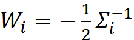
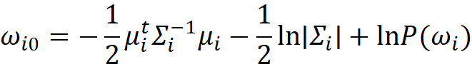

</head>

<body lang=TR style='tab-interval:35.3pt'>

<b>Designing a Bayes
Classifier for the given class conditional densities:<o:p></o:p></b>

<o:p>&nbsp;</o:p>

To classify a
given point into two classes, represented by the give mean values and
covariance matrices, values of discriminant functions for the two classes
should be calculated.<o:p></o:p>

<o:p>&nbsp;</o:p>

For arbitrary
covariance matrices,<o:p></o:p>

<o:p>&nbsp;</o:p>

<!--[if gte vml 1]><v:shapetype id="_x0000_t75"
 coordsize="21600,21600" o:spt="75" o:preferrelative="t" path="m@4@5l@4@11@9@11@9@5xe"
 filled="f" stroked="f">
 <v:stroke joinstyle="miter"/>
 <v:formulas>
  <v:f eqn="if lineDrawn pixelLineWidth 0"/>
  <v:f eqn="sum @0 1 0"/>
  <v:f eqn="sum 0 0 @1"/>
  <v:f eqn="prod @2 1 2"/>
  <v:f eqn="prod @3 21600 pixelWidth"/>
  <v:f eqn="prod @3 21600 pixelHeight"/>
  <v:f eqn="sum @0 0 1"/>
  <v:f eqn="prod @6 1 2"/>
  <v:f eqn="prod @7 21600 pixelWidth"/>
  <v:f eqn="sum @8 21600 0"/>
  <v:f eqn="prod @7 21600 pixelHeight"/>
  <v:f eqn="sum @10 21600 0"/>
 </v:formulas>
 <v:path o:extrusionok="f" gradientshapeok="t" o:connecttype="rect"/>
 <o:lock v:ext="edit" aspectratio="t"/>
</v:shapetype><v:shape id="Resim_x0020_4" o:spid="_x0000_i1028" type="#_x0000_t75"
 style='width:141.3pt;height:14.7pt;visibility:visible;mso-wrap-style:square'>
 <v:imagedata src="readme_files/image001.png" o:title=""
  chromakey="white"/>
</v:shape><![endif]--><![if !vml]><![endif]><o:p></o:p>

<o:p>&nbsp;</o:p>

where<o:p></o:p>

<o:p>&nbsp;</o:p>

<!--[if gte vml 1]><v:shape id="Resim_x0020_5" o:spid="_x0000_i1027"
 type="#_x0000_t75" style='width:66.3pt;height:20.1pt;visibility:visible;
 mso-wrap-style:square'>
 <v:imagedata src="readme_files/image003.png" o:title=""
  chromakey="white"/>
</v:shape><![endif]--><![if !vml]><![endif]>,<o:p></o:p>

<o:p>&nbsp;</o:p>

<!--[if gte vml 1]><v:shape id="Resim_x0020_6"
 o:spid="_x0000_i1026" type="#_x0000_t75" style='width:57.6pt;height:14.7pt;
 visibility:visible;mso-wrap-style:square'>
 <v:imagedata src="readme_files/image005.png" o:title=""
  chromakey="white"/>
</v:shape><![endif]--><![if !vml]><![endif]><o:p></o:p>

<o:p>&nbsp;</o:p>

and<o:p></o:p>

<o:p>&nbsp;</o:p>

<!--[if gte vml 1]><v:shape id="Resim_x0020_7"
 o:spid="_x0000_i1025" type="#_x0000_t75" style='width:198.3pt;height:27pt;
 visibility:visible;mso-wrap-style:square'>
 <v:imagedata src="readme_files/image007.png" o:title=""
  chromakey="white"/>
</v:shape><![endif]--><![if !vml]><![endif]><o:p></o:p>

<o:p>&nbsp;</o:p>

<o:p>&nbsp;</o:p>

Each point from
the test arrays is evaluated using the above discriminant function with the
given two covariance matrices. The class with greater discriminant function
output is chosen.<o:p></o:p>

 <o:p></o:p>

<o:p>&nbsp;</o:p>

</body>

</html>
