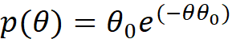
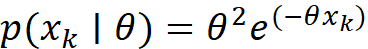
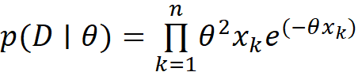
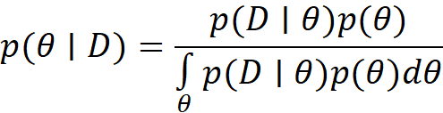
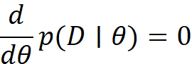
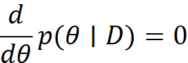
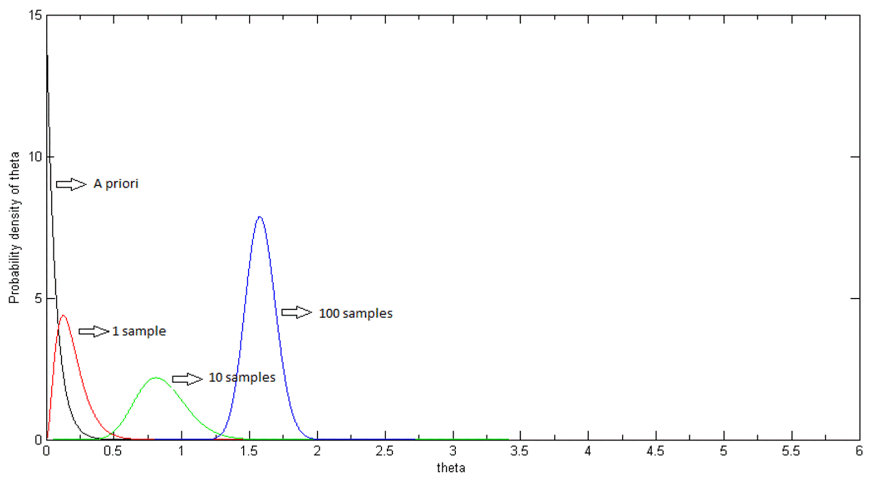
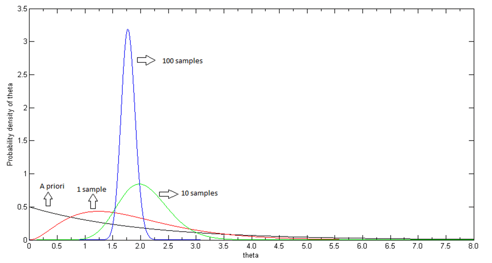

</head>

<body lang=TR style='tab-interval:35.3pt'>

<b><u>A priori and a
posteriori p.d.f:</u></b>

A priori probability density of  the parameter &#952;
:

<o:p>&nbsp;</o:p>

<!--[if gte msEquation 12]><m:oMathPara><m:oMathParaPr><m:jc
   m:val="center"/></m:oMathParaPr><m:oMath><i style='mso-bidi-font-style:normal'><m:r>p</m:r><m:r>(</m:r><m:r>&#952;</m:r><m:r>)</m:r></i><m:r><m:rPr><m:scr m:val="roman"/><m:sty
     m:val="p"/></m:rPr>=</m:r><m:sSub><m:sSubPr><m:ctrlPr></m:ctrlPr></m:sSubPr><m:e><i
    style='mso-bidi-font-style:normal'><m:r>&#952;</m:r></i></m:e><m:sub><i
    style='mso-bidi-font-style:normal'><m:r>0</m:r></i></m:sub></m:sSub><m:sSup><m:sSupPr><m:ctrlPr></m:ctrlPr></m:sSupPr><m:e><i
    style='mso-bidi-font-style:normal'><m:r>e</m:r></i></m:e><m:sup><i
    style='mso-bidi-font-style:normal'><m:r>(</m:r></i><m:r><m:rPr><m:scr m:val="roman"/><m:sty
       m:val="p"/></m:rPr>-</m:r><m:r><i style='mso-bidi-font-style:normal'>&#952;</i></m:r><m:sSub><m:sSubPr><m:ctrlPr></m:ctrlPr></m:sSubPr><m:e><i
      style='mso-bidi-font-style:normal'><m:r>&#952;</m:r></i></m:e><m:sub><i
      style='mso-bidi-font-style:normal'><m:r>0</m:r></i></m:sub></m:sSub><i
    style='mso-bidi-font-style:normal'><m:r>)</m:r></i></m:sup></m:sSup></m:oMath></m:oMathPara><![endif]--><![if !msEquation]><!--[if gte vml 1]><v:shapetype
 id="_x0000_t75" coordsize="21600,21600" o:spt="75" o:preferrelative="t"
 path="m@4@5l@4@11@9@11@9@5xe" filled="f" stroked="f">
 <v:stroke joinstyle="miter"/>
 <v:formulas>
  <v:f eqn="if lineDrawn pixelLineWidth 0"/>
  <v:f eqn="sum @0 1 0"/>
  <v:f eqn="sum 0 0 @1"/>
  <v:f eqn="prod @2 1 2"/>
  <v:f eqn="prod @3 21600 pixelWidth"/>
  <v:f eqn="prod @3 21600 pixelHeight"/>
  <v:f eqn="sum @0 0 1"/>
  <v:f eqn="prod @6 1 2"/>
  <v:f eqn="prod @7 21600 pixelWidth"/>
  <v:f eqn="sum @8 21600 0"/>
  <v:f eqn="prod @7 21600 pixelHeight"/>
  <v:f eqn="sum @10 21600 0"/>
 </v:formulas>
 <v:path o:extrusionok="f" gradientshapeok="t" o:connecttype="rect"/>
 <o:lock v:ext="edit" aspectratio="t"/>
</v:shapetype><v:shape id="_x0000_i1025" type="#_x0000_t75" style='width:86.7pt;
 height:14.7pt'>
 <v:imagedata src="readme_files/image001.png" o:title="" chromakey="white"/>
</v:shape><![endif]--><![if !vml]><![endif]><![endif]><o:p></o:p>

<o:p>&nbsp;</o:p>

Probability density function of
the provided samples:

<o:p>&nbsp;</o:p>

<!--[if gte msEquation 12]><m:oMathPara><m:oMathParaPr><m:jc
   m:val="center"/></m:oMathParaPr><m:oMath><i style='mso-bidi-font-style:normal'><m:r>p</m:r><m:r>(</m:r></i><m:sSub><m:sSubPr><m:ctrlPr></m:ctrlPr></m:sSubPr><m:e><i
    style='mso-bidi-font-style:normal'><m:r>x</m:r></i></m:e><m:sub><i
    style='mso-bidi-font-style:normal'><m:r>k</m:r></i></m:sub></m:sSub><m:r><m:rPr><m:scr m:val="roman"/><m:sty
     m:val="p"/></m:rPr>&#8739;</m:r><m:r><i style='mso-bidi-font-style:normal'>&#952;</i></m:r><m:r><i
   style='mso-bidi-font-style:normal'>)</i></m:r><m:r><m:rPr><m:scr m:val="roman"/><m:sty
     m:val="p"/></m:rPr>=</m:r><m:sSup><m:sSupPr><m:ctrlPr></m:ctrlPr></m:sSupPr><m:e><i
    style='mso-bidi-font-style:normal'><m:r>&#952;</m:r></i></m:e><m:sup><i
    style='mso-bidi-font-style:normal'><m:r>2</m:r></i></m:sup></m:sSup><m:sSup><m:sSupPr><m:ctrlPr></m:ctrlPr></m:sSupPr><m:e><i
    style='mso-bidi-font-style:normal'><m:r>e</m:r></i></m:e><m:sup><i
    style='mso-bidi-font-style:normal'><m:r>(</m:r></i><m:r><m:rPr><m:scr m:val="roman"/><m:sty
       m:val="p"/></m:rPr>-</m:r><m:r><i style='mso-bidi-font-style:normal'>&#952;</i></m:r><m:sSub><m:sSubPr><m:ctrlPr></m:ctrlPr></m:sSubPr><m:e><i
      style='mso-bidi-font-style:normal'><m:r>x</m:r></i></m:e><m:sub><i
      style='mso-bidi-font-style:normal'><m:r>k</m:r></i></m:sub></m:sSub><i
    style='mso-bidi-font-style:normal'><m:r>)</m:r></i></m:sup></m:sSup></m:oMath></m:oMathPara><![endif]--><![if !msEquation]><!--[if gte vml 1]><v:shape
 id="_x0000_i1025" type="#_x0000_t75" style='width:110.4pt;height:14.7pt'>
 <v:imagedata src="readme_files/image003.png" o:title="" chromakey="white"/>
</v:shape><![endif]--><![if !vml]><![endif]><![endif]><o:p></o:p>

<o:p>&nbsp;</o:p>

Using the p.d.f. of the given samples, we can find the <u>likelihood</u>
for n samples:

<o:p>&nbsp;</o:p>

<!--[if gte msEquation 12]><m:oMathPara><m:oMathParaPr><m:jc
   m:val="center"/></m:oMathParaPr><m:oMath><i style='mso-bidi-font-style:normal'><m:r>p</m:r><m:r>(</m:r><m:r>D</m:r></i><m:r><m:rPr><m:scr m:val="roman"/><m:sty
     m:val="p"/></m:rPr>&#8739;</m:r><m:r><i style='mso-bidi-font-style:normal'>&#952;</i></m:r><m:r><i
   style='mso-bidi-font-style:normal'>)</i></m:r><m:r><m:rPr><m:scr m:val="roman"/><m:sty
     m:val="p"/></m:rPr>=</m:r><m:limUpp><m:limUppPr><m:ctrlPr></m:ctrlPr></m:limUppPr><m:e><m:limLow><m:limLowPr><m:ctrlPr></m:ctrlPr></m:limLowPr><m:e><m:r><m:rPr><m:scr m:val="roman"/><m:sty
         m:val="p"/></m:rPr>&#8719;</m:r></m:e><m:lim><i
      style='mso-bidi-font-style:normal'><m:r>k</m:r></i><m:r><m:rPr><m:scr m:val="roman"/><m:sty
         m:val="p"/></m:rPr>=</m:r><m:r><i style='mso-bidi-font-style:normal'>1</i></m:r></m:lim></m:limLow></m:e><m:lim><i
    style='mso-bidi-font-style:normal'><m:r>n</m:r></i></m:lim></m:limUpp><m:sSup><m:sSupPr><m:ctrlPr></m:ctrlPr></m:sSupPr><m:e><i
    style='mso-bidi-font-style:normal'><m:r>&#952;</m:r></i></m:e><m:sup><i
    style='mso-bidi-font-style:normal'><m:r>2</m:r></i></m:sup></m:sSup><m:sSub><m:sSubPr><m:ctrlPr></m:ctrlPr></m:sSubPr><m:e><i
    style='mso-bidi-font-style:normal'><m:r>x</m:r></i></m:e><m:sub><i
    style='mso-bidi-font-style:normal'><m:r>k</m:r></i></m:sub></m:sSub><m:sSup><m:sSupPr><m:ctrlPr></m:ctrlPr></m:sSupPr><m:e><i
    style='mso-bidi-font-style:normal'><m:r>e</m:r></i></m:e><m:sup><i
    style='mso-bidi-font-style:normal'><m:r>(</m:r></i><m:r><m:rPr><m:scr m:val="roman"/><m:sty
       m:val="p"/></m:rPr>-</m:r><m:r><i style='mso-bidi-font-style:normal'>&#952;</i></m:r><m:sSub><m:sSubPr><m:ctrlPr></m:ctrlPr></m:sSubPr><m:e><i
      style='mso-bidi-font-style:normal'><m:r>x</m:r></i></m:e><m:sub><i
      style='mso-bidi-font-style:normal'><m:r>k</m:r></i></m:sub></m:sSub><i
    style='mso-bidi-font-style:normal'><m:r>)</m:r></i></m:sup></m:sSup></m:oMath></m:oMathPara><![endif]--><![if !msEquation]><!--[if gte vml 1]><v:shape
 id="_x0000_i1025" type="#_x0000_t75" style='width:135.6pt;height:27.3pt'>
 <v:imagedata src="readme_files/image005.png" o:title="" chromakey="white"/>
</v:shape><![endif]--><![if !vml]><![endif]><![endif]><o:p></o:p>

<o:p>&nbsp;</o:p>

We know from Bayes' Theorem that,

<o:p>&nbsp;</o:p>

a posteriori = 
likelihood * a priori / evidence<o:p></o:p>

<o:p>&nbsp;</o:p>

 <o:p></o:p>

<!--[if gte msEquation 12]><m:oMathPara><m:oMathParaPr><m:jc
   m:val="center"/></m:oMathParaPr><m:oMath><i style='mso-bidi-font-style:normal'><m:r>p</m:r><m:r>(</m:r><m:r>&#952;</m:r></i><m:r><m:rPr><m:scr m:val="roman"/><m:sty
     m:val="p"/></m:rPr>&#8739;</m:r><m:r><i style='mso-bidi-font-style:normal'>D</i></m:r><m:r><i
   style='mso-bidi-font-style:normal'>)</i></m:r><m:r><m:rPr><m:scr m:val="roman"/><m:sty
     m:val="p"/></m:rPr>=</m:r><m:f><m:fPr><m:ctrlPr></m:ctrlPr></m:fPr><m:num><i
    style='mso-bidi-font-style:normal'><m:r>p</m:r><m:r>(</m:r><m:r>D</m:r></i><m:r><m:rPr><m:scr m:val="roman"/><m:sty
       m:val="p"/></m:rPr>&#8739;</m:r><m:r><i style='mso-bidi-font-style:normal'>&#952;</i></m:r><m:r><i
     style='mso-bidi-font-style:normal'>)</i></m:r><m:r><i style='mso-bidi-font-style:
     normal'>p</i></m:r><m:r><i style='mso-bidi-font-style:normal'>(</i></m:r><m:r><i
     style='mso-bidi-font-style:normal'>&#952;</i></m:r><m:r><i
     style='mso-bidi-font-style:normal'>)</i></m:r></m:num><m:den><m:limLow><m:limLowPr><m:ctrlPr></m:ctrlPr></m:limLowPr><m:e><m:r><m:rPr><m:scr m:val="roman"/><m:sty
         m:val="p"/></m:rPr>&#8747;</m:r></m:e><m:lim><i
      style='mso-bidi-font-style:normal'><m:r>&#952;</m:r></i></m:lim></m:limLow><i
    style='mso-bidi-font-style:normal'><m:r>p</m:r><m:r>(</m:r><m:r>D</m:r></i><m:r><m:rPr><m:scr m:val="roman"/><m:sty
       m:val="p"/></m:rPr>&#8739;</m:r><m:r><i style='mso-bidi-font-style:normal'>&#952;</i></m:r><m:r><i
     style='mso-bidi-font-style:normal'>)</i></m:r><m:r><i style='mso-bidi-font-style:
     normal'>p</i></m:r><m:r><i style='mso-bidi-font-style:normal'>(</i></m:r><m:r><i
     style='mso-bidi-font-style:normal'>&#952;</i></m:r><m:r><i
     style='mso-bidi-font-style:normal'>)</i></m:r><m:r><i style='mso-bidi-font-style:
     normal'>d&#952;</i></m:r></m:den></m:f></m:oMath></m:oMathPara><![endif]--><![if !msEquation]><!--[if gte vml 1]><v:shape
 id="_x0000_i1025" type="#_x0000_t75" style='width:148.5pt;height:38.1pt'>
 <v:imagedata src="readme_files/image007.png" o:title="" chromakey="white"/>
</v:shape><![endif]--><![if !vml]><![endif]><![endif]><o:p></o:p>

<o:p>&nbsp;</o:p>

<b><u>Maximum Likelihood,
Maximum A Posteriori:</u></b><o:p></o:p>

<o:p>&nbsp;</o:p>

<o:p>&nbsp;</o:p>

Maximum Likelihood (ML) estimation for the given samples is
calculated by differentiating the likelihood equation with respect to &#952;
and solving the equation:

<o:p>&nbsp;</o:p>

<!--[if gte msEquation 12]><m:oMathPara><m:oMathParaPr><m:jc
   m:val="center"/></m:oMathParaPr><m:oMath><m:f><m:fPr><m:ctrlPr></m:ctrlPr></m:fPr><m:num><i
    style='mso-bidi-font-style:normal'><m:r>d</m:r></i></m:num><m:den><i
    style='mso-bidi-font-style:normal'><m:r>d&#952;</m:r></i></m:den></m:f><i
  style='mso-bidi-font-style:normal'><m:r>p</m:r><m:r>(</m:r><m:r>D</m:r></i><m:r><m:rPr><m:scr m:val="roman"/><m:sty
     m:val="p"/></m:rPr>&#8739;</m:r><m:r><i style='mso-bidi-font-style:normal'>&#952;</i></m:r><m:r><i
   style='mso-bidi-font-style:normal'>)</i></m:r><m:r><m:rPr><m:scr m:val="roman"/><m:sty
     m:val="p"/></m:rPr>=</m:r><m:r><i style='mso-bidi-font-style:normal'>0</i></m:r></m:oMath></m:oMathPara><![endif]--><![if !msEquation]><!--[if gte vml 1]><v:shape
 id="_x0000_i1025" type="#_x0000_t75" style='width:81pt;height:27.3pt'>
 <v:imagedata src="readme_files/image009.png" o:title="" chromakey="white"/>
</v:shape><![endif]--><![if !vml]><![endif]><![endif]>

Maximum A Posteriori (MAP) estimation for the given samples
is calculated by differentiating the a posteriori p.d.f. of  &#952; 
solving the equation:

<o:p>&nbsp;</o:p>

<!--[if gte msEquation 12]><m:oMathPara><m:oMathParaPr><m:jc
   m:val="center"/></m:oMathParaPr><m:oMath><m:f><m:fPr><m:ctrlPr></m:ctrlPr></m:fPr><m:num><i
    style='mso-bidi-font-style:normal'><m:r>d</m:r></i></m:num><m:den><i
    style='mso-bidi-font-style:normal'><m:r>d&#952;</m:r></i></m:den></m:f><i
  style='mso-bidi-font-style:normal'><m:r>p</m:r><m:r>(</m:r><m:r>&#952;</m:r></i><m:r><m:rPr><m:scr m:val="roman"/><m:sty
     m:val="p"/></m:rPr>&#8739;</m:r><m:r><i style='mso-bidi-font-style:normal'>D</i></m:r><m:r><i
   style='mso-bidi-font-style:normal'>)</i></m:r><m:r><m:rPr><m:scr m:val="roman"/><m:sty
     m:val="p"/></m:rPr>=</m:r><m:r><i style='mso-bidi-font-style:normal'>0</i></m:r></m:oMath></m:oMathPara><![endif]--><![if !msEquation]><!--[if gte vml 1]><v:shape
 id="_x0000_i1025" type="#_x0000_t75" style='width:81pt;height:27.3pt'>
 <v:imagedata src="readme_files/image011.png" o:title="" chromakey="white"/>
</v:shape><![endif]--><![if !vml]><![endif]><![endif]>

<o:p>&nbsp;</o:p>

Minimum Mean Square Estimation for the given samples is
calculated finding the expected value of the a posteriori p.d.f over the
interval that &#952; is specified :

<o:p>&nbsp;</o:p>

<!--[if gte msEquation 12]><m:oMathPara><m:oMathParaPr><m:jc
   m:val="center"/></m:oMathParaPr><m:oMath><m:sSub><m:sSubPr><m:ctrlPr></m:ctrlPr></m:sSubPr><m:e><i
    style='mso-bidi-font-style:normal'><m:r>MMSE</m:r></i></m:e><m:sub><i
    style='mso-bidi-font-style:normal'><m:r>&#952;</m:r></i></m:sub></m:sSub><m:r><m:rPr><m:scr m:val="roman"/><m:sty
     m:val="p"/></m:rPr>=</m:r><m:limLow><m:limLowPr><m:ctrlPr></m:ctrlPr></m:limLowPr><m:e><m:r><m:rPr><m:scr m:val="roman"/><m:sty
       m:val="p"/></m:rPr>&#8747;</m:r></m:e><m:lim><i style='mso-bidi-font-style:
    normal'><m:r>&#952;</m:r></i></m:lim></m:limLow><i
  style='mso-bidi-font-style:normal'><m:r>&#952;p</m:r><m:r>(</m:r><m:r>&#952;</m:r></i><m:r><m:rPr><m:scr m:val="roman"/><m:sty
     m:val="p"/></m:rPr>&#8739;</m:r><m:r><i style='mso-bidi-font-style:normal'>D</i></m:r><m:r><i
   style='mso-bidi-font-style:normal'>)</i></m:r><m:r><i style='mso-bidi-font-style:
   normal'>d&#952;</i></m:r></m:oMath></m:oMathPara><![endif]--><![if !msEquation]><!--[if gte vml 1]><v:shape
 id="_x0000_i1025" type="#_x0000_t75" style='width:128.4pt;height:22.2pt'>
 <v:imagedata src="readme_files/image013.png" o:title="" chromakey="white"/>
</v:shape><![endif]--><![if !vml]><![endif]><![endif]>

<o:p>&nbsp;</o:p>

<b><u>Test Results:<o:p></o:p></u></b>

<o:p>&nbsp;</o:p>

For  &#952;0
= 15, plots for the a priori p.d.f. and a posteri p.d.f.s calculated after 1,10
and 100 samples are shown on the figure below. A posteriori p.d.f. after 1000
samples could be calculated, however, because of MATLAB number limitations, it
couldn't be plotted.

<o:p>&nbsp;</o:p>

<!--[if gte vml 1]><o:wrapblock><v:shape id="graphics1"
  o:spid="_x0000_s1027" type="#_x0000_t75" style='position:absolute;
  margin-left:0;margin-top:0;width:481.85pt;height:263.4pt;z-index:251658240;
  visibility:visible;mso-wrap-style:square;mso-wrap-distance-left:9pt;
  mso-wrap-distance-top:0;mso-wrap-distance-right:9pt;
  mso-wrap-distance-bottom:0;mso-position-horizontal:center;
  mso-position-horizontal-relative:text;mso-position-vertical:top;
  mso-position-vertical-relative:text'>
  <v:imagedata src="readme_files/image015.png" o:title=""/>
  <w:wrap type="topAndBottom"/>
 </v:shape><![endif]--><![if !vml]><![endif]><!--[if gte vml 1]></o:wrapblock><![endif]--> 

<o:p>&nbsp;</o:p>

Following table shows the estimated values for  &#952; after observing 1,10,100 and 1000
samples.

<o:p>&nbsp;</o:p>

<table class=MsoNormalTable border=0 cellspacing=0 cellpadding=0 width=642
 style='border-collapse:collapse;mso-table-layout-alt:fixed;mso-yfti-tbllook:
 1184;mso-padding-alt:0cm .5pt 0cm .5pt'>
 <tr style='mso-yfti-irow:0;mso-yfti-firstrow:yes'>
  <td width=128 valign=top style='width:96.35pt;border:solid black 1.0pt;
  border-right:none;mso-border-top-alt:solid black .25pt;mso-border-left-alt:
  solid black .25pt;mso-border-bottom-alt:solid black .25pt;padding:2.75pt 2.75pt 2.75pt 2.75pt'>
  
<o:p>&nbsp;</o:p>

  </td>
  <td width=128 valign=top style='width:96.35pt;border:solid black 1.0pt;
  border-right:none;mso-border-top-alt:solid black .25pt;mso-border-left-alt:
  solid black .25pt;mso-border-bottom-alt:solid black .25pt;padding:2.75pt 2.75pt 2.75pt 2.75pt'>
  
1 Sample

  </td>
  <td width=128 valign=top style='width:96.35pt;border:solid black 1.0pt;
  border-right:none;mso-border-top-alt:solid black .25pt;mso-border-left-alt:
  solid black .25pt;mso-border-bottom-alt:solid black .25pt;padding:2.75pt 2.75pt 2.75pt 2.75pt'>
  
10 Samples

  </td>
  <td width=128 valign=top style='width:96.35pt;border:solid black 1.0pt;
  border-right:none;mso-border-top-alt:solid black .25pt;mso-border-left-alt:
  solid black .25pt;mso-border-bottom-alt:solid black .25pt;padding:2.75pt 2.75pt 2.75pt 2.75pt'>
  
100 Samples

  </td>
  <td width=128 valign=top style='width:96.35pt;border:solid black 1.0pt;
  mso-border-alt:solid black .25pt;padding:2.75pt 2.75pt 2.75pt 2.75pt'>
  
1000 Samples

  </td>
 </tr>
 <tr style='mso-yfti-irow:1'>
  <td width=128 valign=top style='width:96.35pt;border-top:none;border-left:
  solid black 1.0pt;border-bottom:solid black 1.0pt;border-right:none;
  mso-border-left-alt:solid black .25pt;mso-border-bottom-alt:solid black .25pt;
  padding:2.75pt 2.75pt 2.75pt 2.75pt'>
  
ML Estimate

  </td>
  <td width=128 valign=top style='width:96.35pt;border-top:none;border-left:
  solid black 1.0pt;border-bottom:solid black 1.0pt;border-right:none;
  mso-border-left-alt:solid black .25pt;mso-border-bottom-alt:solid black .25pt;
  padding:2.75pt 2.75pt 2.75pt 2.75pt'>
  
1.81

  </td>
  <td width=128 valign=top style='width:96.35pt;border-top:none;border-left:
  solid black 1.0pt;border-bottom:solid black 1.0pt;border-right:none;
  mso-border-left-alt:solid black .25pt;mso-border-bottom-alt:solid black .25pt;
  padding:2.75pt 2.75pt 2.75pt 2.75pt'>
  
2.09

  </td>
  <td width=128 valign=top style='width:96.35pt;border-top:none;border-left:
  solid black 1.0pt;border-bottom:solid black 1.0pt;border-right:none;
  mso-border-left-alt:solid black .25pt;mso-border-bottom-alt:solid black .25pt;
  padding:2.75pt 2.75pt 2.75pt 2.75pt'>
  
1.78

  </td>
  <td width=128 valign=top style='width:96.35pt;border:solid black 1.0pt;
  border-top:none;mso-border-left-alt:solid black .25pt;mso-border-bottom-alt:
  solid black .25pt;mso-border-right-alt:solid black .25pt;padding:2.75pt 2.75pt 2.75pt 2.75pt'>
  
1.76

  </td>
 </tr>
 <tr style='mso-yfti-irow:2'>
  <td width=128 valign=top style='width:96.35pt;border-top:none;border-left:
  solid black 1.0pt;border-bottom:solid black 1.0pt;border-right:none;
  mso-border-left-alt:solid black .25pt;mso-border-bottom-alt:solid black .25pt;
  padding:2.75pt 2.75pt 2.75pt 2.75pt'>
  
MAP Estimate

  </td>
  <td width=128 valign=top style='width:96.35pt;border-top:none;border-left:
  solid black 1.0pt;border-bottom:solid black 1.0pt;border-right:none;
  mso-border-left-alt:solid black .25pt;mso-border-bottom-alt:solid black .25pt;
  padding:2.75pt 2.75pt 2.75pt 2.75pt'>
  
0.124

  </td>
  <td width=128 valign=top style='width:96.35pt;border-top:none;border-left:
  solid black 1.0pt;border-bottom:solid black 1.0pt;border-right:none;
  mso-border-left-alt:solid black .25pt;mso-border-bottom-alt:solid black .25pt;
  padding:2.75pt 2.75pt 2.75pt 2.75pt'>
  
0.813

  </td>
  <td width=128 valign=top style='width:96.35pt;border-top:none;border-left:
  solid black 1.0pt;border-bottom:solid black 1.0pt;border-right:none;
  mso-border-left-alt:solid black .25pt;mso-border-bottom-alt:solid black .25pt;
  padding:2.75pt 2.75pt 2.75pt 2.75pt'>
  
1.57

  </td>
  <td width=128 valign=top style='width:96.35pt;border:solid black 1.0pt;
  border-top:none;mso-border-left-alt:solid black .25pt;mso-border-bottom-alt:
  solid black .25pt;mso-border-right-alt:solid black .25pt;padding:2.75pt 2.75pt 2.75pt 2.75pt'>
  
1.73

  </td>
 </tr>
 <tr style='mso-yfti-irow:3;mso-yfti-lastrow:yes'>
  <td width=128 valign=top style='width:96.35pt;border-top:none;border-left:
  solid black 1.0pt;border-bottom:solid black 1.0pt;border-right:none;
  mso-border-left-alt:solid black .25pt;mso-border-bottom-alt:solid black .25pt;
  padding:2.75pt 2.75pt 2.75pt 2.75pt'>
  
MMSE Estimate

  </td>
  <td width=128 valign=top style='width:96.35pt;border-top:none;border-left:
  solid black 1.0pt;border-bottom:solid black 1.0pt;border-right:none;
  mso-border-left-alt:solid black .25pt;mso-border-bottom-alt:solid black .25pt;
  padding:2.75pt 2.75pt 2.75pt 2.75pt'>
  
0.186

  </td>
  <td width=128 valign=top style='width:96.35pt;border-top:none;border-left:
  solid black 1.0pt;border-bottom:solid black 1.0pt;border-right:none;
  mso-border-left-alt:solid black .25pt;mso-border-bottom-alt:solid black .25pt;
  padding:2.75pt 2.75pt 2.75pt 2.75pt'>
  
0.854

  </td>
  <td width=128 valign=top style='width:96.35pt;border-top:none;border-left:
  solid black 1.0pt;border-bottom:solid black 1.0pt;border-right:none;
  mso-border-left-alt:solid black .25pt;mso-border-bottom-alt:solid black .25pt;
  padding:2.75pt 2.75pt 2.75pt 2.75pt'>
  
1.58

  </td>
  <td width=128 valign=top style='width:96.35pt;border:solid black 1.0pt;
  border-top:none;mso-border-left-alt:solid black .25pt;mso-border-bottom-alt:
  solid black .25pt;mso-border-right-alt:solid black .25pt;padding:2.75pt 2.75pt 2.75pt 2.75pt'>
  
1.73

  </td>
 </tr>
</table>

<b><o:p>&nbsp;</o:p></b>

<o:p>&nbsp;</o:p>

Results obtained for ML, MAP and MMSE gets similar as the
number of samples increases. The reason for the large difference between ML and
MAP estimates ,also between ML and MMSE estimates, for smaller observed sample
numbers is the fact that ML relies directly on the observed data where MAP and
MMSE takes into account the a priori density. For this reason, ML may be a good
start when no prior information exists. Once it is found, it can be used as an initial value for an
MAP or Bayes solution.

The values obtained for MAP and MMSE differs slightly.
Difference results from the fact that MAP gives the peak value of a posteriori
where the product of MMSE is the mean of it.

<b><o:p>&nbsp;</o:p></b>

<b>c) </b>For  &#952;0
= 0.5, plots for the a priori p.d.f. and a posteri p.d.f.s calculated after
1,10 and 100 samples are shown on the figure below. A posteriori p.d.f. after
1000 samples could be calculated, however, because of MATLAB number
limitations, it couldn't be plotted. 
<![if !supportLineBreakNewLine]> 
<![endif]>

<!--[if gte vml 1]><o:wrapblock><v:shape id="graphics2"
  o:spid="_x0000_s1026" type="#_x0000_t75" style='position:absolute;
  margin-left:0;margin-top:0;width:481.85pt;height:258.55pt;z-index:4;
  visibility:visible;mso-wrap-style:square;mso-wrap-distance-left:9pt;
  mso-wrap-distance-top:0;mso-wrap-distance-right:9pt;
  mso-wrap-distance-bottom:0;mso-position-horizontal:center;
  mso-position-horizontal-relative:text;mso-position-vertical:top;
  mso-position-vertical-relative:text'>
  <v:imagedata src="readme_files/image017.png" o:title=""/>
  <w:wrap type="topAndBottom"/>
 </v:shape><![endif]--><![if !vml]><![endif]><!--[if gte vml 1]></o:wrapblock><![endif]--> 

Following table shows the estimated values for  &#952; after observing 1,10,100 and 1000
samples.

<o:p>&nbsp;</o:p>

<table class=MsoNormalTable border=0 cellspacing=0 cellpadding=0 width=642
 style='border-collapse:collapse;mso-table-layout-alt:fixed;mso-yfti-tbllook:
 1184;mso-padding-alt:0cm .5pt 0cm .5pt'>
 <tr style='mso-yfti-irow:0;mso-yfti-firstrow:yes'>
  <td width=128 valign=top style='width:96.35pt;border:solid black 1.0pt;
  border-right:none;mso-border-top-alt:solid black .25pt;mso-border-left-alt:
  solid black .25pt;mso-border-bottom-alt:solid black .25pt;padding:2.75pt 2.75pt 2.75pt 2.75pt'>
  
<o:p>&nbsp;</o:p>

  </td>
  <td width=128 valign=top style='width:96.35pt;border:solid black 1.0pt;
  border-right:none;mso-border-top-alt:solid black .25pt;mso-border-left-alt:
  solid black .25pt;mso-border-bottom-alt:solid black .25pt;padding:2.75pt 2.75pt 2.75pt 2.75pt'>
  
1 Sample

  </td>
  <td width=128 valign=top style='width:96.35pt;border:solid black 1.0pt;
  border-right:none;mso-border-top-alt:solid black .25pt;mso-border-left-alt:
  solid black .25pt;mso-border-bottom-alt:solid black .25pt;padding:2.75pt 2.75pt 2.75pt 2.75pt'>
  
10 Samples

  </td>
  <td width=128 valign=top style='width:96.35pt;border:solid black 1.0pt;
  border-right:none;mso-border-top-alt:solid black .25pt;mso-border-left-alt:
  solid black .25pt;mso-border-bottom-alt:solid black .25pt;padding:2.75pt 2.75pt 2.75pt 2.75pt'>
  
100 Samples

  </td>
  <td width=128 valign=top style='width:96.35pt;border:solid black 1.0pt;
  mso-border-alt:solid black .25pt;padding:2.75pt 2.75pt 2.75pt 2.75pt'>
  
1000 Samples

  </td>
 </tr>
 <tr style='mso-yfti-irow:1'>
  <td width=128 valign=top style='width:96.35pt;border-top:none;border-left:
  solid black 1.0pt;border-bottom:solid black 1.0pt;border-right:none;
  mso-border-left-alt:solid black .25pt;mso-border-bottom-alt:solid black .25pt;
  padding:2.75pt 2.75pt 2.75pt 2.75pt'>
  
ML Estimate

  </td>
  <td width=128 valign=top style='width:96.35pt;border-top:none;border-left:
  solid black 1.0pt;border-bottom:solid black 1.0pt;border-right:none;
  mso-border-left-alt:solid black .25pt;mso-border-bottom-alt:solid black .25pt;
  padding:2.75pt 2.75pt 2.75pt 2.75pt'>
  
1.81

  </td>
  <td width=128 valign=top style='width:96.35pt;border-top:none;border-left:
  solid black 1.0pt;border-bottom:solid black 1.0pt;border-right:none;
  mso-border-left-alt:solid black .25pt;mso-border-bottom-alt:solid black .25pt;
  padding:2.75pt 2.75pt 2.75pt 2.75pt'>
  
2.09

  </td>
  <td width=128 valign=top style='width:96.35pt;border-top:none;border-left:
  solid black 1.0pt;border-bottom:solid black 1.0pt;border-right:none;
  mso-border-left-alt:solid black .25pt;mso-border-bottom-alt:solid black .25pt;
  padding:2.75pt 2.75pt 2.75pt 2.75pt'>
  
1.78

  </td>
  <td width=128 valign=top style='width:96.35pt;border:solid black 1.0pt;
  border-top:none;mso-border-left-alt:solid black .25pt;mso-border-bottom-alt:
  solid black .25pt;mso-border-right-alt:solid black .25pt;padding:2.75pt 2.75pt 2.75pt 2.75pt'>
  
1.76

  </td>
 </tr>
 <tr style='mso-yfti-irow:2'>
  <td width=128 valign=top style='width:96.35pt;border-top:none;border-left:
  solid black 1.0pt;border-bottom:solid black 1.0pt;border-right:none;
  mso-border-left-alt:solid black .25pt;mso-border-bottom-alt:solid black .25pt;
  padding:2.75pt 2.75pt 2.75pt 2.75pt'>
  
MAP Estimate

  </td>
  <td width=128 valign=top style='width:96.35pt;border-top:none;border-left:
  solid black 1.0pt;border-bottom:solid black 1.0pt;border-right:none;
  mso-border-left-alt:solid black .25pt;mso-border-bottom-alt:solid black .25pt;
  padding:2.75pt 2.75pt 2.75pt 2.75pt'>
  
 1.25

  </td>
  <td width=128 valign=top style='width:96.35pt;border-top:none;border-left:
  solid black 1.0pt;border-bottom:solid black 1.0pt;border-right:none;
  mso-border-left-alt:solid black .25pt;mso-border-bottom-alt:solid black .25pt;
  padding:2.75pt 2.75pt 2.75pt 2.75pt'>
  
1.98

  </td>
  <td width=128 valign=top style='width:96.35pt;border-top:none;border-left:
  solid black 1.0pt;border-bottom:solid black 1.0pt;border-right:none;
  mso-border-left-alt:solid black .25pt;mso-border-bottom-alt:solid black .25pt;
  padding:2.75pt 2.75pt 2.75pt 2.75pt'>
  
1.77

  </td>
  <td width=128 valign=top style='width:96.35pt;border:solid black 1.0pt;
  border-top:none;mso-border-left-alt:solid black .25pt;mso-border-bottom-alt:
  solid black .25pt;mso-border-right-alt:solid black .25pt;padding:2.75pt 2.75pt 2.75pt 2.75pt'>
  
1.75

  </td>
 </tr>
 <tr style='mso-yfti-irow:3;mso-yfti-lastrow:yes'>
  <td width=128 valign=top style='width:96.35pt;border-top:none;border-left:
  solid black 1.0pt;border-bottom:solid black 1.0pt;border-right:none;
  mso-border-left-alt:solid black .25pt;mso-border-bottom-alt:solid black .25pt;
  padding:2.75pt 2.75pt 2.75pt 2.75pt'>
  
MMSE Estimate

  </td>
  <td width=128 valign=top style='width:96.35pt;border-top:none;border-left:
  solid black 1.0pt;border-bottom:solid black 1.0pt;border-right:none;
  mso-border-left-alt:solid black .25pt;mso-border-bottom-alt:solid black .25pt;
  padding:2.75pt 2.75pt 2.75pt 2.75pt'>
  
1.87

  </td>
  <td width=128 valign=top style='width:96.35pt;border-top:none;border-left:
  solid black 1.0pt;border-bottom:solid black 1.0pt;border-right:none;
  mso-border-left-alt:solid black .25pt;mso-border-bottom-alt:solid black .25pt;
  padding:2.75pt 2.75pt 2.75pt 2.75pt'>
  
2.03

  </td>
  <td width=128 valign=top style='width:96.35pt;border-top:none;border-left:
  solid black 1.0pt;border-bottom:solid black 1.0pt;border-right:none;
  mso-border-left-alt:solid black .25pt;mso-border-bottom-alt:solid black .25pt;
  padding:2.75pt 2.75pt 2.75pt 2.75pt'>
  
1.78

  </td>
  <td width=128 valign=top style='width:96.35pt;border:solid black 1.0pt;
  border-top:none;mso-border-left-alt:solid black .25pt;mso-border-bottom-alt:
  solid black .25pt;mso-border-right-alt:solid black .25pt;padding:2.75pt 2.75pt 2.75pt 2.75pt'>
  
1.76

  </td>
 </tr>
</table>

<o:p>&nbsp;</o:p>

The variation of the estimated values is explained for  &quot;&#952;0 = 15&quot; case.
Same reasons can be taken into account for also this case.

<o:p>&nbsp;</o:p>

<b>d) </b>As it can be seen from the plots of a priori
distribution for choices of &#952;0  = 15 and &#952;0  = 
0.5,  lowering the  &#952;0 value can be considered as
assuming that possible values of &#952; spread over a greater interval. It is
like being less sure about the true value of &#952;.<b><o:p></o:p></b>

<o:p>&nbsp;</o:p>

However, if the value for &#952;0 is too distant
to the true value of &#952;, it takes more time(more samples) for Bayesian
estimators to converge the true value. ML estimator isn't affected by the a
priori knowledge.<b><o:p></o:p></b>

</body>

</html>
