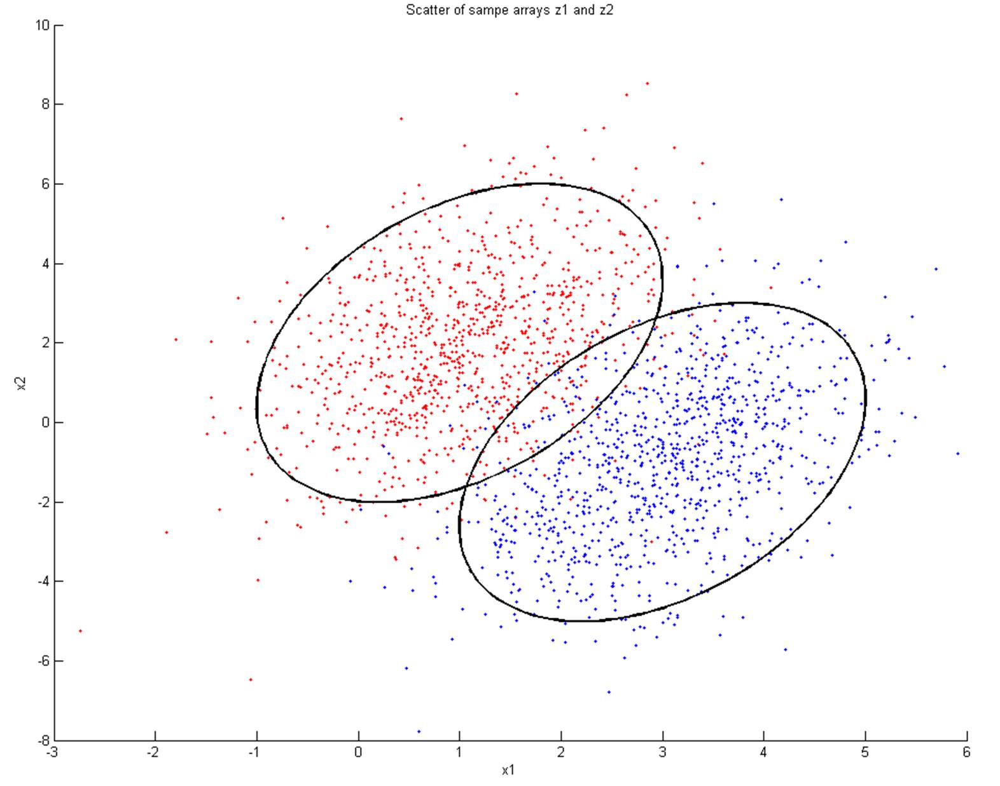
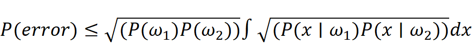
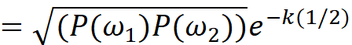
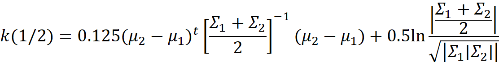
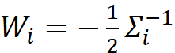
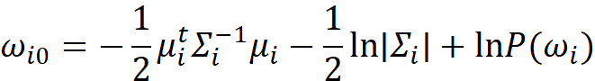
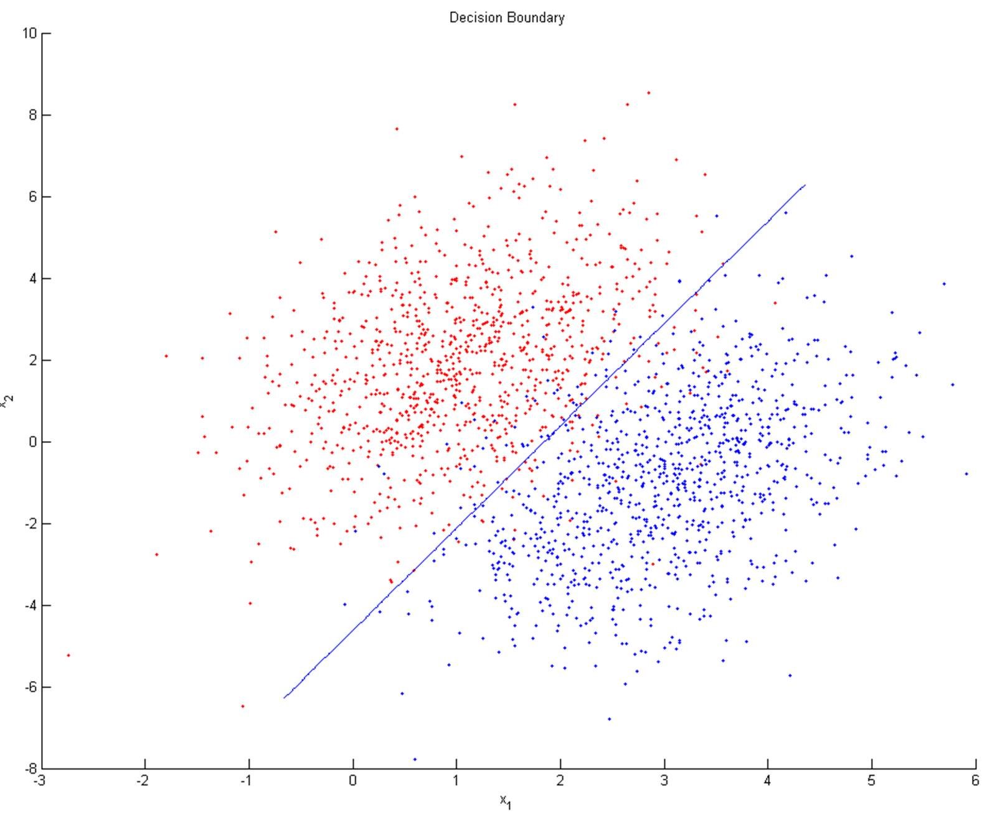
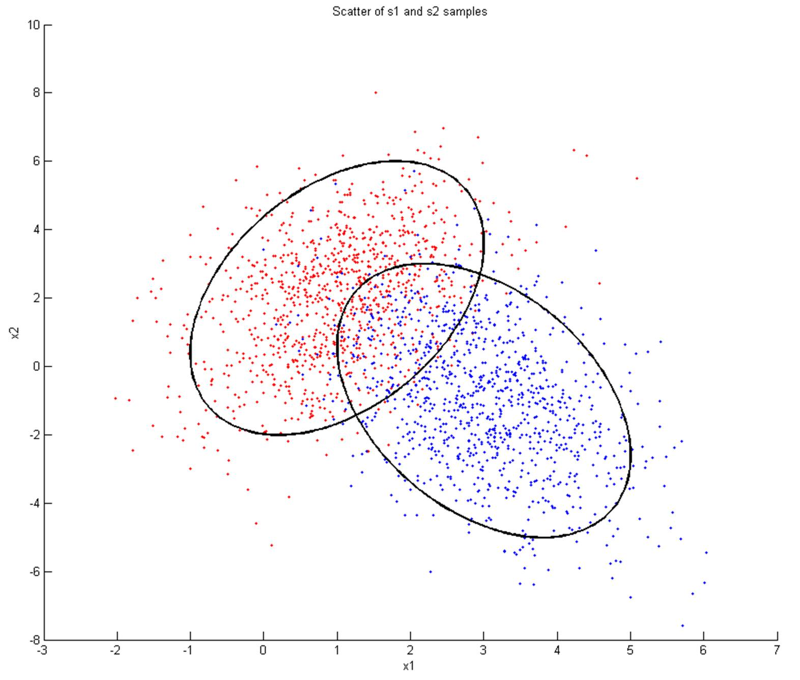
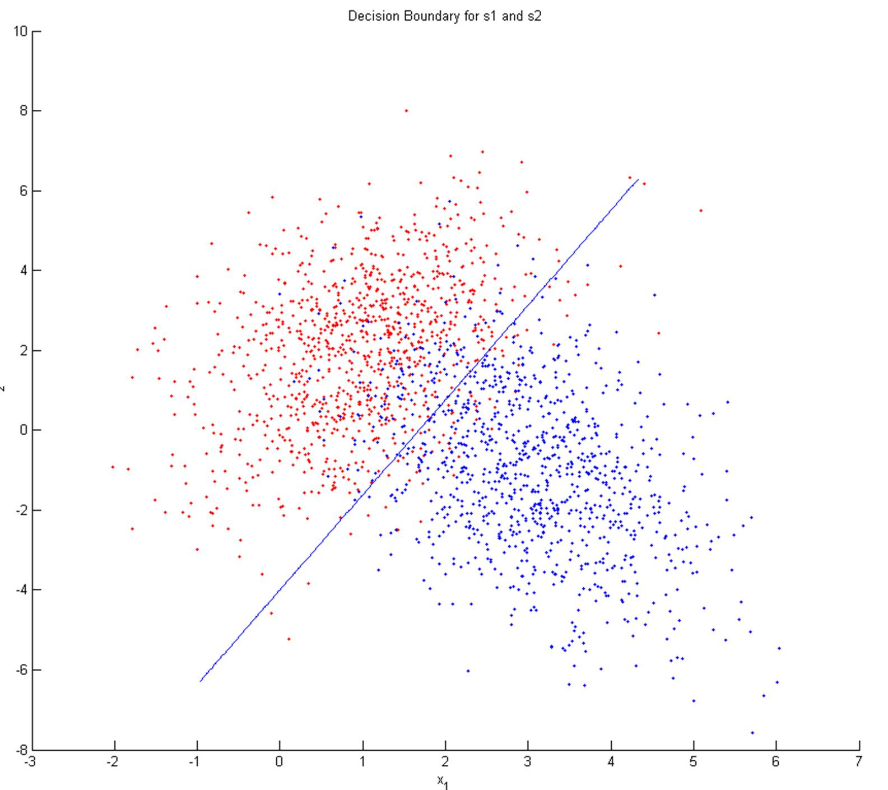

</head>

<body lang=TR style='tab-interval:35.3pt'>

<b>Discriminant Function:<o:p></o:p></b>

<b><o:p>&nbsp;</o:p></b>

<b>a) Scatter of samples with two sigma ellipses on them are shown
below:<o:p></o:p></b>

<o:p>&nbsp;</o:p>

<!--[if gte vml 1]><o:wrapblock><v:shapetype
  id="_x0000_t75" coordsize="21600,21600" o:spt="75" o:preferrelative="t"
  path="m@4@5l@4@11@9@11@9@5xe" filled="f" stroked="f">
  <v:stroke joinstyle="miter"/>
  <v:formulas>
   <v:f eqn="if lineDrawn pixelLineWidth 0"/>
   <v:f eqn="sum @0 1 0"/>
   <v:f eqn="sum 0 0 @1"/>
   <v:f eqn="prod @2 1 2"/>
   <v:f eqn="prod @3 21600 pixelWidth"/>
   <v:f eqn="prod @3 21600 pixelHeight"/>
   <v:f eqn="sum @0 0 1"/>
   <v:f eqn="prod @6 1 2"/>
   <v:f eqn="prod @7 21600 pixelWidth"/>
   <v:f eqn="sum @8 21600 0"/>
   <v:f eqn="prod @7 21600 pixelHeight"/>
   <v:f eqn="sum @10 21600 0"/>
  </v:formulas>
  <v:path o:extrusionok="f" gradientshapeok="t" o:connecttype="rect"/>
  <o:lock v:ext="edit" aspectratio="t"/>
 </v:shapetype><v:shape id="graphics1" o:spid="_x0000_s1029" type="#_x0000_t75"
  style='position:absolute;left:0;text-align:left;margin-left:0;margin-top:0;
  width:471.6pt;height:371.2pt;z-index:251658240;visibility:visible;
  mso-wrap-style:square;mso-wrap-distance-left:9pt;mso-wrap-distance-top:0;
  mso-wrap-distance-right:9pt;mso-wrap-distance-bottom:0;
  mso-position-horizontal:center;mso-position-horizontal-relative:text;
  mso-position-vertical:top;mso-position-vertical-relative:text'>
  <v:imagedata src="readme_files/image001.png" o:title=""/>
  <w:wrap type="topAndBottom"/>
 </v:shape><![endif]--><![if !vml]><![endif]><!--[if gte vml 1]></o:wrapblock><![endif]--> 
2-sigma ellipses cover the 95% of the given samples for each
class.<o:p></o:p>

<o:p>&nbsp;</o:p>

<b>b) Calculating Bhattacharyya Bound for the given distributions :<o:p></o:p></b>

<b><o:p>&nbsp;</o:p></b>

<b><o:p>&nbsp;</o:p></b>

<!--[if gte msEquation 12]><m:oMathPara><m:oMathParaPr><m:jc
   m:val="center"/></m:oMathParaPr><m:oMath><i style='mso-bidi-font-style:normal'><m:r>P</m:r><m:r>(</m:r><m:r>error</m:r><m:r>)&#8804;</m:r></i><m:rad><m:radPr><m:degHide
     m:val="on"/><m:ctrlPr></m:ctrlPr></m:radPr><m:deg></m:deg><m:e><i
    style='mso-bidi-font-style:normal'><m:r>(</m:r><m:r>P</m:r><m:r>(</m:r></i><m:sSub><m:sSubPr><m:ctrlPr></m:ctrlPr></m:sSubPr><m:e><i
      style='mso-bidi-font-style:normal'><m:r>&#969;</m:r></i></m:e><m:sub><i
      style='mso-bidi-font-style:normal'><m:r>1</m:r></i></m:sub></m:sSub><i
    style='mso-bidi-font-style:normal'><m:r>)</m:r><m:r>P</m:r><m:r>(</m:r></i><m:sSub><m:sSubPr><m:ctrlPr></m:ctrlPr></m:sSubPr><m:e><i
      style='mso-bidi-font-style:normal'><m:r>&#969;</m:r></i></m:e><m:sub><i
      style='mso-bidi-font-style:normal'><m:r>2</m:r></i></m:sub></m:sSub><i
    style='mso-bidi-font-style:normal'><m:r>))</m:r></i></m:e></m:rad><m:limUpp><m:limUppPr><m:ctrlPr></m:ctrlPr></m:limUppPr><m:e><m:limLow><m:limLowPr><m:ctrlPr></m:ctrlPr></m:limLowPr><m:e><m:r><m:rPr><m:scr m:val="roman"/><m:sty
         m:val="p"/></m:rPr>&#8747;</m:r></m:e><m:lim></m:lim></m:limLow></m:e><m:lim></m:lim></m:limUpp><m:rad><m:radPr><m:degHide
     m:val="on"/><m:ctrlPr></m:ctrlPr></m:radPr><m:deg></m:deg><m:e><i
    style='mso-bidi-font-style:normal'><m:r>(</m:r><m:r>P</m:r><m:r>(</m:r><m:r>x</m:r></i><m:r><m:rPr><m:scr m:val="roman"/><m:sty
       m:val="p"/></m:rPr>&#8739;</m:r><m:sSub><m:sSubPr><m:ctrlPr></m:ctrlPr></m:sSubPr><m:e><i
      style='mso-bidi-font-style:normal'><m:r>&#969;</m:r></i></m:e><m:sub><i
      style='mso-bidi-font-style:normal'><m:r>1</m:r></i></m:sub></m:sSub><i
    style='mso-bidi-font-style:normal'><m:r>)</m:r><m:r>P</m:r><m:r>(</m:r><m:r>x</m:r></i><m:r><m:rPr><m:scr m:val="roman"/><m:sty
       m:val="p"/></m:rPr>&#8739;</m:r><m:sSub><m:sSubPr><m:ctrlPr></m:ctrlPr></m:sSubPr><m:e><i
      style='mso-bidi-font-style:normal'><m:r>&#969;</m:r></i></m:e><m:sub><i
      style='mso-bidi-font-style:normal'><m:r>2</m:r></i></m:sub></m:sSub><i
    style='mso-bidi-font-style:normal'><m:r>))</m:r></i></m:e></m:rad><i
  style='mso-bidi-font-style:normal'><m:r>dx</m:r></i></m:oMath></m:oMathPara><![endif]--><![if !msEquation]><!--[if gte vml 1]><v:shape
 id="_x0000_i1025" type="#_x0000_t75" style='width:285.3pt;height:31.8pt'>
 <v:imagedata src="readme_files/image003.png" o:title="" chromakey="white"/>
</v:shape><![endif]--><![if !vml]><![endif]><![endif]><o:p></o:p>

<o:p>&nbsp;</o:p>

<!--[if gte msEquation 12]><m:oMathPara><m:oMathParaPr><m:jc
   m:val="center"/></m:oMathParaPr><m:oMath><m:r><m:rPr><m:scr
     m:val="roman"/><m:sty m:val="p"/></m:rPr>=</m:r><m:rad><m:radPr><m:degHide
     m:val="on"/><m:ctrlPr></m:ctrlPr></m:radPr><m:deg></m:deg><m:e><i
    style='mso-bidi-font-style:normal'><m:r>(</m:r><m:r>P</m:r><m:r>(</m:r></i><m:sSub><m:sSubPr><m:ctrlPr></m:ctrlPr></m:sSubPr><m:e><i
      style='mso-bidi-font-style:normal'><m:r>&#969;</m:r></i></m:e><m:sub><i
      style='mso-bidi-font-style:normal'><m:r>1</m:r></i></m:sub></m:sSub><i
    style='mso-bidi-font-style:normal'><m:r>)</m:r><m:r>P</m:r><m:r>(</m:r></i><m:sSub><m:sSubPr><m:ctrlPr></m:ctrlPr></m:sSubPr><m:e><i
      style='mso-bidi-font-style:normal'><m:r>&#969;</m:r></i></m:e><m:sub><i
      style='mso-bidi-font-style:normal'><m:r>2</m:r></i></m:sub></m:sSub><i
    style='mso-bidi-font-style:normal'><m:r>))</m:r></i></m:e></m:rad><m:sSup><m:sSupPr><m:ctrlPr></m:ctrlPr></m:sSupPr><m:e><i
    style='mso-bidi-font-style:normal'><m:r>e</m:r></i></m:e><m:sup><m:r><m:rPr><m:scr m:val="roman"/><m:sty
       m:val="p"/></m:rPr>-</m:r><m:r><i style='mso-bidi-font-style:normal'>k</i></m:r><m:r><i
     style='mso-bidi-font-style:normal'>(1</i></m:r><m:r><m:rPr><m:scr m:val="roman"/><m:sty
       m:val="p"/></m:rPr>/</m:r><m:r><i style='mso-bidi-font-style:normal'>2)</i></m:r></m:sup></m:sSup></m:oMath></m:oMathPara><![endif]--><![if !msEquation]><!--[if gte vml 1]><v:shape
 id="_x0000_i1025" type="#_x0000_t75" style='width:134.4pt;height:17.4pt'>
 <v:imagedata src="readme_files/image005.png" o:title="" chromakey="white"/>
</v:shape><![endif]--><![if !vml]><![endif]><![endif]><o:p></o:p>

where<o:p></o:p>

<o:p>&nbsp;</o:p>

<!--[if gte msEquation 12]><m:oMathPara><m:oMathParaPr><m:jc
   m:val="left"/></m:oMathParaPr><m:oMath><i style='mso-bidi-font-style:normal'><m:r>k</m:r><m:r>(1</m:r></i><m:r><m:rPr><m:scr m:val="roman"/><m:sty
     m:val="p"/></m:rPr>/</m:r><m:r><i style='mso-bidi-font-style:normal'>2)</i></m:r><m:r><m:rPr><m:scr
     m:val="roman"/><m:sty m:val="p"/></m:rPr>=</m:r><m:r><i style='mso-bidi-font-style:
   normal'>0.125</i></m:r><m:sSup><m:sSupPr><m:ctrlPr></m:ctrlPr></m:sSupPr><m:e><i
    style='mso-bidi-font-style:normal'><m:r>(</m:r></i><m:sSub><m:sSubPr><m:ctrlPr></m:ctrlPr></m:sSubPr><m:e><i
      style='mso-bidi-font-style:normal'><m:r>&#956;</m:r></i></m:e><m:sub><i
      style='mso-bidi-font-style:normal'><m:r>2</m:r></i></m:sub></m:sSub><m:r><m:rPr><m:scr m:val="roman"/><m:sty
       m:val="p"/></m:rPr>-</m:r><m:sSub><m:sSubPr><m:ctrlPr></m:ctrlPr></m:sSubPr><m:e><i
      style='mso-bidi-font-style:normal'><m:r>&#956;</m:r></i></m:e><m:sub><i
      style='mso-bidi-font-style:normal'><m:r>1</m:r></i></m:sub></m:sSub><i
    style='mso-bidi-font-style:normal'><m:r>)</m:r></i></m:e><m:sup><i
    style='mso-bidi-font-style:normal'><m:r>t</m:r></i></m:sup></m:sSup><m:sSup><m:sSupPr><m:ctrlPr></m:ctrlPr></m:sSupPr><m:e><m:d><m:dPr><m:begChr
       m:val="["/><m:endChr m:val="]"/><m:ctrlPr></m:ctrlPr></m:dPr><m:e><m:f><m:fPr><m:ctrlPr></m:ctrlPr></m:fPr><m:num><m:sSub><m:sSubPr><m:ctrlPr></m:ctrlPr></m:sSubPr><m:e><i
          style='mso-bidi-font-style:normal'><m:r>&#931;</m:r></i></m:e><m:sub><i
          style='mso-bidi-font-style:normal'><m:r>1</m:r></i></m:sub></m:sSub><i
        style='mso-bidi-font-style:normal'><m:r>+</m:r></i><m:sSub><m:sSubPr><m:ctrlPr></m:ctrlPr></m:sSubPr><m:e><i
          style='mso-bidi-font-style:normal'><m:r>&#931;</m:r></i></m:e><m:sub><i
          style='mso-bidi-font-style:normal'><m:r>2</m:r></i></m:sub></m:sSub></m:num><m:den><i
        style='mso-bidi-font-style:normal'><m:r>2</m:r></i></m:den></m:f></m:e></m:d></m:e><m:sup><m:r><m:rPr><m:scr m:val="roman"/><m:sty
       m:val="p"/></m:rPr>-</m:r><m:r><i style='mso-bidi-font-style:normal'>1</i></m:r></m:sup></m:sSup><i
  style='mso-bidi-font-style:normal'><m:r>(</m:r></i><m:sSub><m:sSubPr><m:ctrlPr></m:ctrlPr></m:sSubPr><m:e><i
    style='mso-bidi-font-style:normal'><m:r>&#956;</m:r></i></m:e><m:sub><i
    style='mso-bidi-font-style:normal'><m:r>2</m:r></i></m:sub></m:sSub><m:r><m:rPr><m:scr m:val="roman"/><m:sty
     m:val="p"/></m:rPr>-</m:r><m:sSub><m:sSubPr><m:ctrlPr></m:ctrlPr></m:sSubPr><m:e><i
    style='mso-bidi-font-style:normal'><m:r>&#956;</m:r></i></m:e><m:sub><i
    style='mso-bidi-font-style:normal'><m:r>1</m:r></i></m:sub></m:sSub><i
  style='mso-bidi-font-style:normal'><m:r>)+0.5</m:r></i><m:r><m:rPr><m:scr m:val="roman"/><m:sty
     m:val="p"/></m:rPr>ln</m:r><m:f><m:fPr><m:ctrlPr></m:ctrlPr></m:fPr><m:num><m:d><m:dPr><m:begChr
       m:val="&#8739;"/><m:endChr m:val="&#8739;"/><m:ctrlPr></m:ctrlPr></m:dPr><m:e><m:f><m:fPr><m:ctrlPr></m:ctrlPr></m:fPr><m:num><m:sSub><m:sSubPr><m:ctrlPr></m:ctrlPr></m:sSubPr><m:e><i
          style='mso-bidi-font-style:normal'><m:r>&#931;</m:r></i></m:e><m:sub><i
          style='mso-bidi-font-style:normal'><m:r>1</m:r></i></m:sub></m:sSub><i
        style='mso-bidi-font-style:normal'><m:r>+</m:r></i><m:sSub><m:sSubPr><m:ctrlPr></m:ctrlPr></m:sSubPr><m:e><i
          style='mso-bidi-font-style:normal'><m:r>&#931;</m:r></i></m:e><m:sub><i
          style='mso-bidi-font-style:normal'><m:r>2</m:r></i></m:sub></m:sSub></m:num><m:den><i
        style='mso-bidi-font-style:normal'><m:r>2</m:r></i></m:den></m:f></m:e></m:d></m:num><m:den><m:rad><m:radPr><m:degHide
       m:val="on"/><m:ctrlPr></m:ctrlPr></m:radPr><m:deg></m:deg><m:e><m:d><m:dPr><m:begChr
         m:val="&#8739;"/><m:endChr m:val="&#8739;"/><m:ctrlPr></m:ctrlPr></m:dPr><m:e><m:sSub><m:sSubPr><m:ctrlPr></m:ctrlPr></m:sSubPr><m:e><i
          style='mso-bidi-font-style:normal'><m:r>&#931;</m:r></i></m:e><m:sub><i
          style='mso-bidi-font-style:normal'><m:r>1</m:r></i></m:sub></m:sSub><m:d><m:dPr><m:begChr
           m:val="&#8739;"/><m:endChr m:val="&#8739;"/><m:ctrlPr></m:ctrlPr></m:dPr><m:e><m:sSub><m:sSubPr><m:ctrlPr></m:ctrlPr></m:sSubPr><m:e><i
            style='mso-bidi-font-style:normal'><m:r>&#931;</m:r></i></m:e><m:sub><i
            style='mso-bidi-font-style:normal'><m:r>2</m:r></i></m:sub></m:sSub></m:e></m:d></m:e></m:d></m:e></m:rad></m:den></m:f></m:oMath></m:oMathPara><![endif]--><![if !msEquation]><!--[if gte vml 1]><v:shape
 id="_x0000_i1025" type="#_x0000_t75" style='width:333.6pt;height:42.3pt'>
 <v:imagedata src="readme_files/image007.png" o:title="" chromakey="white"/>
</v:shape><![endif]--><![if !vml]><![endif]><![endif]><o:p></o:p>

<o:p>&nbsp;</o:p>

Battacharyya Bound found for the given distributions is 0.138021.<o:p></o:p>

<o:p>&nbsp;</o:p>

   <b>c) Classification of
the samples using the theoretical decision boundary for z1 and z2 :<o:p></o:p></b>

<b><o:p>&nbsp;</o:p></b>

To classify a given point into two classes, represented by the
give mean values and covariance matrices, values of discriminant functions for
the two classes should be calculated.<o:p></o:p>

<o:p>&nbsp;</o:p>

For arbitrary covariance matrices,<o:p></o:p>

<o:p>&nbsp;</o:p>

<!--[if gte msEquation 12]><m:oMathPara><m:oMathParaPr><m:jc
   m:val="center"/></m:oMathParaPr><m:oMath><m:sSub><m:sSubPr><m:ctrlPr></m:ctrlPr></m:sSubPr><m:e><i
    style='mso-bidi-font-style:normal'><m:r>g</m:r></i></m:e><m:sub><i
    style='mso-bidi-font-style:normal'><m:r>i</m:r></i></m:sub></m:sSub><i
  style='mso-bidi-font-style:normal'><m:r>(</m:r><m:r>x</m:r><m:r>)</m:r></i><m:r><m:rPr><m:scr m:val="roman"/><m:sty
     m:val="p"/></m:rPr>=</m:r><m:sSup><m:sSupPr><m:ctrlPr></m:ctrlPr></m:sSupPr><m:e><i
    style='mso-bidi-font-style:normal'><m:r>x</m:r></i></m:e><m:sup><i
    style='mso-bidi-font-style:normal'><m:r>t</m:r></i></m:sup></m:sSup><m:sSub><m:sSubPr><m:ctrlPr></m:ctrlPr></m:sSubPr><m:e><i
    style='mso-bidi-font-style:normal'><m:r>W</m:r></i></m:e><m:sub><i
    style='mso-bidi-font-style:normal'><m:r>i</m:r></i></m:sub></m:sSub><i
  style='mso-bidi-font-style:normal'><m:r>x</m:r><m:r>+</m:r></i><m:sSubSup><m:sSubSupPr><m:ctrlPr></m:ctrlPr></m:sSubSupPr><m:e><i
    style='mso-bidi-font-style:normal'><m:r>w</m:r></i></m:e><m:sub><i
    style='mso-bidi-font-style:normal'><m:r>i</m:r></i></m:sub><m:sup><i
    style='mso-bidi-font-style:normal'><m:r>t</m:r></i></m:sup></m:sSubSup><i
  style='mso-bidi-font-style:normal'><m:r>x</m:r><m:r>+</m:r></i><m:sSub><m:sSubPr><m:ctrlPr></m:ctrlPr></m:sSubPr><m:e><i
    style='mso-bidi-font-style:normal'><m:r>&#969;</m:r></i></m:e><m:sub><i
    style='mso-bidi-font-style:normal'><m:r>i</m:r><m:r>0</m:r></i></m:sub></m:sSub></m:oMath></m:oMathPara><![endif]--><![if !msEquation]><!--[if gte vml 1]><v:shape
 id="_x0000_i1025" type="#_x0000_t75" style='width:141.3pt;height:14.7pt'>
 <v:imagedata src="readme_files/image009.png" o:title="" chromakey="white"/>
</v:shape><![endif]--><![if !vml]><![endif]><![endif]><o:p></o:p>

<o:p>&nbsp;</o:p>

where<o:p></o:p>

<o:p>&nbsp;</o:p>

<!--[if gte msEquation 12]><m:oMath><m:sSub><m:sSubPr><m:ctrlPr></m:ctrlPr></m:sSubPr><m:e><i
   style='mso-bidi-font-style:normal'><m:r>W</m:r></i></m:e><m:sub><i
   style='mso-bidi-font-style:normal'><m:r>i</m:r></i></m:sub></m:sSub><m:r><m:rPr><m:scr m:val="roman"/><m:sty
    m:val="p"/></m:rPr>=-</m:r><m:f><m:fPr><m:ctrlPr></m:ctrlPr></m:fPr><m:num><i
   style='mso-bidi-font-style:normal'><m:r>1</m:r></i></m:num><m:den><i
   style='mso-bidi-font-style:normal'><m:r>2</m:r></i></m:den></m:f><m:sSubSup><m:sSubSupPr><m:ctrlPr></m:ctrlPr></m:sSubSupPr><m:e><i
   style='mso-bidi-font-style:normal'><m:r>&#931;</m:r></i></m:e><m:sub><i
   style='mso-bidi-font-style:normal'><m:r>i</m:r></i></m:sub><m:sup><m:r><m:rPr><m:scr m:val="roman"/><m:sty
      m:val="p"/></m:rPr>-</m:r><m:r><i style='mso-bidi-font-style:normal'>1</i></m:r></m:sup></m:sSubSup></m:oMath><![endif]--><![if !msEquation]><!--[if gte vml 1]><v:shape
 id="_x0000_i1025" type="#_x0000_t75" style='width:66.3pt;height:20.1pt'>
 <v:imagedata src="readme_files/image011.png" o:title="" chromakey="white"/>
</v:shape><![endif]--><![if !vml]><![endif]><![endif]>,<o:p></o:p>

<o:p>&nbsp;</o:p>

<!--[if gte msEquation 12]><m:oMathPara><m:oMathParaPr><m:jc
   m:val="center"/></m:oMathParaPr><m:oMath><m:sSub><m:sSubPr><m:ctrlPr></m:ctrlPr></m:sSubPr><m:e><i
    style='mso-bidi-font-style:normal'><m:r>w</m:r></i></m:e><m:sub><i
    style='mso-bidi-font-style:normal'><m:r>i</m:r></i></m:sub></m:sSub><m:r><m:rPr><m:scr m:val="roman"/><m:sty
     m:val="p"/></m:rPr>=</m:r><m:sSubSup><m:sSubSupPr><m:ctrlPr></m:ctrlPr></m:sSubSupPr><m:e><i
    style='mso-bidi-font-style:normal'><m:r>&#931;</m:r></i></m:e><m:sub><i
    style='mso-bidi-font-style:normal'><m:r>i</m:r></i></m:sub><m:sup><m:r><m:rPr><m:scr m:val="roman"/><m:sty
       m:val="p"/></m:rPr>-</m:r><m:r><i style='mso-bidi-font-style:normal'>1</i></m:r></m:sup></m:sSubSup><m:sSub><m:sSubPr><m:ctrlPr></m:ctrlPr></m:sSubPr><m:e><i
    style='mso-bidi-font-style:normal'><m:r>&#956;</m:r></i></m:e><m:sub><i
    style='mso-bidi-font-style:normal'><m:r>i</m:r></i></m:sub></m:sSub></m:oMath></m:oMathPara><![endif]--><![if !msEquation]><!--[if gte vml 1]><v:shape
 id="_x0000_i1025" type="#_x0000_t75" style='width:57.6pt;height:14.7pt'>
 <v:imagedata src="readme_files/image013.png" o:title="" chromakey="white"/>
</v:shape><![endif]--><![if !vml]><![endif]><![endif]><o:p></o:p>

<o:p>&nbsp;</o:p>

and<o:p></o:p>

<o:p>&nbsp;</o:p>

<!--[if gte msEquation 12]><m:oMathPara><m:oMathParaPr><m:jc
   m:val="center"/></m:oMathParaPr><m:oMath><m:sSub><m:sSubPr><m:ctrlPr></m:ctrlPr></m:sSubPr><m:e><i
    style='mso-bidi-font-style:normal'><m:r>&#969;</m:r></i></m:e><m:sub><i
    style='mso-bidi-font-style:normal'><m:r>i</m:r><m:r>0</m:r></i></m:sub></m:sSub><m:r><m:rPr><m:scr m:val="roman"/><m:sty
     m:val="p"/></m:rPr>=-</m:r><m:f><m:fPr><m:ctrlPr></m:ctrlPr></m:fPr><m:num><i
    style='mso-bidi-font-style:normal'><m:r>1</m:r></i></m:num><m:den><i
    style='mso-bidi-font-style:normal'><m:r>2</m:r></i></m:den></m:f><m:sSubSup><m:sSubSupPr><m:ctrlPr></m:ctrlPr></m:sSubSupPr><m:e><i
    style='mso-bidi-font-style:normal'><m:r>&#956;</m:r></i></m:e><m:sub><i
    style='mso-bidi-font-style:normal'><m:r>i</m:r></i></m:sub><m:sup><i
    style='mso-bidi-font-style:normal'><m:r>t</m:r></i></m:sup></m:sSubSup><m:sSubSup><m:sSubSupPr><m:ctrlPr></m:ctrlPr></m:sSubSupPr><m:e><i
    style='mso-bidi-font-style:normal'><m:r>&#931;</m:r></i></m:e><m:sub><i
    style='mso-bidi-font-style:normal'><m:r>i</m:r></i></m:sub><m:sup><m:r><m:rPr><m:scr m:val="roman"/><m:sty
       m:val="p"/></m:rPr>-</m:r><m:r><i style='mso-bidi-font-style:normal'>1</i></m:r></m:sup></m:sSubSup><m:sSub><m:sSubPr><m:ctrlPr></m:ctrlPr></m:sSubPr><m:e><i
    style='mso-bidi-font-style:normal'><m:r>&#956;</m:r></i></m:e><m:sub><i
    style='mso-bidi-font-style:normal'><m:r>i</m:r></i></m:sub></m:sSub><m:r><m:rPr><m:scr m:val="roman"/><m:sty
     m:val="p"/></m:rPr>-</m:r><m:f><m:fPr><m:ctrlPr></m:ctrlPr></m:fPr><m:num><i
    style='mso-bidi-font-style:normal'><m:r>1</m:r></i></m:num><m:den><i
    style='mso-bidi-font-style:normal'><m:r>2</m:r></i></m:den></m:f><m:r><m:rPr><m:scr m:val="roman"/><m:sty
     m:val="p"/></m:rPr>ln</m:r><m:d><m:dPr><m:begChr m:val="&#8739;"/><m:endChr
     m:val="&#8739;"/><m:ctrlPr></m:ctrlPr></m:dPr><m:e><m:sSub><m:sSubPr><m:ctrlPr></m:ctrlPr></m:sSubPr><m:e><i
      style='mso-bidi-font-style:normal'><m:r>&#931;</m:r></i></m:e><m:sub><i
      style='mso-bidi-font-style:normal'><m:r>i</m:r></i></m:sub></m:sSub></m:e></m:d><i
  style='mso-bidi-font-style:normal'><m:r>+</m:r></i><m:r><m:rPr><m:scr m:val="roman"/><m:sty
     m:val="p"/></m:rPr>ln</m:r><m:r><i style='mso-bidi-font-style:normal'>P</i></m:r><m:r><i
   style='mso-bidi-font-style:normal'>(</i></m:r><m:sSub><m:sSubPr><m:ctrlPr></m:ctrlPr></m:sSubPr><m:e><i
    style='mso-bidi-font-style:normal'><m:r>&#969;</m:r></i></m:e><m:sub><i
    style='mso-bidi-font-style:normal'><m:r>i</m:r></i></m:sub></m:sSub><i
  style='mso-bidi-font-style:normal'><m:r>)</m:r></i></m:oMath></m:oMathPara><![endif]--><![if !msEquation]><!--[if gte vml 1]><v:shape
 id="_x0000_i1025" type="#_x0000_t75" style='width:198.3pt;height:27pt'>
 <v:imagedata src="readme_files/image015.png" o:title="" chromakey="white"/>
</v:shape><![endif]--><![if !vml]><![endif]><![endif]><o:p></o:p>

<o:p>&nbsp;</o:p>

<o:p>&nbsp;</o:p>

Each point from the test arrays is evaluated using the above
discriminant function with the given two covariance matrices. The class with
greater discriminant function output is chosen.<o:p></o:p>

<o:p>&nbsp;</o:p>

Classification resulted in 108 out of 2000 samples to be
misclassified. It means 0.054 error rate.<o:p></o:p>

<o:p>&nbsp;</o:p>

<b>    d) Perceptron learning :<o:p></o:p></b>

<b><o:p>&nbsp;</o:p></b>

Perceptron learning is used to obtain an augmented weight vector,
which constitutes the coefficients of the discriminant function.<o:p></o:p>

<o:p>&nbsp;</o:p>

          i) Error rate is
found to be 5.3% for the z1 and z2 arrays. 106 of 2000 samples were                      misclassified. 
 
          ii) Augmented weight vector <b>a</b>
calculated by the perceptron learning algorithm was:<o:p></o:p>

 
                                                       aT = [1.2167   -0.6587 
0.2631]          <o:p></o:p>

          <o:p></o:p>

<o:p>&nbsp;</o:p>

          Decision boundary
is shown on the following figure:<o:p></o:p>

<o:p>&nbsp;</o:p>

<!--[if gte vml 1]><o:wrapblock><v:shape
  id="graphics2" o:spid="_x0000_s1028" type="#_x0000_t75" style='position:absolute;
  left:0;text-align:left;margin-left:0;margin-top:0;width:481.85pt;height:392.2pt;
  z-index:2;visibility:visible;mso-wrap-style:square;mso-wrap-distance-left:9pt;
  mso-wrap-distance-top:0;mso-wrap-distance-right:9pt;
  mso-wrap-distance-bottom:0;mso-position-horizontal:center;
  mso-position-horizontal-relative:text;mso-position-vertical:top;
  mso-position-vertical-relative:text'>
  <v:imagedata src="readme_files/image017.png" o:title=""/>
  <w:wrap type="topAndBottom"/>
 </v:shape><![endif]--><![if !vml]><![endif]><!--[if gte vml 1]></o:wrapblock><![endif]--> 
<o:p></o:p>

<o:p>&nbsp;</o:p>

          iii) Perceptron
algorithm took 4 iterations to converge the final classification error.<o:p></o:p>

          iv) Learning rate
was taken to be 0.1 initially and it was decremented with the following           rule.<o:p></o:p>

<o:p>&nbsp;</o:p>

                                                       <!--[if gte msEquation 12]><m:oMath><i
 style='mso-bidi-font-style:normal'><m:r>&#951;</m:r></i><m:r><m:rPr><m:scr m:val="roman"/><m:sty
    m:val="p"/></m:rPr>=</m:r><m:r><i style='mso-bidi-font-style:normal'>&#951;</i></m:r><m:r><m:rPr><m:scr
    m:val="roman"/><m:sty m:val="p"/></m:rPr>/</m:r><m:r><i style='mso-bidi-font-style:
  normal'>k</i></m:r></m:oMath><![endif]--><![if !msEquation]><!--[if gte vml 1]><v:shape
 id="_x0000_i1025" type="#_x0000_t75" style='width:41.7pt;height:14.1pt'>
 <v:imagedata src="readme_files/image019.png" o:title="" chromakey="white"/>
</v:shape><![endif]--><![if !vml]><![endif]><![endif]><o:p></o:p>

<o:p>&nbsp;</o:p>

          where k is the
iteration number.<o:p></o:p>

          v) MATLAB code is
represented in the Appendix part.<o:p></o:p>

<o:p>&nbsp;</o:p>

<o:p>&nbsp;</o:p>

<b>2) Case 3 Discriminant Function:<o:p></o:p></b>

<b><o:p>&nbsp;</o:p></b>

<b>a) Scatter of samples with two sigma ellipses on them are shown
below:<o:p></o:p></b>

<b><o:p>&nbsp;</o:p></b>

<b><o:p>&nbsp;</o:p></b>

<!--[if gte vml 1]><o:wrapblock><v:shape
  id="graphics3" o:spid="_x0000_s1027" type="#_x0000_t75" style='position:absolute;
  left:0;text-align:left;margin-left:0;margin-top:0;width:471.6pt;height:401.05pt;
  z-index:10;visibility:visible;mso-wrap-style:square;mso-wrap-distance-left:9pt;
  mso-wrap-distance-top:0;mso-wrap-distance-right:9pt;
  mso-wrap-distance-bottom:0;mso-position-horizontal:center;
  mso-position-horizontal-relative:text;mso-position-vertical:top;
  mso-position-vertical-relative:text'>
  <v:imagedata src="readme_files/image021.png" o:title=""/>
  <w:wrap type="topAndBottom"/>
 </v:shape><![endif]--><![if !vml]><![endif]><!--[if gte vml 1]></o:wrapblock><![endif]--> 
<b><o:p></o:p></b>

<b><o:p>&nbsp;</o:p></b>

<b>b) Calculating Bhattacharyya Bound for the given distributions :<o:p></o:p></b>

<b><o:p>&nbsp;</o:p></b>

Method for calculating the Bhattacharyya Bound on the classification
error is explained in the previous part.<o:p></o:p>

          <o:p></o:p>

Bhattacharyya Bound for s1 and s2 samples is found to be 0.209806.<o:p></o:p>

<o:p>&nbsp;</o:p>

<b>c) Classification of the samples using the theoretical decision
boundary for z1 and z2 :<o:p></o:p></b>

<o:p>&nbsp;</o:p>

The error resulted from the classfication using discriminant
function is 0.0960. 192 of 2000 samples are misclassified.<o:p></o:p>

<o:p>&nbsp;</o:p>

<o:p>&nbsp;</o:p>

<b>  </b><b>d) Perceptron learning :<o:p></o:p></b>

<b><o:p>&nbsp;</o:p></b>

Perceptron learning is used to obtain an augmented weight vector,
which constitutes the coefficients of the discriminant function.<o:p></o:p>

<o:p>&nbsp;</o:p>

          i) Error rate is
found to be 11% for the s1 and s2 arrays. 220 of 2000 samples were                      misclassified. 
 
          ii) Augmented weight vector <b>a</b>
calculated by the perceptron learning algorithm was:<o:p></o:p>

 
                                                       aT = [0.0342   -0.0203 
0.0086]          <o:p></o:p>

<o:p>&nbsp;</o:p>

          Decision boundary
is shown on the following figure:<o:p></o:p>

<o:p>&nbsp;</o:p>

<!--[if gte vml 1]><o:wrapblock><v:shape
  id="graphics4" o:spid="_x0000_s1026" type="#_x0000_t75" style='position:absolute;
  left:0;text-align:left;margin-left:0;margin-top:0;width:475.5pt;height:423.05pt;
  z-index:12;visibility:visible;mso-wrap-style:square;mso-wrap-distance-left:9pt;
  mso-wrap-distance-top:0;mso-wrap-distance-right:9pt;
  mso-wrap-distance-bottom:0;mso-position-horizontal:center;
  mso-position-horizontal-relative:text;mso-position-vertical:top;
  mso-position-vertical-relative:text'>
  <v:imagedata src="readme_files/image023.png" o:title=""/>
  <w:wrap type="topAndBottom"/>
 </v:shape><![endif]--><![if !vml]><![endif]><!--[if gte vml 1]></o:wrapblock><![endif]--> 
<o:p></o:p>

          iii) Perceptron
algorithm took 5 iterations to converge the final classification error.<o:p></o:p>

          iv) Learning rate
was taken to be 0.1 initially and it was decremented with the following           rule.<o:p></o:p>

<o:p>&nbsp;</o:p>

                                                       <!--[if gte msEquation 12]><m:oMath><i
 style='mso-bidi-font-style:normal'><m:r>&#951;</m:r></i><m:r><m:rPr><m:scr m:val="roman"/><m:sty
    m:val="p"/></m:rPr>=</m:r><m:r><i style='mso-bidi-font-style:normal'>&#951;</i></m:r><m:r><m:rPr><m:scr
    m:val="roman"/><m:sty m:val="p"/></m:rPr>/</m:r><m:r><i style='mso-bidi-font-style:
  normal'>k</i></m:r></m:oMath><![endif]--><![if !msEquation]><!--[if gte vml 1]><v:shape
 id="_x0000_i1025" type="#_x0000_t75" style='width:41.7pt;height:14.1pt'>
 <v:imagedata src="readme_files/image019.png" o:title="" chromakey="white"/>
</v:shape><![endif]--><![if !vml]><![endif]><![endif]><o:p></o:p>

<o:p>&nbsp;</o:p>

          where k is the
iteration number.<o:p></o:p>

          v) MATLAB code is
represented in the Appendix part.<o:p></o:p>

<o:p>&nbsp;</o:p>

</body>

</html>
