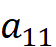
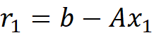
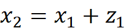

</head>

<body lang=TR>

<b>a ) Gaussian Elimination</b>

&nbsp;

For a linear system to be solved
by back-substitution it has to have an upper triangular form. In Gaussian
Elimination, to obtain upper triangular form, elementary elimination matrices
are used. For vectors A,x and b, below linear system is given,

&nbsp;

&nbsp;

We first choose an elementary
elimination matrix  with the first
diagonal entry as pivot, so that, when
premultiplied by , the  first column of
A becomes zero below the first row. All of the remaining columns of , as well as the
right-hand-side vector are also
multiplied by M1, so the new system becomes , but the solution is
unchanged.

&nbsp;

Next we use the second diagonal
entry as pivot to determine a second elementary elimination matrix that annihilates all of
the entries of the second column of the new matrix, , below the second row.
Again, must be applied to the
entire matrix and right-hand-side vector, so that we obtain the further modifed
linear system . Note that the first
column of the matrix is not affected by because all of its
entries are zero in the relevant rows. This process is continued for each
successive column until all of the subdiagonal entries of the matrix have been
annihilated, so that the linear system

&nbsp;

is upper triangular and can be
solved by back-substitution to obtain the solution to the original linear
system Ax = b.

&nbsp;

<b>b) Residual and Iterative
Refinement</b>

&nbsp;

The residual vector of an
approximate solution x to the nx n linear system Ax = b is defined as

&nbsp;

&nbsp;

The norm of the residual vector
may be used as a measure of the closeness to the exact solution. Furthermore
residual can be used to improve the accuracy of the solution when used in an
iterative scheme such as,

&nbsp;

and the refined solution is

&nbsp;

&nbsp;

This value can be used to
calculate a new residual value and after a number of iterations, ideally, the
full machine precision can be obtained.

</body>

</html>
