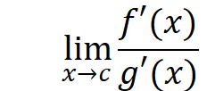

</head>

<body lang=TR style='tab-interval:35.3pt'>

<b>l'Hopital Rule: <o:p></o:p></b>

<o:p>&nbsp;</o:p>

If,<o:p></o:p>

<!--[if gte msEquation 12]><m:oMathPara><m:oMath><m:limLow><m:limLowPr><m:ctrlPr></m:ctrlPr></m:limLowPr><m:e><m:r><m:rPr><m:scr m:val="roman"/><m:sty
       m:val="p"/></m:rPr>lim</m:r></m:e><m:lim><i style='mso-bidi-font-style:
    normal'><m:r>x</m:r><m:r>&#8594;</m:r><m:r>c</m:r></i></m:lim></m:limLow><i
  style='mso-bidi-font-style:normal'><m:r>f</m:r></i><m:d><m:dPr><m:ctrlPr></m:ctrlPr></m:dPr><m:e><i style='mso-bidi-font-style:
    normal'><m:r>x</m:r></i></m:e></m:d><m:r><m:rPr><m:scr m:val="roman"/><m:sty
     m:val="p"/></m:rPr>=</m:r><m:limLow><m:limLowPr><m:ctrlPr></m:ctrlPr></m:limLowPr><m:e><m:r><m:rPr><m:scr m:val="roman"/><m:sty
       m:val="p"/></m:rPr>lim</m:r></m:e><m:lim><i style='mso-bidi-font-style:
    normal'><m:r>x</m:r><m:r>&#8594;</m:r><m:r>c</m:r></i></m:lim></m:limLow><i
  style='mso-bidi-font-style:normal'><m:r>g</m:r></i><m:d><m:dPr><m:ctrlPr></m:ctrlPr></m:dPr><m:e><i style='mso-bidi-font-style:
    normal'><m:r>x</m:r></i></m:e></m:d><m:r><m:rPr><m:scr m:val="roman"/><m:sty
     m:val="p"/></m:rPr>=</m:r><m:r><i style='mso-bidi-font-style:normal'>0   </i></m:r>or<m:r><m:rPr><m:scr m:val="roman"/><m:sty
     m:val="p"/></m:rPr>±&#8734;</m:r><m:r><i style='mso-bidi-font-style:normal'>  </i></m:r></m:oMath></m:oMathPara><![endif]--><![if !msEquation]><!--[if gte vml 1]><v:shapetype
 id="_x0000_t75" coordsize="21600,21600" o:spt="75" o:preferrelative="t"
 path="m@4@5l@4@11@9@11@9@5xe" filled="f" stroked="f">
 <v:stroke joinstyle="miter"/>
 <v:formulas>
  <v:f eqn="if lineDrawn pixelLineWidth 0"/>
  <v:f eqn="sum @0 1 0"/>
  <v:f eqn="sum 0 0 @1"/>
  <v:f eqn="prod @2 1 2"/>
  <v:f eqn="prod @3 21600 pixelWidth"/>
  <v:f eqn="prod @3 21600 pixelHeight"/>
  <v:f eqn="sum @0 0 1"/>
  <v:f eqn="prod @6 1 2"/>
  <v:f eqn="prod @7 21600 pixelWidth"/>
  <v:f eqn="sum @8 21600 0"/>
  <v:f eqn="prod @7 21600 pixelHeight"/>
  <v:f eqn="sum @10 21600 0"/>
 </v:formulas>
 <v:path o:extrusionok="f" gradientshapeok="t" o:connecttype="rect"/>
 <o:lock v:ext="edit" aspectratio="t"/>
</v:shapetype><v:shape id="_x0000_i1025" type="#_x0000_t75" style='width:167.4pt;
 height:18.6pt'>
 <v:imagedata src="readme_files/image023.png" o:title="" chromakey="white"/>
</v:shape><![endif]--><![if !vml]><![endif]><![endif]>

and<o:p></o:p>

<!--[if gte msEquation 12]><m:oMathPara><m:oMath><m:limLow><m:limLowPr><m:ctrlPr></m:ctrlPr></m:limLowPr><m:e><m:r><m:rPr><m:scr m:val="roman"/><m:sty
       m:val="p"/></m:rPr>        lim</m:r></m:e><m:lim><i
    style='mso-bidi-font-style:normal'><m:r>           </m:r><m:r>x</m:r><m:r>&#8594;</m:r><m:r>c</m:r></i></m:lim></m:limLow><m:f><m:fPr><m:ctrlPr></m:ctrlPr></m:fPr><m:num><i
    style='mso-bidi-font-style:normal'><m:r>f</m:r><m:r>'(</m:r><m:r>x</m:r><m:r>)</m:r></i></m:num><m:den><i
    style='mso-bidi-font-style:normal'><m:r>g</m:r><m:r>'(</m:r><m:r>x</m:r><m:r>)</m:r></i></m:den></m:f><i
  style='mso-bidi-font-style:normal'><m:r>
    </m:r></i></m:oMath></m:oMathPara><![endif]--><![if !msEquation]><!--[if gte vml 1]><v:shape
 id="_x0000_i1025" type="#_x0000_t75" style='width:72.3pt;height:30.6pt'>
 <v:imagedata src="readme_files/image025.png" o:title="" chromakey="white"/>
</v:shape><![endif]--><![if !vml]><![endif]><![endif]><o:p></o:p>

exists, then<o:p></o:p>

<o:p>&nbsp;</o:p>

<!--[if gte msEquation 12]><m:oMathPara><m:oMathParaPr><m:jc
   m:val="center"/></m:oMathParaPr><m:oMath><m:limLow><m:limLowPr><m:ctrlPr></m:ctrlPr></m:limLowPr><m:e><m:r><m:rPr><m:scr m:val="roman"/><m:sty
       m:val="p"/></m:rPr>lim</m:r></m:e><m:lim><i style='mso-bidi-font-style:
    normal'><m:r>x</m:r><m:r>&#8594;</m:r><m:r>c</m:r></i></m:lim></m:limLow><m:f><m:fPr><m:ctrlPr></m:ctrlPr></m:fPr><m:num><i
    style='mso-bidi-font-style:normal'><m:r>f</m:r><m:r>(</m:r><m:r>x</m:r><m:r>)</m:r></i></m:num><m:den><i
    style='mso-bidi-font-style:normal'><m:r>g</m:r><m:r>(</m:r><m:r>x</m:r><m:r>)</m:r></i></m:den></m:f><m:r><m:rPr><m:scr m:val="roman"/><m:sty
     m:val="p"/></m:rPr>=</m:r><m:limLow><m:limLowPr><m:ctrlPr></m:ctrlPr></m:limLowPr><m:e><m:r><m:rPr><m:scr m:val="roman"/><m:sty
       m:val="p"/></m:rPr>lim</m:r></m:e><m:lim><i style='mso-bidi-font-style:
    normal'><m:r>x</m:r><m:r>&#8594;</m:r><m:r>c</m:r></i></m:lim></m:limLow><m:f><m:fPr><m:ctrlPr></m:ctrlPr></m:fPr><m:num><i
    style='mso-bidi-font-style:normal'><m:r>f</m:r><m:r>'(</m:r><m:r>x</m:r><m:r>)</m:r></i></m:num><m:den><i
    style='mso-bidi-font-style:normal'><m:r>g</m:r><m:r>'(</m:r><m:r>x</m:r><m:r>)</m:r></i></m:den></m:f></m:oMath></m:oMathPara><![endif]--><![if !msEquation]><!--[if gte vml 1]><v:shape
 id="_x0000_i1025" type="#_x0000_t75" style='width:105pt;height:30.6pt'>
 <v:imagedata src="readme_files/image013.png" o:title="" chromakey="white"/>
</v:shape><![endif]--><![if !vml]><![endif]><![endif]>

<o:p>&nbsp;</o:p>

The differentiation of the numerator and denominator often
simplifies the quotient and/or converts it to a determinate form, allowing the
limit to be evaluated more easily.

<o:p>&nbsp;</o:p>

<!--[if gte msEquation 12]><m:oMathPara><m:oMathParaPr><m:jc
   m:val="center"/></m:oMathParaPr><m:oMath><i style='mso-bidi-font-style:normal'><m:r>f</m:r><m:r>(</m:r><m:r>x</m:r><m:r>)</m:r></i><m:r><m:rPr><m:scr m:val="roman"/><m:sty
     m:val="p"/></m:rPr>=</m:r><m:r><i style='mso-bidi-font-style:normal'>(</i></m:r><m:sSup><m:sSupPr><m:ctrlPr></m:ctrlPr></m:sSupPr><m:e><i
    style='mso-bidi-font-style:normal'><m:r>e</m:r></i></m:e><m:sup><i
    style='mso-bidi-font-style:normal'><m:r>x</m:r></i></m:sup></m:sSup><m:r><m:rPr><m:scr m:val="roman"/><m:sty
     m:val="p"/></m:rPr>-</m:r><m:r><i style='mso-bidi-font-style:normal'>1)</i></m:r><m:r><m:rPr><m:scr
     m:val="roman"/><m:sty m:val="p"/></m:rPr>/</m:r><m:r><i style='mso-bidi-font-style:
   normal'>x</i></m:r></m:oMath></m:oMathPara><![endif]--><![if !msEquation]><!--[if gte vml 1]><v:shape
 id="_x0000_i1025" type="#_x0000_t75" style='width:95.4pt;height:14.1pt'>
 <v:imagedata src="readme_files/image015.png" o:title="" chromakey="white"/>
</v:shape><![endif]--><![if !vml]><![endif]><![endif]>

<b><o:p>&nbsp;</o:p></b>

<!--[if gte msEquation 12]><m:oMathPara><m:oMathParaPr><m:jc
   m:val="center"/></m:oMathParaPr><m:oMath><m:limLow><m:limLowPr><m:ctrlPr></m:ctrlPr></m:limLowPr><m:e><m:r><m:rPr><m:scr m:val="roman"/><m:sty
       m:val="p"/></m:rPr>lim</m:r></m:e><m:lim><i style='mso-bidi-font-style:
    normal'><m:r>x</m:r><m:r>&#8594;0</m:r></i></m:lim></m:limLow><i
  style='mso-bidi-font-style:normal'><m:r>f</m:r><m:r>(</m:r><m:r>x</m:r><m:r>)</m:r></i><m:r><m:rPr><m:scr m:val="roman"/><m:sty
     m:val="p"/></m:rPr>=</m:r><m:r><i style='mso-bidi-font-style:normal'>+</i></m:r><m:r><m:rPr><m:scr
     m:val="roman"/><m:sty m:val="p"/></m:rPr>&#8734;</m:r></m:oMath></m:oMathPara><![endif]--><![if !msEquation]><!--[if gte vml 1]><v:shape
 id="_x0000_i1025" type="#_x0000_t75" style='width:75.9pt;height:18.9pt'>
 <v:imagedata src="readme_files/image017.png" o:title="" chromakey="white"/>
</v:shape><![endif]--><![if !vml]><![endif]><![endif]><b><o:p></o:p></b>

<b><o:p>&nbsp;</o:p></b>

We can implement l'Hopital's rule to simplify the evaluation
of the limit and obtain a valid result.

<o:p>&nbsp;</o:p>

<!--[if gte msEquation 12]><m:oMathPara><m:oMathParaPr><m:jc
   m:val="center"/></m:oMathParaPr><m:oMath><m:limLow><m:limLowPr><m:ctrlPr></m:ctrlPr></m:limLowPr><m:e><m:r><m:rPr><m:scr m:val="roman"/><m:sty
       m:val="p"/></m:rPr>lim</m:r></m:e><m:lim><i style='mso-bidi-font-style:
    normal'><m:r>x</m:r><m:r>&#8594;0</m:r></i></m:lim></m:limLow><m:f><m:fPr><m:ctrlPr></m:ctrlPr></m:fPr><m:num><i
    style='mso-bidi-font-style:normal'><m:r>(</m:r></i><m:sSup><m:sSupPr><m:ctrlPr></m:ctrlPr></m:sSupPr><m:e><i
      style='mso-bidi-font-style:normal'><m:r>e</m:r></i></m:e><m:sup><i
      style='mso-bidi-font-style:normal'><m:r>x</m:r></i></m:sup></m:sSup><m:r><m:rPr><m:scr m:val="roman"/><m:sty
       m:val="p"/></m:rPr>-</m:r><m:r><i style='mso-bidi-font-style:normal'>1)</i></m:r></m:num><m:den><i
    style='mso-bidi-font-style:normal'><m:r>x</m:r></i></m:den></m:f><m:r><m:rPr><m:scr m:val="roman"/><m:sty
     m:val="p"/></m:rPr>=</m:r><m:limLow><m:limLowPr><m:ctrlPr></m:ctrlPr></m:limLowPr><m:e><m:r><m:rPr><m:scr m:val="roman"/><m:sty
       m:val="p"/></m:rPr>lim</m:r></m:e><m:lim><i style='mso-bidi-font-style:
    normal'><m:r>x</m:r><m:r>&#8594;0</m:r></i></m:lim></m:limLow><m:sSup><m:sSupPr><m:ctrlPr></m:ctrlPr></m:sSupPr><m:e><i
    style='mso-bidi-font-style:normal'><m:r>e</m:r></i></m:e><m:sup><i
    style='mso-bidi-font-style:normal'><m:r>x</m:r></i></m:sup></m:sSup><m:r><m:rPr><m:scr m:val="roman"/><m:sty
     m:val="p"/></m:rPr>=</m:r><m:r><i style='mso-bidi-font-style:normal'>1</i></m:r></m:oMath></m:oMathPara><![endif]--><![if !msEquation]><!--[if gte vml 1]><v:shape
 id="_x0000_i1025" type="#_x0000_t75" style='width:130.5pt;height:27.6pt'>
 <v:imagedata src="readme_files/image019.png" o:title="" chromakey="white"/>
</v:shape><![endif]--><![if !vml]><![endif]><![endif]>

<o:p>&nbsp;</o:p>

</body>

</html>
