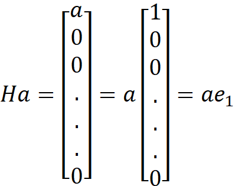
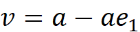

</head>

<body lang=TR style='tab-interval:35.4pt'>

<b>Least</b><b> Squares Estimation:<o:p></o:p></b>

<b><o:p>&nbsp;</o:p></b>

<b>a ) Normal Equations Method:</b>

&nbsp;

If A has
full column rank, then the
matrix is
nonsingular. Therefore, the nxn system
of normal equations

&nbsp;

&nbsp;

can be used to
obtain the solution x to the
linear least squares problem .
In fact, in this case is symmetric
and positive definite, so we
can compute its Cholesky factorization,

&nbsp;

&nbsp;

where L
is lower triangular. The solution x to the least
squares problem can then be
computed by solving the triangular
systems

&nbsp;

&nbsp;

and

&nbsp;

&nbsp;

&nbsp;

<b>b
) Householder Transformations:</b>

&nbsp;

A Householder
transformation H is a matrix
of the form

&nbsp;

&nbsp;

&nbsp;

where is a nonzero
vector. From the definition, we see that
, so that

H is both orthogonal
and symmetric. Given a vector , we wish to choose
the vector so

that

&nbsp;

&nbsp;

&nbsp;

Using the
formula for H, we have

&nbsp;

&nbsp;

&nbsp;

and hence,

&nbsp;

&nbsp;

&nbsp;

&nbsp;

But the scalar
factor is irrelevant in determining v, since it divides out in the formula
for H anyway, so we can take

&nbsp;

&nbsp;

&nbsp;

To preserve
the norm, we must have and the sign should
be chosen to avoid cancellation.

</body>

</html>
