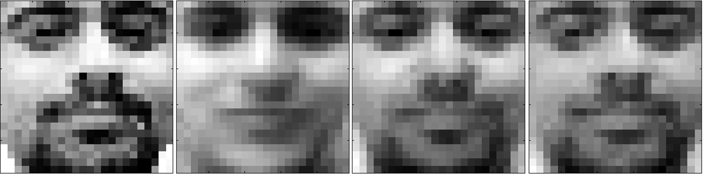
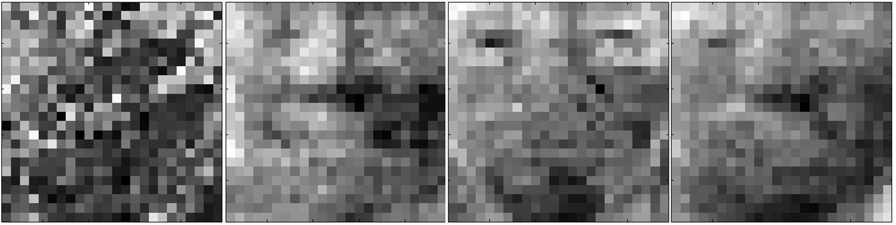

</head>

<body lang=TR style='tab-interval:35.3pt'>

<b>Face
Detection Using PCA</b><o:p></o:p>

<o:p>&nbsp;</o:p>

<o:p>&nbsp;</o:p>

<b>a) Calculation of Eigenvectors:<o:p></o:p></b>

<o:p>&nbsp;</o:p>

A Matlab function
which calculates the eigenvectors used for dimensionality reduction was
written. First, it finds the scatter matrix. After finding the scatter matrix m
eigenvectors with greatest magnitude are placed into columns of the matrix V.
These are the eigenvectors which represent the change of data best. The
function also returns the mean of the data. <o:p></o:p>

 
<![if !supportLineBreakNewLine]> 
<![endif]><o:p></o:p>

<b>b) Visualizing the
Eigenvectors:<o:p></o:p></b>

<b><o:p>&nbsp;</o:p></b>

The following figure shows the first 15 components.<o:p></o:p>

<o:p>&nbsp;</o:p>

<o:p>&nbsp;</o:p>

<!--[if gte vml 1]><o:wrapblock><v:shapetype
  id="_x0000_t75" coordsize="21600,21600" o:spt="75" o:preferrelative="t"
  path="m@4@5l@4@11@9@11@9@5xe" filled="f" stroked="f">
  <v:stroke joinstyle="miter"/>
  <v:formulas>
   <v:f eqn="if lineDrawn pixelLineWidth 0"/>
   <v:f eqn="sum @0 1 0"/>
   <v:f eqn="sum 0 0 @1"/>
   <v:f eqn="prod @2 1 2"/>
   <v:f eqn="prod @3 21600 pixelWidth"/>
   <v:f eqn="prod @3 21600 pixelHeight"/>
   <v:f eqn="sum @0 0 1"/>
   <v:f eqn="prod @6 1 2"/>
   <v:f eqn="prod @7 21600 pixelWidth"/>
   <v:f eqn="sum @8 21600 0"/>
   <v:f eqn="prod @7 21600 pixelHeight"/>
   <v:f eqn="sum @10 21600 0"/>
  </v:formulas>
  <v:path o:extrusionok="f" gradientshapeok="t" o:connecttype="rect"/>
  <o:lock v:ext="edit" aspectratio="t"/>
 </v:shapetype><v:shape id="graphics1" o:spid="_x0000_s1029" type="#_x0000_t75"
  style='position:absolute;left:0;text-align:left;margin-left:0;margin-top:0;
  width:332.95pt;height:200.2pt;z-index:3;visibility:visible;mso-wrap-style:square;
  mso-wrap-distance-left:9pt;mso-wrap-distance-top:0;mso-wrap-distance-right:9pt;
  mso-wrap-distance-bottom:0;mso-position-horizontal:center;
  mso-position-horizontal-relative:text;mso-position-vertical:top;
  mso-position-vertical-relative:text'>
  <v:imagedata src="readme_files/image001.png" o:title=""/>
  <w:wrap type="topAndBottom"/>
 </v:shape><![endif]--><![if !vml]><![endif]><!--[if gte vml 1]></o:wrapblock><![endif]--> 
<o:p></o:p>

<o:p>&nbsp;</o:p>

First 15 eigenvectors can be
interpreted as the components which describe the training data best.

<o:p>&nbsp;</o:p>

<o:p>&nbsp;</o:p>

<b>c) Performing  Dimensionality Reduction on the Examples of
the faceTrain Array :<o:p></o:p></b>

<b><o:p>&nbsp;</o:p></b>

Dimension of the samples from the faceTrain array is reduced to 3,
10 and 20, respectively. For the 30th face in the array reduced data
is reconstructed to d=576 again and reconstruction error is calculated. Matlab
code for the master program is presented in the appendix.<o:p></o:p>

<o:p>&nbsp;</o:p>

<table class=MsoNormalTable border=0 cellspacing=0 cellpadding=0 width=642
 style='border-collapse:collapse;mso-table-layout-alt:fixed;mso-padding-alt:
 0cm .5pt 0cm .5pt'>
 <tr style='mso-yfti-irow:0;mso-yfti-firstrow:yes'>
  <td width=321 valign=top style='width:240.95pt;border:solid black 1.0pt;
  border-right:none;mso-border-top-alt:solid black .25pt;mso-border-left-alt:
  solid black .25pt;mso-border-bottom-alt:solid black .25pt;padding:2.75pt 2.75pt 2.75pt 2.75pt'>
  
Reduced
  Dimension Count<o:p></o:p>

  </td>
  <td width=321 valign=top style='width:240.95pt;border:solid black 1.0pt;
  mso-border-alt:solid black .25pt;padding:2.75pt 2.75pt 2.75pt 2.75pt'>
  
Reconstruction
  Error<o:p></o:p>

  </td>
 </tr>
 <tr style='mso-yfti-irow:1'>
  <td width=321 valign=top style='width:240.95pt;border-top:none;border-left:
  solid black 1.0pt;border-bottom:solid black 1.0pt;border-right:none;
  mso-border-left-alt:solid black .25pt;mso-border-bottom-alt:solid black .25pt;
  padding:2.75pt 2.75pt 2.75pt 2.75pt'>
  
3<o:p></o:p>

  </td>
  <td width=321 valign=top style='width:240.95pt;border:solid black 1.0pt;
  border-top:none;mso-border-left-alt:solid black .25pt;mso-border-bottom-alt:
  solid black .25pt;mso-border-right-alt:solid black .25pt;padding:2.75pt 2.75pt 2.75pt 2.75pt'>
  
1145.885007<o:p></o:p>

  </td>
 </tr>
 <tr style='mso-yfti-irow:2'>
  <td width=321 valign=top style='width:240.95pt;border-top:none;border-left:
  solid black 1.0pt;border-bottom:solid black 1.0pt;border-right:none;
  mso-border-left-alt:solid black .25pt;mso-border-bottom-alt:solid black .25pt;
  padding:2.75pt 2.75pt 2.75pt 2.75pt'>
  
10<o:p></o:p>

  </td>
  <td width=321 valign=top style='width:240.95pt;border:solid black 1.0pt;
  border-top:none;mso-border-left-alt:solid black .25pt;mso-border-bottom-alt:
  solid black .25pt;mso-border-right-alt:solid black .25pt;padding:2.75pt 2.75pt 2.75pt 2.75pt'>
  
666.344835<o:p></o:p>

  </td>
 </tr>
 <tr style='mso-yfti-irow:3;mso-yfti-lastrow:yes'>
  <td width=321 valign=top style='width:240.95pt;border-top:none;border-left:
  solid black 1.0pt;border-bottom:solid black 1.0pt;border-right:none;
  mso-border-left-alt:solid black .25pt;mso-border-bottom-alt:solid black .25pt;
  padding:2.75pt 2.75pt 2.75pt 2.75pt'>
  
20<o:p></o:p>

  </td>
  <td width=321 valign=top style='width:240.95pt;border:solid black 1.0pt;
  border-top:none;mso-border-left-alt:solid black .25pt;mso-border-bottom-alt:
  solid black .25pt;mso-border-right-alt:solid black .25pt;padding:2.75pt 2.75pt 2.75pt 2.75pt'>
  
491.723068<o:p></o:p>

  </td>
 </tr>
</table>

<o:p>&nbsp;</o:p>

<o:p>&nbsp;</o:p>

<!--[if gte vml 1]><o:wrapblock><v:shape
  id="graphics2" o:spid="_x0000_s1028" type="#_x0000_t75" style='position:absolute;
  left:0;text-align:left;margin-left:0;margin-top:0;width:481.85pt;height:119.9pt;
  z-index:251658240;visibility:visible;mso-wrap-style:square;
  mso-wrap-distance-left:9pt;mso-wrap-distance-top:0;mso-wrap-distance-right:9pt;
  mso-wrap-distance-bottom:0;mso-position-horizontal:center;
  mso-position-horizontal-relative:text;mso-position-vertical:top;
  mso-position-vertical-relative:text'>
  <v:imagedata src="readme_files/image003.png" o:title=""/>
  <w:wrap type="topAndBottom"/>
 </v:shape><![endif]--><![if !vml]><![endif]><!--[if gte vml 1]></o:wrapblock><![endif]--> 
<o:p></o:p>

The figure above shows the original 30th face and the
variation of the reconstructed data for m=3, 10 and 20, from left to right. As
it can be seen from the images, greater value of reduced dimension results in a
more accurate reconstructed data.<o:p></o:p>

<o:p>&nbsp;</o:p>

Euclidian distance of the reconstructed face image to the original
one is used as the reconstruction error value. Here is the code for Euclidian
distance measurement:<o:p></o:p>

<o:p>&nbsp;</o:p>

function
[dist]=pca_euclidianDist(A,B)<o:p></o:p>

%Distance
between two faces<o:p></o:p>

%Dimensions
of the faces must agree<o:p></o:p>

dist
= 0;<o:p></o:p>

 <o:p></o:p>

n
= size(A,2);<o:p></o:p>

 <o:p></o:p>

for i=1:1:n<o:p></o:p>

    dist = dist + (A(i) - B(i))^2;<o:p></o:p>

end<o:p></o:p>

 <o:p></o:p>

dist
= sqrt(dist);<o:p></o:p>

 <o:p></o:p>

end<o:p></o:p>

<o:p>&nbsp;</o:p>

<o:p>&nbsp;</o:p>

<o:p>&nbsp;</o:p>

<b>d) Performing  Dimensionality Reduction on the Examples of
the faceTest Array :<o:p></o:p></b>

<b><o:p>&nbsp;</o:p></b>

Dimension of the samples from the faceTest array is reduced to 3,
10 and 20, respectively. For the 10th face in the array reduced data
is reconstructed to d=576 again and reconstruction error is calculated. Matlab
code for the master program is presented in the appendix.<o:p></o:p>

<o:p>&nbsp;</o:p>

<o:p>&nbsp;</o:p>

<table class=MsoNormalTable border=0 cellspacing=0 cellpadding=0 width=642
 style='border-collapse:collapse;mso-table-layout-alt:fixed;mso-padding-alt:
 0cm .5pt 0cm .5pt'>
 <tr style='mso-yfti-irow:0;mso-yfti-firstrow:yes'>
  <td width=321 valign=top style='width:240.95pt;border:solid black 1.0pt;
  border-right:none;mso-border-top-alt:solid black .25pt;mso-border-left-alt:
  solid black .25pt;mso-border-bottom-alt:solid black .25pt;padding:2.75pt 2.75pt 2.75pt 2.75pt'>
  
Reduced
  Dimension Count<o:p></o:p>

  </td>
  <td width=321 valign=top style='width:240.95pt;border:solid black 1.0pt;
  mso-border-alt:solid black .25pt;padding:2.75pt 2.75pt 2.75pt 2.75pt'>
  
Reconstruction
  Error<o:p></o:p>

  </td>
 </tr>
 <tr style='mso-yfti-irow:1'>
  <td width=321 valign=top style='width:240.95pt;border-top:none;border-left:
  solid black 1.0pt;border-bottom:solid black 1.0pt;border-right:none;
  mso-border-left-alt:solid black .25pt;mso-border-bottom-alt:solid black .25pt;
  padding:2.75pt 2.75pt 2.75pt 2.75pt'>
  
3<o:p></o:p>

  </td>
  <td width=321 valign=top style='width:240.95pt;border:solid black 1.0pt;
  border-top:none;mso-border-left-alt:solid black .25pt;mso-border-bottom-alt:
  solid black .25pt;mso-border-right-alt:solid black .25pt;padding:2.75pt 2.75pt 2.75pt 2.75pt'>
  
1088.018993<o:p></o:p>

  </td>
 </tr>
 <tr style='mso-yfti-irow:2'>
  <td width=321 valign=top style='width:240.95pt;border-top:none;border-left:
  solid black 1.0pt;border-bottom:solid black 1.0pt;border-right:none;
  mso-border-left-alt:solid black .25pt;mso-border-bottom-alt:solid black .25pt;
  padding:2.75pt 2.75pt 2.75pt 2.75pt'>
  
10<o:p></o:p>

  </td>
  <td width=321 valign=top style='width:240.95pt;border:solid black 1.0pt;
  border-top:none;mso-border-left-alt:solid black .25pt;mso-border-bottom-alt:
  solid black .25pt;mso-border-right-alt:solid black .25pt;padding:2.75pt 2.75pt 2.75pt 2.75pt'>
  
920.244913<o:p></o:p>

  </td>
 </tr>
 <tr style='mso-yfti-irow:3;mso-yfti-lastrow:yes'>
  <td width=321 valign=top style='width:240.95pt;border-top:none;border-left:
  solid black 1.0pt;border-bottom:solid black 1.0pt;border-right:none;
  mso-border-left-alt:solid black .25pt;mso-border-bottom-alt:solid black .25pt;
  padding:2.75pt 2.75pt 2.75pt 2.75pt'>
  
20<o:p></o:p>

  </td>
  <td width=321 valign=top style='width:240.95pt;border:solid black 1.0pt;
  border-top:none;mso-border-left-alt:solid black .25pt;mso-border-bottom-alt:
  solid black .25pt;mso-border-right-alt:solid black .25pt;padding:2.75pt 2.75pt 2.75pt 2.75pt'>
  
863.561016<o:p></o:p>

  </td>
 </tr>
</table>

<o:p>&nbsp;</o:p>

<!--[if gte vml 1]><o:wrapblock><v:shape
  id="graphics3" o:spid="_x0000_s1027" type="#_x0000_t75" style='position:absolute;
  left:0;text-align:left;margin-left:0;margin-top:0;width:481.85pt;height:122.55pt;
  z-index:251659264;visibility:visible;mso-wrap-style:square;
  mso-wrap-distance-left:9pt;mso-wrap-distance-top:0;mso-wrap-distance-right:9pt;
  mso-wrap-distance-bottom:0;mso-position-horizontal:center;
  mso-position-horizontal-relative:text;mso-position-vertical:top;
  mso-position-vertical-relative:text'>
  <v:imagedata src="readme_files/image005.png" o:title=""/>
  <w:wrap type="topAndBottom"/>
 </v:shape><![endif]--><![if !vml]><![endif]><!--[if gte vml 1]></o:wrapblock><![endif]--> 
<o:p></o:p>

<o:p>&nbsp;</o:p>

The figure above shows the original 10th face and the
variation of the reconstructed data for m=3, 10 and 20, from left to right.
Components, especially for dimensions greater than 3, result in better
reconstruction as it is for the images from the faceTrain array.<o:p></o:p>

<o:p>&nbsp;</o:p>

<b>e) Performing  Dimensionality Reduction on the Examples of
the nonFaceTrain Array :<o:p></o:p></b>

<b><o:p>&nbsp;</o:p></b>

Dimension of the samples from the nonFaceTrain array is reduced to
3, 10 and 20, respectively. For the 24th image from the array
dimensionality reduction is applied.<o:p></o:p>

<o:p>&nbsp;</o:p>

<o:p>&nbsp;</o:p>

<o:p>&nbsp;</o:p>

<table class=MsoNormalTable border=0 cellspacing=0 cellpadding=0 width=642
 style='border-collapse:collapse;mso-table-layout-alt:fixed;mso-padding-alt:
 0cm .5pt 0cm .5pt'>
 <tr style='mso-yfti-irow:0;mso-yfti-firstrow:yes'>
  <td width=321 valign=top style='width:240.95pt;border:solid black 1.0pt;
  border-right:none;mso-border-top-alt:solid black .25pt;mso-border-left-alt:
  solid black .25pt;mso-border-bottom-alt:solid black .25pt;padding:2.75pt 2.75pt 2.75pt 2.75pt'>
  
Reduced
  Dimension Count<o:p></o:p>

  </td>
  <td width=321 valign=top style='width:240.95pt;border:solid black 1.0pt;
  mso-border-alt:solid black .25pt;padding:2.75pt 2.75pt 2.75pt 2.75pt'>
  
Reconstruction
  Error<o:p></o:p>

  </td>
 </tr>
 <tr style='mso-yfti-irow:1'>
  <td width=321 valign=top style='width:240.95pt;border-top:none;border-left:
  solid black 1.0pt;border-bottom:solid black 1.0pt;border-right:none;
  mso-border-left-alt:solid black .25pt;mso-border-bottom-alt:solid black .25pt;
  padding:2.75pt 2.75pt 2.75pt 2.75pt'>
  
3<o:p></o:p>

  </td>
  <td width=321 valign=top style='width:240.95pt;border:solid black 1.0pt;
  border-top:none;mso-border-left-alt:solid black .25pt;mso-border-bottom-alt:
  solid black .25pt;mso-border-right-alt:solid black .25pt;padding:2.75pt 2.75pt 2.75pt 2.75pt'>
  
1132.466965<o:p></o:p>

  </td>
 </tr>
 <tr style='mso-yfti-irow:2'>
  <td width=321 valign=top style='width:240.95pt;border-top:none;border-left:
  solid black 1.0pt;border-bottom:solid black 1.0pt;border-right:none;
  mso-border-left-alt:solid black .25pt;mso-border-bottom-alt:solid black .25pt;
  padding:2.75pt 2.75pt 2.75pt 2.75pt'>
  
10<o:p></o:p>

  </td>
  <td width=321 valign=top style='width:240.95pt;border:solid black 1.0pt;
  border-top:none;mso-border-left-alt:solid black .25pt;mso-border-bottom-alt:
  solid black .25pt;mso-border-right-alt:solid black .25pt;padding:2.75pt 2.75pt 2.75pt 2.75pt'>
  
1110.000381<o:p></o:p>

  </td>
 </tr>
 <tr style='mso-yfti-irow:3;mso-yfti-lastrow:yes'>
  <td width=321 valign=top style='width:240.95pt;border-top:none;border-left:
  solid black 1.0pt;border-bottom:solid black 1.0pt;border-right:none;
  mso-border-left-alt:solid black .25pt;mso-border-bottom-alt:solid black .25pt;
  padding:2.75pt 2.75pt 2.75pt 2.75pt'>
  
20<o:p></o:p>

  </td>
  <td width=321 valign=top style='width:240.95pt;border:solid black 1.0pt;
  border-top:none;mso-border-left-alt:solid black .25pt;mso-border-bottom-alt:
  solid black .25pt;mso-border-right-alt:solid black .25pt;padding:2.75pt 2.75pt 2.75pt 2.75pt'>
  
1065.454026<o:p></o:p>

  </td>
 </tr>
</table>

<o:p>&nbsp;</o:p>

<o:p>&nbsp;</o:p>

<!--[if gte vml 1]><o:wrapblock><v:shape
  id="graphics4" o:spid="_x0000_s1026" type="#_x0000_t75" style='position:absolute;
  left:0;text-align:left;margin-left:0;margin-top:0;width:481.85pt;height:121.3pt;
  z-index:2;visibility:visible;mso-wrap-style:square;mso-wrap-distance-left:9pt;
  mso-wrap-distance-top:0;mso-wrap-distance-right:9pt;
  mso-wrap-distance-bottom:0;mso-position-horizontal:center;
  mso-position-horizontal-relative:text;mso-position-vertical:top;
  mso-position-vertical-relative:text'>
  <v:imagedata src="readme_files/image007.png" o:title=""/>
  <w:wrap type="topAndBottom"/>
 </v:shape><![endif]--><![if !vml]><![endif]><!--[if gte vml 1]></o:wrapblock><![endif]--> 
<o:p></o:p>

The figure above shows the original 24th image from the
nonFaceTrain with reconstructed versions of it, from left to right (m=3 to 20).
With increasing number of components, the image resembles to a face more.<o:p></o:p>

<o:p>&nbsp;</o:p>

<b>f) Discussion on Dimensionality
Reduction Implemented in Previous Parts :<o:p></o:p></b>

<o:p>&nbsp;</o:p>

In part c dimensionality reduction is implemented on the data set
which is also used to create the eigenvectors. Therefore, as reduced dimension
count increases, reconstruction error decays more in this case. This fact can
also be seen from the reconstructed images.<o:p></o:p>

<o:p>&nbsp;</o:p>

In parts c and d, reconstruction error decreases significantly
with the increasing number of principle components. On the other hand, in part
e, increasing the number of principle components doesn't affect the error much.
However, even if the original image isn't a face, reconstructed image has the
traces of a face. These traces come from the eigenvectors used in dimension
conversion.<o:p></o:p>

<o:p>&nbsp;</o:p>

<b>g) Implementation of PCA on the
Examples From nonFaceTrain Array:<o:p></o:p></b>

<b><o:p>&nbsp;</o:p></b>

PCA implemented to the examples from nonfaceTrain array. As a
result, new eigenvectors representing the primary characteristics of a
&quot;non-face&quot; image are created. Related Matlab code can be found in the
Appendix.<o:p></o:p>

<o:p>&nbsp;</o:p>

<o:p>&nbsp;</o:p>

<b>h) Face Detection Using the
Face and Non-Face Eigenvectors:<o:p></o:p></b>

<b><o:p>&nbsp;</o:p></b>

The eigenvectors created in the previous parts are
used to down-size the examples from faceTest array. Again Euclidian distance of
the original image to the reconstructed image is used as the error metric.<o:p></o:p>

<o:p>&nbsp;</o:p>

Below are the results for the classification. As it
can be seen from the results classification results in error only for the m=3
case where the 576 dimension data is represented in only 3 dimension.<o:p></o:p>

<o:p>&nbsp;</o:p>

Classification for m=3<o:p></o:p>

Sample ID Correct      Error<o:p></o:p>

---------       
-------       -----<o:p></o:p>

    1               +               <o:p></o:p>

    2               +               <o:p></o:p>

    3               +               <o:p></o:p>

    4               +               <o:p></o:p>

    5               +               <o:p></o:p>

    6               +               <o:p></o:p>

    7               +               <o:p></o:p>

    8               +               <o:p></o:p>

    9               +               <o:p></o:p>

   10               +               <o:p></o:p>

   11               +               <o:p></o:p>

   12               +               <o:p></o:p>

   13               +               <o:p></o:p>

   14               +               <o:p></o:p>

   15               +              
<o:p></o:p>

   16               +               <o:p></o:p>

   17               +               <o:p></o:p>

   18               +               <o:p></o:p>

   19               +               <o:p></o:p>

   20               +               <o:p></o:p>

   21                            +  <o:p></o:p>

   22               +               <o:p></o:p>

   23               +               <o:p></o:p>

   24               +               <o:p></o:p>

   25               +               <o:p></o:p>

   26               +               <o:p></o:p>

   27               +               <o:p></o:p>

   28               +               <o:p></o:p>

   29               +               <o:p></o:p>

   30               +               <o:p></o:p>

   31               +               <o:p></o:p>

   32               +               <o:p></o:p>

   33               +               <o:p></o:p>

   34               +               <o:p></o:p>

   35               +               <o:p></o:p>

   36                            +  <o:p></o:p>

   37                            +  <o:p></o:p>

   38               +               <o:p></o:p>

   39               +               <o:p></o:p>

   40                            +  <o:p></o:p>

   41                            +  <o:p></o:p>

   42               +               <o:p></o:p>

   43               +               <o:p></o:p>

   44                            +  <o:p></o:p>

   45               +               <o:p></o:p>

   46               +               <o:p></o:p>

   47               +               <o:p></o:p>

   48               +               <o:p></o:p>

   49               +               <o:p></o:p>

   50               +               <o:p></o:p>

   51               +               <o:p></o:p>

   52               +               <o:p></o:p>

   53               +               <o:p></o:p>

   54               +               <o:p></o:p>

   55               +               <o:p></o:p>

   56               +               <o:p></o:p>

   57               +               <o:p></o:p>

<o:p>&nbsp;</o:p>

Classification for m=10<o:p></o:p>

Sample ID  
Correct    Error<o:p></o:p>

---------       
-------       -----<o:p></o:p>

    1               +               <o:p></o:p>

    2               +               <o:p></o:p>

    3               +               <o:p></o:p>

    4               +               <o:p></o:p>

    5               +               <o:p></o:p>

    6               +               <o:p></o:p>

    7               +               <o:p></o:p>

    8               +               <o:p></o:p>

    9               +               <o:p></o:p>

   10               +               <o:p></o:p>

   11               +               <o:p></o:p>

   12               +               <o:p></o:p>

   13               +               <o:p></o:p>

   14               +               <o:p></o:p>

   15               +               <o:p></o:p>

   16               +               <o:p></o:p>

   17               +               <o:p></o:p>

   18               +               <o:p></o:p>

   19               +               <o:p></o:p>

   20               +               <o:p></o:p>

   21               +               <o:p></o:p>

   22               +               <o:p></o:p>

   23               +               <o:p></o:p>

   24               +               <o:p></o:p>

   25               +               <o:p></o:p>

   26               +               <o:p></o:p>

   27               +               <o:p></o:p>

   28               +               <o:p></o:p>

   29               +               <o:p></o:p>

   30               +               <o:p></o:p>

   31               +               <o:p></o:p>

   32               +               <o:p></o:p>

   33               +               <o:p></o:p>

   34               +               <o:p></o:p>

   35               +               <o:p></o:p>

   36               +               <o:p></o:p>

   37               +               <o:p></o:p>

   38               +               <o:p></o:p>

   39               +               <o:p></o:p>

   40               +               <o:p></o:p>

   41               +               <o:p></o:p>

   42               +               <o:p></o:p>

   43               +              
<o:p></o:p>

   44               +               <o:p></o:p>

   45               +               <o:p></o:p>

   46               +               <o:p></o:p>

   47               +               <o:p></o:p>

   48               +               <o:p></o:p>

   49               +               <o:p></o:p>

   50               +               <o:p></o:p>

   51               +               <o:p></o:p>

   52               +               <o:p></o:p>

   53               +               <o:p></o:p>

   54               +               <o:p></o:p>

   55               +               <o:p></o:p>

   56               +               <o:p></o:p>

   57               +               <o:p></o:p>

<o:p>&nbsp;</o:p>

Classification for m=20<o:p></o:p>

Sample ID  
Correct    Error<o:p></o:p>

---------       
-------       -----<o:p></o:p>

    1               +               <o:p></o:p>

    2               +               <o:p></o:p>

    3               +               <o:p></o:p>

    4               +               <o:p></o:p>

    5               +               <o:p></o:p>

    6               +               <o:p></o:p>

    7               +               <o:p></o:p>

    8               +               <o:p></o:p>

    9               +               <o:p></o:p>

   10               +               <o:p></o:p>

   11               +               <o:p></o:p>

   12               +               <o:p></o:p>

   13               +               <o:p></o:p>

   14               +               <o:p></o:p>

   15               +               <o:p></o:p>

   16               +               <o:p></o:p>

   17               +               <o:p></o:p>

   18               +               <o:p></o:p>

   19               +               <o:p></o:p>

   20               +               <o:p></o:p>

   21               +               <o:p></o:p>

   22               +               <o:p></o:p>

   23               +               <o:p></o:p>

   24               +               <o:p></o:p>

   25               +               <o:p></o:p>

   26               +               <o:p></o:p>

   27               +               <o:p></o:p>

   28               +               <o:p></o:p>

   29               +               <o:p></o:p>

   30               +               <o:p></o:p>

   31               +               <o:p></o:p>

   32               +               <o:p></o:p>

   33               +               <o:p></o:p>

   34               +               <o:p></o:p>

   35               +               <o:p></o:p>

   36               +               <o:p></o:p>

   37               +               <o:p></o:p>

   38               +               <o:p></o:p>

   39               +               <o:p></o:p>

   40               +               <o:p></o:p>

   41               +               <o:p></o:p>

   42               +               <o:p></o:p>

   43               +               <o:p></o:p>

   44               +               <o:p></o:p>

   45               +               <o:p></o:p>

   46               +               <o:p></o:p>

   47               +               <o:p></o:p>

   48               +               <o:p></o:p>

   49               +               <o:p></o:p>

   50               +               <o:p></o:p>

   51               +               <o:p></o:p>

   52               +               <o:p></o:p>

   53               +               <o:p></o:p>

   54               +               <o:p></o:p>

   55               +               <o:p></o:p>

   56               +               <o:p></o:p>

   57               +               <o:p></o:p>

<o:p>&nbsp;</o:p>

</body>

</html>
