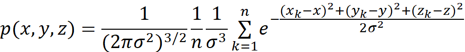

</head>

<body lang=TR style='tab-interval:35.3pt'>

<b>P</b><b>arzen Window Estimated p.d.f
for Bayes Classification:<o:p></o:p></b>

<o:p>&nbsp;</o:p>

A practical way to
use Parzen Window estimation for Bayes Classification is to use a single point
of the p.d.f as the metric in classification rather than calculating the entire
p.d.f.By this way computational complexity of the classification is reduced.<o:p></o:p>

<o:p>&nbsp;</o:p>

As the kernel
function 3D gaussian function is used:<o:p></o:p>

<o:p>&nbsp;</o:p>

<!--[if gte vml 1]><v:shapetype id="_x0000_t75"
 coordsize="21600,21600" o:spt="75" o:preferrelative="t" path="m@4@5l@4@11@9@11@9@5xe"
 filled="f" stroked="f">
 <v:stroke joinstyle="miter"/>
 <v:formulas>
  <v:f eqn="if lineDrawn pixelLineWidth 0"/>
  <v:f eqn="sum @0 1 0"/>
  <v:f eqn="sum 0 0 @1"/>
  <v:f eqn="prod @2 1 2"/>
  <v:f eqn="prod @3 21600 pixelWidth"/>
  <v:f eqn="prod @3 21600 pixelHeight"/>
  <v:f eqn="sum @0 0 1"/>
  <v:f eqn="prod @6 1 2"/>
  <v:f eqn="prod @7 21600 pixelWidth"/>
  <v:f eqn="sum @8 21600 0"/>
  <v:f eqn="prod @7 21600 pixelHeight"/>
  <v:f eqn="sum @10 21600 0"/>
 </v:formulas>
 <v:path o:extrusionok="f" gradientshapeok="t" o:connecttype="rect"/>
 <o:lock v:ext="edit" aspectratio="t"/>
</v:shapetype><v:shape id="Resim_x0020_8" o:spid="_x0000_i1025" type="#_x0000_t75"
 style='width:279.3pt;height:31.5pt;visibility:visible;mso-wrap-style:square'>
 <v:imagedata src="readme_files/image001.png" o:title=""
  chromakey="white"/>
</v:shape><![endif]--><![if !vml]><![endif]><o:p></o:p>

<o:p>&nbsp;</o:p>

</body>

</html>
