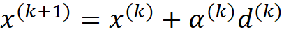

</head>

<body lang=TR>

<b>Unconstrained
Convex Minimization</b>

&nbsp;

A real-valued <a
href="http://en.wikipedia.org/wiki/Function_%28mathematics%29">function</a> <i>f</i>(<i>x</i>)
defined on an <a href="http://en.wikipedia.org/wiki/Interval_%28mathematics%29">interval</a> is called <b>convex</b>
if the graph of the function lies below the line segment joining any two points
of the graph.

&nbsp;

We can  express the general
quadratic <i> </i><i>f(x)</i><i> 
</i>n the following form,

&nbsp;

 <i>f(x)</i><i>   = </i>(1/2)<i>xTQx + bT x
+ c</i>

&nbsp;

Q, here, is the Hessian matrix.
For  <i>f(x)</i><i> </i> to
be convex Q should be positive definite. Positive definiteness can be verified
by calculating the eigenvalues of the Hessian matrix. If all eigenvalues of the
Hessian matrix is positive, than it can be stated that  <i>f(x)</i><i>  </i>is positive
definite.

&nbsp;

In
this homework we are going to deal with solving the unconstrained optimization
problem:

&nbsp;

minimize<i> f(x)</i>                  

<i>&nbsp;</i>

where
<i>f</i> : Rn R
is convex and twice continuously differentiable. We
will assume that the problem is solvable, i.e., there exists an optimal point <i>x*</i>
(More precisely, the assumptions later in the chapter will imply that <i>x*</i>
exists and is unique. We denote the optimal value, <i> f(x) = f(x*),</i>
as <i>p*.</i>

&nbsp;

Since
E is differentiable and convex, a necessary and sufficient condition for a
point <i>x*</i> to be optimal is

&nbsp;

         

&nbsp;

Usually
minimization problem must be solved by an iterative algorithm that computes a
sequence of points x(0), x(1), . . ., x(n) with
f(x(k))  <i>p*</i> as k .  The algorithm is terminated when <i>f(x(k)) - p*</i>, where  &gt; 0 is some specified tolerance
or execution time limit of the algorithm is exceeded.

&nbsp;

 We want
to generate a sequence  and such that it converges to the minimum of <i>f(x)</i>.

&nbsp;

Consider
the kth guess,x(k) , we can generate x(k+1)   provided that
we have two of information

&nbsp;

(1)&nbsp;&nbsp;&nbsp;&nbsp;&nbsp;&nbsp;&nbsp;&nbsp;&nbsp;&nbsp;&nbsp;
&#945; : The direction to go

(2)&nbsp;&nbsp;&nbsp;&nbsp;&nbsp;&nbsp;&nbsp;&nbsp;&nbsp;&nbsp;&nbsp;
d : A scalar step size

&nbsp;

Then;

&nbsp;

&nbsp;

Usually
optimum step size is calculated using the exact line search method

&nbsp;

&nbsp;

&nbsp;

&nbsp;

where Q is the Hessian matrix.

&nbsp;

In
the first part of this homework, a minimization problem is solved using three different
iterative algorithms, namely Steepest Descent Method, Newton's Method and
Fletcher Reeves Conjugate Gradient Method. At this point, we will investigate
the details of this algorithms.

<b>&nbsp;</b>

<b>&nbsp;</b>

<b>Steepest Descent Method</b>

&nbsp;

Steepest Descent (or Gradient Descent) is a first-order
optimization algorithm which is used to find the minimum of a function using
gradient descent. In this method, one takes steps proportional to the negative
of the gradient of the function at the current point.

&nbsp;

&nbsp;

Step size &#945; can be calculated using the exact line
search method given above.

&nbsp;

&nbsp;

Algorithm for Steepest Descent Method:

&nbsp;

<i>Steepest Descent
Method Algorithm:</i>

<b>given</b> a starting point x

<b>repeat</b>

1.
Compute steepest descent direction f(x)'

2. Line search. Choose step size
alpha
using exact line search.

3. Update. x := x + alpha * f(x)'

<b>until</b> stopping criterion is
satisfied.

&nbsp;

As a stopping criterion, gradient of the newly found point
can be used. If it is below some tolerance value than the iteration is stopped.

<b>&nbsp;</b>

<b>Newton's Method</b>

<b>&nbsp;</b>

Newton's Method iterates similar to the Steepest Descent
Method. On the other hand, direction of movement is calculated by multiplying
the inverse of the Hessian matrix by the gradient of the current point.

&nbsp;

&nbsp;

&nbsp;

            

&nbsp;

&nbsp;

Algorithm for Newton's Method:

&nbsp;

<i>Newton's method
Algorithm:</i>

<b>given</b> a starting point x

<b>repeat</b>

1. Compute the Newton
step d

2. Line search. Choose step size
alpha 
using exact
line search.

3. Update. x := x + alpha * d

<b>until </b>stopping criterion is
satisfied.

&nbsp;

Again as a stopping
criterion, gradient of the newly found point can be used. If it is below some
tolerance value than the iteration is stopped.

&nbsp;

The second step is
called the line
search since
selection of the step size t determines
where along the line {x + t<i> </i><i>&#916;</i><i> </i>x | t   R+} the next iterate will
be. (A more accurate term might be <i>ray search</i>).

&nbsp;

<b>Exact line search</b>

<b>&nbsp;</b>

One line search
method sometimes used in practice is <i>exact line search</i>, in which t is chosen to minimize
f along the ray {x + t<i> </i><i>&#916;</i><i> </i>x | t   R+} :

&nbsp;

&nbsp;

From
the Taylor series expansion at <b>:</b>

where
Q is the Hessian matrix of.

&nbsp;

In
exact line search to find the optimal step
size, we need to apply which
yields:

&nbsp;

&nbsp;

<b>Backtracking line
search</b>

<b>&nbsp;</b>

Most line searches
used in practice are inexact: the step length is
chosen to approximately minimize f along the ray {x + t<i> </i><i>&#916;</i><i> </i>x | t &#8805; 0}, or even to just
reduce f
enough.
Many inexact line search methods have been proposed. One inexact line search
method that is very simple and quite effective is called <i>backtracking </i><i>line search.</i> It depends on two
constants &#945;, &#946; with 0 &lt; &#945; &lt; 0.5, 0 &lt; &#946; &lt; 1.

&nbsp;

<i>Backtracking
Line Search Algorihm:</i>

<b>given</b> a descent direction <i>&#916;</i> x for f at xdom
f, &#945; (0, 0.5), &#946;(0,1).

t := 1.

<b>while</b> f(x + t<i> </i><i>&#916;</i><i> </i>x ) &gt; f(x) + ,
t := &#946;t.

&nbsp;

</body>

</html>
